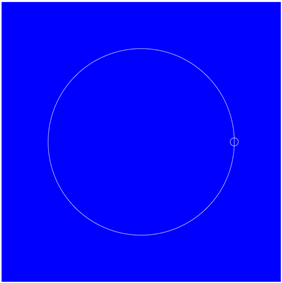
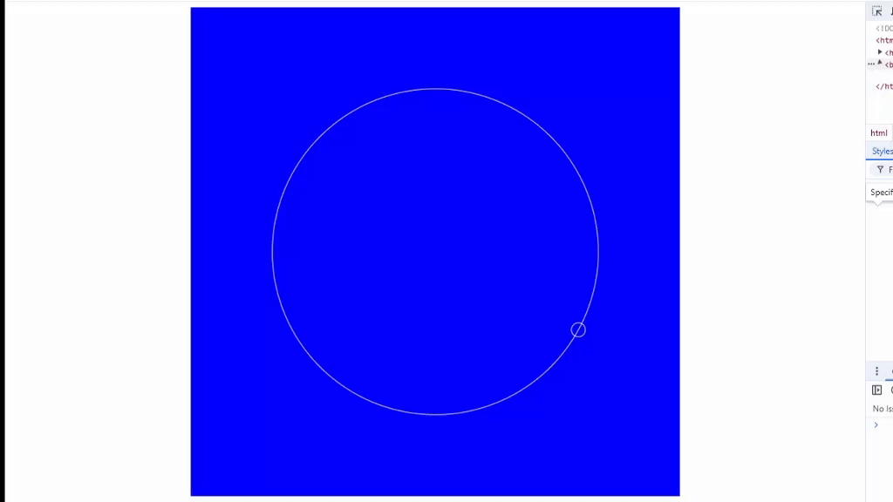
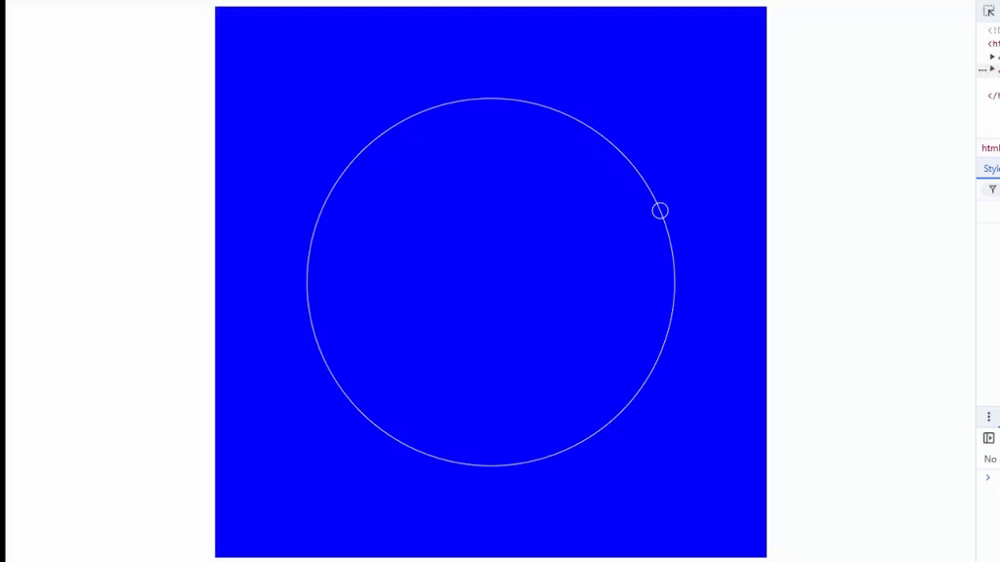
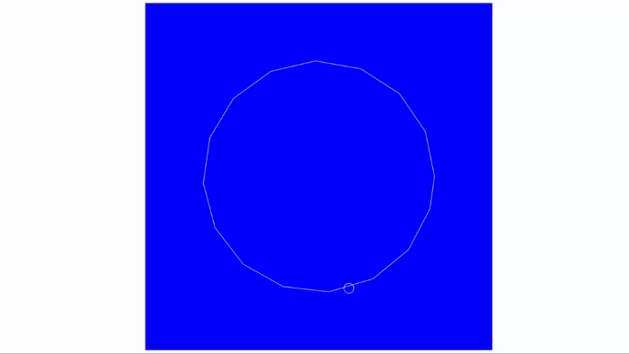
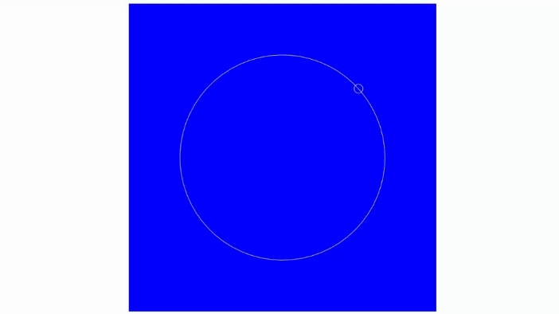
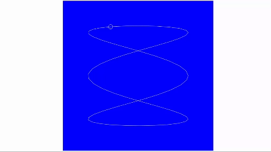

# Polyrhythms JavaScript Project Tutorial – How Math Can Make Your Code Better

[](https://www.youtube.com/watch?v=eX-ODcr3XJg)

## 1. Los tres archivos básicos

1. Creamos el archivo **`index.html`**, y se genera un esqueleto básico, 
digitando `html:5`:
```html
<!DOCTYPE html>
<html lang="en">
<head>
  <meta charset="UTF-8">
  <meta name="viewport" content="width=device-width, initial-scale=1.0">
  <title>Document</title>
</head>
<body>
  
</body>
<footer>
  
</footer>
</html>
```
2. Hacemos los cambios de `<title>` a `Polyrhythm` y en el `<body>`
agregamos un `<canvas>`:
```html
<!DOCTYPE html>
<html lang="en">
<head>
  <meta charset="UTF-8">
  <meta name="viewport" content="width=device-width, initial-scale=1.0">
  <title>Polyrhythms </title>
</head>
<body>
  <canvas id="canvas"></canvas> 
</body>
<footer>
  
</footer>
</html>
```
3. Invocamos los archivos de:
* **`style.css`**, en el `<footer>`
* **`script.js`**, en el `<header>`
```html
<!DOCTYPE html>
<html lang="en">
<head>
  <meta charset="UTF-8">
  <meta name="viewport" content="width=device-width, initial-scale=1.0">
  <title>Polyrhythms </title>

  <script type="module" src="script.js"></script>
</head>
<body>
  <canvas id="canvas"></canvas> 
</body>
<footer>
  <link rel="stylesheet" href="style.css">
</footer>
</html>
```
4. Creamos los dos archivos en la raíz de este proyecto: **`style.css`** 
y **`script.js`**.

5. Se pone esto en el archivo **`style.css`** para visualizar el `canvas`:
```css
body {
  font-family: Arial, Helvetica, sans-serif;
  text-align: center;
}

h1, h2, h3, h4, h5, h6 {
  margin-block-start: 0.2em;
  margin-block-end: 0.2em;
}

#canvas {
  background-color: blue;
}
```
6. En el archivo **`script.js`**, empezamos con estas definiciones, como el tamaño `size` y toma del objeto con el id de `canvas`:
```js
const size = 700;
const myCanvas = document.getElementById('canvas');

// Cuando se muestra la pantalla
window.onload = () => {
  setInit(); // Llamo esta función
};

// Función para inicializar el ambiente
const setInit = () => {
  myCanvas.width = size;
  myCanvas.height = size;
}
```

## 2. Dibujo un círulo usando el `canvas` en **`track.js`**

1. En el archivo **`script.js`**, definimos otra constante del contexto 
del `canvas`:
```js
const ctx = myCanvas.getContext('2d'); // Obtengo el contexto del canvas
```
2. En el archivo **`script.js`**, definimos el `track` o recorrido:
```js
const trackCenter = { x: size / 2, y: size / 2 }; // Centro del canvas
const trackRadius = size / 3; // Radio del círculo
const track = new Track(trackCenter, trackRadius); // Defino el objeto `track`
```
3. Creamos el archivo **`track.js`**, con al menos una clase:
```js
class Track{
  constructor(center, radius){
    this.center = center;
    this.radius = radius;
  }

  draw(ctx){
    ctx.beginPath();
    ctx.arc(this.center.x, this.center.y, this.radius, 0, 2 * Math.PI);
    ctx.strokeStyle = 'white';
    ctx.stroke();
  }
}

export default Track; // Exporto la clase `Track` para poder importarla en otro archivo
```
4. En el archivo **`script.js`**, en el método `setInit()`, invocamos el
método `draw()`:
```js
track.draw(ctx); // Dibujo el círculo
```
5. En el archivo **`script.js`**, importar la clase `Track`:
```js
import Track from './track.js'; // Importo la clase `Track`
```

## 3. Dibujo una bola usando el `canvas` en **`ball.js`**

1. Creamos el archivo **`ball.js`**, con una clase que exportamos:
```js
class Ball{
  constructor(){

  }

  draw(ctx){

  }
}

export default Ball; // Exporto la clase `Ball` para poder importarla en otro archivo
```
2. En **`script.js`**, debajo del `track = new Track`, instanciamos
la clase `Ball`:
```js
  const ball = new Ball(track, ballRadius, ballSpeed); // Defino el objeto
```
3. Importo en **`script.js`**, la clase `Ball`:
```js
import Ball from './ball.js'; // Importo la clase `Ball`
```
4. Debajo de `track.draw(ctx);` en **`script.js`**, también dibujo
la bola:
```js
  ball.draw(ctx); // Dibujo la bola
```
5. Definimos las constantes que nos faltan: `ballRadius`, 
y `ballSpeed`:
```js
  const ballRadius = 10; // Radio de la bola
  const ballSpeed = 0.1; // Velocidad de la bola
```
6. Completamos la clase en el archivo **`ball.js`**:
```js
class Ball {
  constructor(track, radius, speed) {
    this.track = track;
    this.radius = radius;
    this.speed = speed;
    this.offset = 0;
    this.center = this.track.getPosition(this.offset);
  }

  draw(ctx) {
    ctx.beginPath();
    ctx.arc(this.center.x, this.center.y, this.radius, 0, 2 * Math.PI);
    ctx.strokeStyle = 'white';
    ctx.stroke();
  }
}

export default Ball; // Exporto la clase `Ball` para poder importarla en otro archivo
```
7. En el archivo **`track.js`**, añadimos el método, que está
llamando en la clase `Ball` de nombre: `getPosition()`:
```js
  getPosition(offset) {
    return {
      x: this.center.x + Math.cos(offset) * this.radius,
      y: this.center.y + Math.sin(offset) * this.radius,
    };
  }
```

>[!NOTE]
>Así se ve la imagen hasta el momento en el browser:  
>

>[!TIP]
>Creo una carpeta de nombre **"components"** y muevo ahí
>los archivos **`track.js`** y **`ball.js`**, 
>por ende las importaciones de **`script.js`**, van a cambiar:
>```js
>import Track from './components/track.js'; // Importo la clase `Track`
>import Ball from './components/ball.js'; // Importo la clase `Ball`
>```

## 4. Dándole movimiento a la `ball` dentro del `track`

1. En el archivo **`script.js`** debajo de donde se instanciaron los 
dos objetos y antes del `.draw(ctx)` de cada objeto, llamamos una 
función de nombre `animate()` y justo debajo, la función en cuestión:
```js
// Función para inicializar el ambiente
const setInit = () => {
 ...

  animate(track, ball); // Llamo la función

};

// Función para que se llame a sí misma cada segundo
function animate(track, ball) {
  ctx.clearRect(0, 0, size, size); // Limpio el canvas
  track.draw(ctx); // Dibujo el círculo
  ball.draw(ctx); // Dibujo la bola
  requestAnimationFrame(() => animate(track, ball)); // Hago la animación
}
```
2. En la función `animate()`, llamamos una nueva función de nombre
`ball.move()`, depués de `track.draw()` y antes de `ball.draw()`,
 que vamos a crear en la clase `Ball` del archivo **`ball.js`**:
```js
  move() {
    this.offset += this.speed; // Incrementamos el offset
    this.center = this.track.getPosition(this.offset); // Obtenemos la nueva posición
  }
```

>[!TIP]  
> Así luce en pantalla con el movimiento:  
>

3. Hago un ajuste, puesto que en mi ejercicio se mueve en el sentido
de las manecillas del reloj, y al instructor se ve en sentido opuesto
y esto se hace en el archivo **`track.js`**, en la función 
`getPosition()`, restando la posición de `y` en vez de sumarla:
```js
  getPosition(offset) {
    return {
      x: this.center.x + Math.cos(offset) * this.radius,
      y: this.center.y - Math.sin(offset) * this.radius,
    };
  }

```

>[!TIP]  
> Así luce en pantalla con el movimiento, después de la corrección:  
>

## 5. Mejorando la forma de `draw()` en la clase `Track`
1. En el archivo **`track.js`**, hacemos un cambio en el método
`draw()`:
```js
  draw(ctx) {
    ctx.beginPath();
    // ctx.arc(this.center.x, this.center.y, this.radius, 0, 2 * Math.PI);
    for (let a = 0; a < 2 * Math.PI; a += 0.4) {
      ctx.lineTo(
        this.center.x + Math.cos(a) * this.radius,
        this.center.y - Math.sin(a) * this.radius
      );
    }
    ctx.closePath(); // Cierro el círculo o figura de muchos lados
    ctx.strokeStyle = 'white';
    ctx.stroke();
  }
}
```
* Así se ve:  

2. Si la condición en el `for` para el incremento lo hago mas pequeño
se verá mas fluida la forma, es decir cambiar el `a += 0.4` por
`a += 0.1`
* Así se ve:  

3. Si cambio las fórmulas en las funciones `getPosition()` y
`draw()`, en el archivo **`track.js`**,
cambiamos la forma de la imagen y el movimiento:
```js
  getPosition(offset) {
    return {
      x: this.center.x + Math.cos(offset * 3) * this.radius,
      y: this.center.y - Math.sin(offset) * this.radius,
    };
  }

  draw(ctx) {
...
    for (let a = 0; a < 2 * Math.PI; a += 0.1) {
      ctx.lineTo(
        this.center.x + Math.cos(a * 3) * this.radius,
        this.center.y - Math.sin(a) * this.radius
      );
    }
...
  }
```
4. Cambiamos el valor de `ballSpeed` en **`script.js`** de 
`0.1` a `0.01`.
* Así se ve:  

5. Para qué tener una copia del código tanto para la función
`getPostion` como para el `for` de `draw()`, se hacen estos cambios
en el método `draw()` de el archivo **`track.js`**, por ahí derecho
mejoramos el fluido de la línea del `track` cambiando el valor
en el `for` de `a += 0.1` por `a += 0.01`:
```js
  draw(ctx) {
...
    for (let a = 0; a < 2 * Math.PI; a += 0.01) {
      const pos = this.getPosition(a);
      ctx.lineTo(pos.x, pos.y);
    }
...
  }
```
6. Regresamos la fórmula de la función `getPosidion()` sin la 
multiplicación por tres (`Math.cos(offset * 3)`), para que se 
vea un círculo simple.
