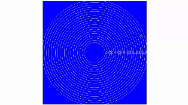
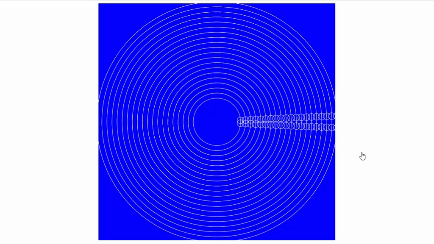
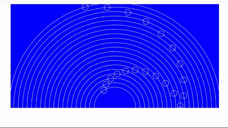
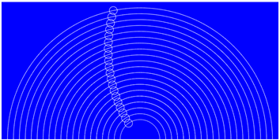
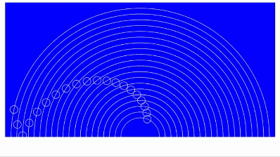
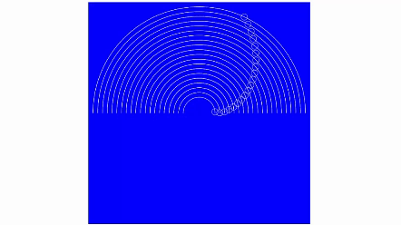
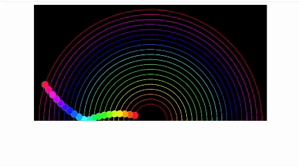
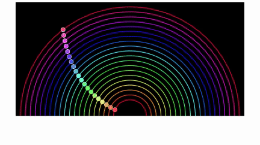

# Polyrhythms JavaScript Project Tutorial – How Math Can Make Your Code Better

[](https://www.youtube.com/watch?v=eX-ODcr3XJg)

## 1. Los tres archivos básicos

1. Creamos el archivo **`index.html`**, y se genera un esqueleto básico, 
digitando `html:5`:
```html
<!DOCTYPE html>
<html lang="en">
<head>
  <meta charset="UTF-8">
  <meta name="viewport" content="width=device-width, initial-scale=1.0">
  <title>Document</title>
</head>
<body>
  
</body>
<footer>
  
</footer>
</html>
```
2. Hacemos los cambios de `<title>` a `Polyrhythm` y en el `<body>`
agregamos un `<canvas>`:
```html
<!DOCTYPE html>
<html lang="en">
<head>
  <meta charset="UTF-8">
  <meta name="viewport" content="width=device-width, initial-scale=1.0">
  <title>Polyrhythms </title>
</head>
<body>
  <canvas id="canvas"></canvas> 
</body>
<footer>
  
</footer>
</html>
```
3. Invocamos los archivos de:
* **`style.css`**, en el `<footer>`
* **`script.js`**, en el `<header>`
```html
<!DOCTYPE html>
<html lang="en">
<head>
  <meta charset="UTF-8">
  <meta name="viewport" content="width=device-width, initial-scale=1.0">
  <title>Polyrhythms </title>

  <script type="module" src="script.js"></script>
</head>
<body>
  <canvas id="canvas"></canvas> 
</body>
<footer>
  <link rel="stylesheet" href="style.css">
</footer>
</html>
```
4. Creamos los dos archivos en la raíz de este proyecto: **`style.css`** 
y **`script.js`**.

5. Se pone esto en el archivo **`style.css`** para visualizar el `canvas`:
```css
body {
  font-family: Arial, Helvetica, sans-serif;
  text-align: center;
}

h1, h2, h3, h4, h5, h6 {
  margin-block-start: 0.2em;
  margin-block-end: 0.2em;
}

#canvas {
  background-color: blue;
}
```
6. En el archivo **`script.js`**, empezamos con estas definiciones, como el tamaño `size` y toma del objeto con el id de `canvas`:
```js
const size = 700;
const myCanvas = document.getElementById('canvas');

// Cuando se muestra la pantalla
window.onload = () => {
  setInit(); // Llamo esta función
};

// Función para inicializar el ambiente
const setInit = () => {
  myCanvas.width = size;
  myCanvas.height = size;
}
```

## 2. Dibujo un círulo usando el `canvas` en **`track.js`**

1. En el archivo **`script.js`**, definimos otra constante del contexto 
del `canvas`:
```js
const ctx = myCanvas.getContext('2d'); // Obtengo el contexto del canvas
```
2. En el archivo **`script.js`**, definimos el `track` o recorrido:
```js
const trackCenter = { x: size / 2, y: size / 2 }; // Centro del canvas
const trackRadius = size / 3; // Radio del círculo
const track = new Track(trackCenter, trackRadius); // Defino el objeto `track`
```
3. Creamos el archivo **`track.js`**, con al menos una clase:
```js
class Track{
  constructor(center, radius){
    this.center = center;
    this.radius = radius;
  }

  draw(ctx){
    ctx.beginPath();
    ctx.arc(this.center.x, this.center.y, this.radius, 0, 2 * Math.PI);
    ctx.strokeStyle = 'white';
    ctx.stroke();
  }
}

export default Track; // Exporto la clase `Track` para poder importarla en otro archivo
```
4. En el archivo **`script.js`**, en el método `setInit()`, invocamos el
método `draw()`:
```js
track.draw(ctx); // Dibujo el círculo
```
5. En el archivo **`script.js`**, importar la clase `Track`:
```js
import Track from './track.js'; // Importo la clase `Track`
```

## 3. Dibujo una bola usando el `canvas` en **`ball.js`**

1. Creamos el archivo **`ball.js`**, con una clase que exportamos:
```js
class Ball{
  constructor(){

  }

  draw(ctx){

  }
}

export default Ball; // Exporto la clase `Ball` para poder importarla en otro archivo
```
2. En **`script.js`**, debajo del `track = new Track`, instanciamos
la clase `Ball`:
```js
  const ball = new Ball(track, ballRadius, ballSpeed); // Defino el objeto
```
3. Importo en **`script.js`**, la clase `Ball`:
```js
import Ball from './ball.js'; // Importo la clase `Ball`
```
4. Debajo de `track.draw(ctx);` en **`script.js`**, también dibujo
la bola:
```js
  ball.draw(ctx); // Dibujo la bola
```
5. Definimos las constantes que nos faltan: `ballRadius`, 
y `ballSpeed`:
```js
  const ballRadius = 10; // Radio de la bola
  const ballSpeed = 0.1; // Velocidad de la bola
```
6. Completamos la clase en el archivo **`ball.js`**:
```js
class Ball {
  constructor(track, radius, speed) {
    this.track = track;
    this.radius = radius;
    this.speed = speed;
    this.offset = 0;
    this.center = this.track.getPosition(this.offset);
  }

  draw(ctx) {
    ctx.beginPath();
    ctx.arc(this.center.x, this.center.y, this.radius, 0, 2 * Math.PI);
    ctx.strokeStyle = 'white';
    ctx.stroke();
  }
}

export default Ball; // Exporto la clase `Ball` para poder importarla en otro archivo
```
7. En el archivo **`track.js`**, añadimos el método, que está
llamando en la clase `Ball` de nombre: `getPosition()`:
```js
  getPosition(offset) {
    return {
      x: this.center.x + Math.cos(offset) * this.radius,
      y: this.center.y + Math.sin(offset) * this.radius,
    };
  }
```

>[!NOTE]
>Así se ve la imagen hasta el momento en el browser:  
>

>[!TIP]
>Creo una carpeta de nombre **"components"** y muevo ahí
>los archivos **`track.js`** y **`ball.js`**, 
>por ende las importaciones de **`script.js`**, van a cambiar:
>```js
>import Track from './components/track.js'; // Importo la clase `Track`
>import Ball from './components/ball.js'; // Importo la clase `Ball`
>```

## 4. Dándole movimiento a la `ball` dentro del `track`

1. En el archivo **`script.js`** debajo de donde se instanciaron los 
dos objetos y antes del `.draw(ctx)` de cada objeto, llamamos una 
función de nombre `animate()` y justo debajo, la función en cuestión:
```js
// Función para inicializar el ambiente
const setInit = () => {
 ...

  animate(track, ball); // Llamo la función

};

// Función para que se llame a sí misma cada segundo
function animate(track, ball) {
  ctx.clearRect(0, 0, size, size); // Limpio el canvas
  track.draw(ctx); // Dibujo el círculo
  ball.draw(ctx); // Dibujo la bola
  requestAnimationFrame(() => animate(track, ball)); // Hago la animación
}
```
2. En la función `animate()`, llamamos una nueva función de nombre
`ball.move()`, depués de `track.draw()` y antes de `ball.draw()`,
 que vamos a crear en la clase `Ball` del archivo **`ball.js`**:
```js
  move() {
    this.offset += this.speed; // Incrementamos el offset
    this.center = this.track.getPosition(this.offset); // Obtenemos la nueva posición
  }
```

>[!TIP]  
> Así luce en pantalla con el movimiento:  
>

3. Hago un ajuste, puesto que en mi ejercicio se mueve en el sentido
de las manecillas del reloj, y al instructor se ve en sentido opuesto
y esto se hace en el archivo **`track.js`**, en la función 
`getPosition()`, restando la posición de `y` en vez de sumarla:
```js
  getPosition(offset) {
    return {
      x: this.center.x + Math.cos(offset) * this.radius,
      y: this.center.y - Math.sin(offset) * this.radius,
    };
  }

```

>[!TIP]  
> Así luce en pantalla con el movimiento, después de la corrección:  
>

## 5. Mejorando la forma de `draw()` en la clase `Track`
1. En el archivo **`track.js`**, hacemos un cambio en el método
`draw()`:
```js
  draw(ctx) {
    ctx.beginPath();
    // ctx.arc(this.center.x, this.center.y, this.radius, 0, 2 * Math.PI);
    for (let a = 0; a < 2 * Math.PI; a += 0.4) {
      ctx.lineTo(
        this.center.x + Math.cos(a) * this.radius,
        this.center.y - Math.sin(a) * this.radius
      );
    }
    ctx.closePath(); // Cierro el círculo o figura de muchos lados
    ctx.strokeStyle = 'white';
    ctx.stroke();
  }
}
```
* Así se ve:  

2. Si la condición en el `for` para el incremento lo hago mas pequeño
se verá mas fluida la forma, es decir cambiar el `a += 0.4` por
`a += 0.1`
* Así se ve:  

3. Si cambio las fórmulas en las funciones `getPosition()` y
`draw()`, en el archivo **`track.js`**,
cambiamos la forma de la imagen y el movimiento:
```js
  getPosition(offset) {
    return {
      x: this.center.x + Math.cos(offset * 3) * this.radius,
      y: this.center.y - Math.sin(offset) * this.radius,
    };
  }

  draw(ctx) {
...
    for (let a = 0; a < 2 * Math.PI; a += 0.1) {
      ctx.lineTo(
        this.center.x + Math.cos(a * 3) * this.radius,
        this.center.y - Math.sin(a) * this.radius
      );
    }
...
  }
```
4. Cambiamos el valor de `ballSpeed` en **`script.js`** de 
`0.1` a `0.01`.
* Así se ve:  

5. Para qué tener una copia del código tanto para la función
`getPostion` como para el `for` de `draw()`, se hacen estos cambios
en el método `draw()` de el archivo **`track.js`**, por ahí derecho
mejoramos el fluido de la línea del `track` cambiando el valor
en el `for` de `a += 0.1` por `a += 0.01`:
```js
  draw(ctx) {
...
    for (let a = 0; a < 2 * Math.PI; a += 0.01) {
      const pos = this.getPosition(a);
      ctx.lineTo(pos.x, pos.y);
    }
...
  }
```
6. Regresamos la fórmula de la función `getPosidion()` sin la 
multiplicación por tres (`Math.cos(offset * 3)`), para que se 
vea un círculo simple.

## 6. Rebotando la `ball`

1. Agregamos la constante `direction` en el archivo **`ball.js`**,
este irá entre los valore `+1` y `-1`.
2. Simplemente al obtener el `offset`, lo multiplicamos por 
`direction`, en el método `move()`:
```js
    this.offset += this.speed * this.direction;
```
3. En el método `move()` de **`ball.js`**, establecemos una 
condicional para cambiar la `direction`:
```js
    if (this.center.y > this.track.center.y) {
      this.direction *= -1;
    }
```
4. Cambiemos la `ballSpeed` en el archivo **`script.js`**, a
`0.05`, así se ve el rebote:  


## 7. Sonido al rebotar la `ball`

1. Creamos el archivo en la carpeta **"components"** de nombre
**`sound.js`**, con esto básico de una clase:
```js
function playSound() {}

export default playSound;
```
2. En la condicional del método `move()` en el archivo
**`ball.js`**, llamamos la nueva función `playSound()`, por ende
se hace la importación respectiva:
```js
import playSound from "./sound.js";
...
  move() {
    ...
    if (this.center.y > this.track.center.y) {
      ...
      playSound();
    }
  }
```
3. En el archivo **`sound.js`**, usamos una `api` propia de 
`window`:
```js
const audioCtx = new (window.AudioContext || window.webkitAudioContext)();
```
4. Completamos la función `playSound()` en **`sound.js`**
:
```js
  function playSound(frecuency = 440, duration = 1) {
    const osc = audioCtx.createOscillator();
    osc.connect(audioCtx.destination);

    osc.frequency.setValueAtTime(frecuency, audioCtx.currentTime);

    osc.start();
    osc.stop(audioCtx.currentTime + duration);
  }
```
>[!WARNING]  
>Si miramos el `inspect` (`[F12]`) del browser, nos parece un 
>error y no hay sonido:
>```diff
>-sound.js:1 The AudioContext was not allowed to start. It must be >resumed (or created) after a user gesture on the page. >https://goo.gl/7K7WLu
>```
>Si Damos click en la imagen del browser, interactuamos con el sitio
y el empieza a generar el sonido.

5. Agregamos en **`sound.js`**, en la función `playSound()`, otra
constante:
```js
    const envelope = audioCtx.createGain();

    osc.connect(envelope);
    envelope.connect(audioCtx.destination);
```
6. Incrementamos a `envelope`, para que incremente el sonido:
```js
  envelope.gain.setValueAtTime(0, audioCtx.currentTime);
  envelope.gain.linearRampToValueAtTime(1, audioCtx.currentTime + 0.05);
  envelope.gain.linearRampToValueAtTime(0, audioCtx.currentTime + duration);
```

## 8. Múltiples `ball` y múltiples `track`

1. En el archivo **`script.js`**, definimos tres constantes, arriba:
```js
  const tracks = []; // Arreglo vacío de `tracks`
  const balls = []; // Arreglo vacío de `balls`
  const N = 20; // Número total de elementos
```
2. Debajo añadimos un ciclo `for`, donde definiremos el nuevo
`trackRadius` y por ende la variable anterior del mismo nombre
la vamos a cambiar por `trackMinRadius` y definir otra constante
de nombre `trackStep`:
```js
  const trackMinRadius = size / 3; // Radio del círculo o `track`
  const trackStep = 15; // Separación entre `track`
...

  for (let i = 0; i < N; i++) {
    const trackRadius = trackMinRadius + i * trackStep;
    
  }
```
3. Subimos las instanciaciones de `track` y `ball` dentro del 
ciclo `for` y añadimos a los arreglos el correspondiente valor:
```js
  for (let i = 0; i < N; i++) {
    const trackRadius = trackMinRadius + i * trackStep;
    // Obtengo los dos objetos
    const track = new Track(trackCenter, trackRadius);
    const ball = new Ball(track, ballRadius, ballSpeed);
    // Añado a los arreglos
    tracks.push(track);
    balls.push(ball);
  }
```
4. Hacemos un cambio grande en el método `animate()` para incluir
cada `track` de `tracks` y cada `ball` de `balls`:
```js
function animate() {
  ctx.clearRect(0, 0, size, size); // Limpio el canvas
  tracks.forEach((track) => {
    track.draw(ctx); // Dibujo el círculo
  });

  balls.forEach((ball) => {
    ball.move();
    ball.draw(ctx); // Dibujo la bola
  });

  requestAnimationFrame(() => animate()); // Hago la animación
}
```
5. El llamado a la función `animate()` desde el método `setInit()`,
no requiere parámetros.
6. El valor del `trackMinRadius` lo cambié a `size / 10`, aunque el 
instructor sugiere `100`.

>[!TIP]  
>Así se ve en el browser:  
>

## 9. Cambio de frecuencias para cada `ball`

1. En el archivo **`script.js`** cambiamos la constante `ballSpeed` 
por `ballMinSpeed` y la 
inicializamos en `0.01`.
2. Creamos la constante `ballSpeedStep` con valor de `-0.0001`.
3. En el archivo **`script.js`**, en el `for` del método `setInit()`
Cambiamos la `ballSpeed`:
```js
    const ballSpeed = ballMinSpeed + i * ballSpeedStep;
```

>[!TIP]  
>Así se ve en el browser:  
>

4. Creamos la constante `soundFrecuencies` como un arreglo al tope:
```js
const soundFrecuencies = [
  1760, 1567.98, 1396.91, 1318.51, 1174.66, 1046.5, 987.77, 880, 783.99, 698.46,
  659.25, 587.33, 523.25, 493.88, 440, 392, 349.23, 329.63, 293.66, 261.63,
]; // Arreglo de `soundFrecuencies`
```
5. Asignamos en el `for` del método `setInit()` esta nueva 
constante a `ballSoundFrecuency` y luego usándola para enviar a 
la clase `Ball`:
```js
  for (let i = 0; i < N; i++) {
    ...
    const ballSoundFrecuency = soundFrecuencies[i];
    ...
    const ball = new Ball(track, ballRadius, ballSpeed, ballSoundFrecuency);
    ...
  }
```
6. Ahora bien en la clase `Ball` del archivo **`ball.js`**, hacemos
uso del valor en el `constructor`:
```js
class Ball {
  constructor(track, radius, speed, soundFrecuency) {
    ...
    this.soundFrecuency = soundFrecuency;
    ...
  }
  ...
}
```
7. En el archivo **`ball.js`** al llamar la función `playSound()`, lo
llamamos con el parámetro obtenido de `this.soundFrecuency`:
```js
      playSound(this.soundFrecuency);
```
>[!TIP]  
>Ya el sonido de cada bola es diferente, el parámetro ya existía
>en la función `playSound()`.

8. Cambiamos en el archivo **`sound.js`** el valor de 
`envelope.gain...` de `1` a `0.05`, y el sonido será mas fluído y 
menos brusco.
9. El momento de llamar el método `playSoubnd()` desde 
**`ball.js`**, añadimos el parámetro de `duration` a un valor fijo 
de 2:
```js

```

## 10. Mejorando el fluído en vez del rebote con algo de matemáticas

1. En el archivo **`ball.js`**, cambiamos la constante `direction`
por `round` en el constructor y lo inicalizamos en `0`.
2. En el constructor de **`track`**, defino otro valor de nombre
`period` con el valore de `PI`:
```js
  constructor(center, radius) {
    ...
    this.period = Math.PI;
  }
```
3. En el archivo **`track`**, devolveremos `round` en el método
`getPosition()`:
```js
  getPosition(offset) {
    return {
      x: this.center.x + Math.cos(offset) * this.radius,
      y: this.center.y - Math.sin(offset) * this.radius,
      round: Math.floor(offset / this.period),
    };
  }
```
4. Dado el cambio de `return` en `getPosition()`, cambiamos esto
en el archivo **`ball.js`** , empezando en el `constructor`:
```js
  constructor(track, radius, speed, soundFrecuency) {
    this.track = track;
    this.radius = radius;
    this.speed = speed;
    this.soundFrecuency = soundFrecuency;
    this.offset = 0;
    this.round = 0; // Valor de base en PI
    this.center = {};
  }
```
5. También el método `move()`, hacemos estos cambios, ya que
`direction` fue reemplazada por `round`:
```js
  move() {
    // Incrementamos el offset
    this.offset += this.speed ;
    // Obtenemos la nueva posición
    const res = this.track.getPosition(this.offset);
    // Asignamos la posición `center` de la `ball`
    this.center = { x: res.x, y: res.y };
    // Condicional para cambiar la `direction`
    if (this.round !== res.round) {
      playSound(this.soundFrecuency, 2);
      this.round = res.round;
    }
  }
```

>[!TIP]  
>Así se ve el movimiento fluido en el `track`  
>

## 11. Mostrando solo medio escenario

1. Agregamos un grupo de `ball` en movimiento opuesto a modo de 
espejo, en el `draw()` de **`ball.js`**:
```js
  drawBall(ctx, x, y, radius) {
    ctx.beginPath();
    ctx.arc(x, y, radius, 0, 2 * Math.PI);
    ctx.strokeStyle = 'white';
    ctx.stroke();
  }

  draw(ctx) {
    const fakeY = 2 * this.track.center.y - this.center.y;
    this.drawBall(ctx, this.center.x, this.center.y, this.radius);
    this.drawBall(ctx, this.center.x, fakeY, this.radius);
  }
```

>[!TIP]  
>Así se ve ese movimiento en espejo  
>

2. Ahora solo veremos la mitad del campo en pantalla, para dar la 
impresión que las bolas están rebotando, en el achivo **`script.js`**
poneinto la `height` el valor dividido por 2:
```js
  myCanvas.height = size / 2;
```

>[!TIP]  
>Así se ve ese movimiento en la mitad del círculo 
>

3. Hacemos encajar todos el `track`, cambiando en el archivo
**`script.js`**, el valor de `trackMinRadius` con el valor de 
`50`. Ahora los semi círculos encajan en el espacio:  

4. En el archivo **`ball.js`**, solo dibujamos el que sea mayor
en la posición `y` que el otro en el método `draw()`:
```js
  draw(ctx) {
    const fakeY = 2 * this.track.center.y - this.center.y;
    if (fakeY > this.center.y) {
      this.drawBall(ctx, this.center.x, this.center.y, this.radius);
    } else {
      this.drawBall(ctx, this.center.x, fakeY, this.radius);
    }
  }
```

>[!TIP]  
>Así se ve ese movimiento solo mostrando el correcto
>

## 12. Dibubar solo medio `track` en un `canvas` completo

1. Usemos la matemática para simplificar la lógica, empezamos
con el archivo **`ball.js`**, regresando a borrar lo relacionado
con `fakeY`:
```js
  draw(ctx) {
    this.drawBall(ctx, this.center.x, this.center.y, this.radius);
  }
```
2. En el archivo **`track.js`**, en el método `getPosition()`, 
cambiamos la fórmula al asignar la `y` con la función `abs()`:
```js
  getPosition(offset) {
    return {
      x: this.center.x + Math.cos(offset) * this.radius,
      y: this.center.y - Math.abs(Math.sin(offset)) * this.radius,
      round: Math.floor(offset / this.period),
    };
  }
```

3. Regresamos el tamaño del `canvas` eliminando la división por dos
en el archivo **`script.js`**.

>[!TIP]  
>Así se ve ese movimiento con el `track` solo en positivo y con
>el escenario completo:  
>

## 13. Mejoras de la presentación
1. En el archivo **`script.js`**, volvemos a dividir por dos 
al momento de crear el `canvas`, en el método `setInit()`:
```js
  myCanvas.height = size / 2;
```
2. Cambio el color del canvas a `black` en el archivo 
**`style.css`**.
3. Vamos a generar colores, creamos la constante `hue` en el 
`for` de `setInit` en el aerchivo **`script.js`**:
```js
    // Creo colores para cada `track` y `ball`
    const hue = (i * 360) / N;
```
4. Agregamos como parámetro al momento de instanciar los dos
objetos de `track` y `ball`:
```js
    // Obtengo los dos objetos
    const track = new Track(trackCenter, trackRadius, hue);
    const ball = new Ball(
      track,
      ballRadius,
      ballSpeed,
      ballSoundFrecuency,
      hue
    );
```
5. Por ende debemos colocar en el `constructor` del archivo
**`track.js`**, este nuevo parámetro y utilizarlo:
```js
class Track {
  constructor(center, radius, hue) {
    ...
    this.hue = hue;
    ...
  }
  ...
  draw(ctx) {
    ...
    ctx.strokeStyle = `hsl(${this.hue}, 100%, 50%)`;
    ...
  }
}
```
6. Hacemos algo similar en la clase `Ball` del archivo
**`ball.js`**:
```js
class Ball {
  constructor(track, radius, speed, soundFrecuency, hue) {
    ...
    this.hue = hue;
    ...
  }
  ...
  draw(ctx) {
    ctx.beginPath();
    ctx.arc(this.center.x, this.center.y, this.radius, 0, 2 * Math.PI);

    ctx.strokeStyle = 'white';
    ctx.stroke();
    ctx.fillStyle = `hsl(${this.hue}, 100%, 50%)`;
    ctx.fill();
  }
}
```

>[!TIP]  
>Esta sería la forma de verlo en varios colores:  
>

7. Ajustamos unos estilos en el archivo **`ball.js`**, para el
método `draw()`: 
```js
    ctx.lineWidth = 2;
```
8. En el archivo **`script.js`**, cambiamos el valor de `ballRadius`
de `10` a `6`.
9. Pondermos en blanco la `ball`, cuando llegue a uno de los 
extremos, lo hacemos en el archivo **`ball.js`** empezando en el 
`constructor`:
```js
  constructor(track, radius, speed, soundFrecuency, hue) {
    ...
    this.progress = 0;
    ...
  }

  move() {
    ...
    this.progress = res.progress
    ...
    }
```
10. En el archivo **`track.js`** en el método `getPosition()`
se añade en el `return` el valor de `progress`:
```js
  getPosition(offset) {
    return {
      ...
      progress: (offset % this.period) / this.period,
    };
  }
```
11. De regreso en el archivo **`ball.js`** en el método `draw()`,
usamos el valor de `progress`:
```js
  draw(ctx) {
    ...
    const lightness = 100 - 50 * this.progress;
    ctx.stroke();
    ctx.fillStyle = `hsl(${this.hue}, 100%, ${lightness}%)`;
    ctx.fill();
  }
```
>[!TIP]  
>Cambio de colores y tonos en cada `ball`:  
>
