# JavaScript Christmas Calendar Tutorial 🎄 de freeCodeCamp.org 
## 2 horas y 49 minutos

[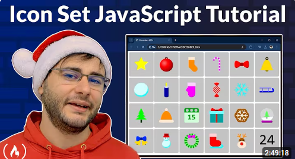](https://www.youtube.com/watch?v=07vQARYrJgw&t=155s)

## 1. Los tres archivos básicos
1. Empezamos con el archivo **`index.html`**, digitando en 
`Visual Studio Code` el _snippet_ de `html:5` y añadiendo el elemento
`<footer>` debajo de `<body>`:
```html
<!DOCTYPE html>
<html lang="en">
<head>
  <meta charset="UTF-8">
  <meta name="viewport" content="width=html:5, initial-scale=1.0">
  <title>Document</title>
</head>
<body>
  
</body>
<footer></footer>
</html>
```
2. Cambiamos el título a `Diciembre`.
3. En el `<head>` debajo del `<title>` agregamos el `<script>`
llamando un archivo de nombre **`script.js`** de tipo `module`:
```html
  <script type="module" src="script.js"></script>
```
4. Se da `[ctrl]` + click en el nombre `"script.js"` para
crear y abrir el archivo **`script.js`**.
5. En el `<body>` creamos un `<div>` con el `id` de `calendar`:
```html
  <div id = "calendar"></div>
```
6. En el archivo **`script.js`**, agregamos estas líneas:
```js
// Cuando se muestra la pantalla
window.onload = () => {
  setInit(); // Llamo esta función
};

// Función para inicializar el ambiente
const setInit = () => {}
```
7. Añadimos este código dentro de **`script.js`**, justo en el inicio:
```js
const cellSize = 200; // Tamaño de la celda
const calendar = document.getElementById('calendar'); // Obtengo el div con id calendar
```
8. Dentro del método `setInit()` , añadimos un `for`:
```js
const setInit = () => {
  for (let day = 1; day <= 24; day++) {
    const canvas = document.createElement('canvas'); // Creo un canvas
    canvas.width = cellSize; // Asigno el ancho
    canvas.height = cellSize; // Asigno el alto
    calendar.appendChild(canvas); // Agrego el canvas al div  
  }
}
```
9. En el `<footer>`, agregamos un `link` invocando un archivo
de nombre **`style.css`**:
```html
  <link rel="stylesheet" href="style.css">
```
10. Se da `[ctrl]` + click en el nombre `"style.css"` para
crear y abrir el archivo **`style.css`**.
11. Poner esto en el archivo **`style.css`**:
```css
canvas {
  background-color: #BBB;
  margin: 3px;
  border-radius: 10px;
}
```

>[!TIP]  
>Así se ve el browser hasta el momento:  
>

## 2. Dibujando números en las celdas

1. Empezamos a llenar las celdas con algo. En el archivo 
**`script.js`**, en el `for` de `setInit()`, debajo del 
`appendChild`, agregamos esto:
```js
    fillCell(canvas, day); // Llamo la función fillCell
```
2. Creo la función `fillCell()` y empiezo esto en el código:
```js
// Función para llenar la celda
const fillCell = (canvas, index) => {
  const ctx = canvas.getContext('2d'); // Obtengo el contexto del canvas
  const x = canvas.width / 2; // Obtengo la mitad del ancho
  const y = canvas.height / 2; // Obtengo la mitad del alto 
}
```
3. Definimos el tamaño de los elementos en el canvas con esto dentro
de la función `fillCell()`:
```js
  const itemSize = canvas.width * 0.6; // Defino el tamaño del item
```
4. Por ahora vamos a dibujar un número en cada una de las celdas, 
en la función `fillCell()`:
```js
  drawNmber(ctx, index, x, y, itemSize); // Llamo la función drawNumber
```
5. Creo la función `drawNumber()`:
```js
// Función para dibujar el número
const drawNmber = (ctx, number, x, y, size) => {
  ctx.font = size + 'px Arial'; // Asigno la fuente
  ctx.fillText(number, x, y); // Dibujo el número
  ctx.fillStyle = 'black'; // Asigno el color 
}
``` 

>[!TIP]  
>En cada celda aparece un número:  
>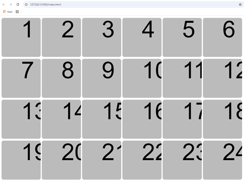

6. Añadimos en la función `drawNmber()`, un `textAlign` y un
`textBaseline`:
```js
  ctx.textAlign = 'center'; // Asigno la alineación
  ctx.textBaseline = 'middle'; // Asigno la base del texto
```

>[!TIP]  
>Los números aparecen centrados en cada celda:  
>

## 3. Día primero con **`01-start.js`**

1. Creamos en la parte superior de **`script.js`** la definicón
de un arreglo de nombre `drawImtemFunctions`:
```js
const drawItemFunctions = []; // Creo un array para guardar las funciones
```
2. En el método `setInit()`, antes del `for`, cargo el primer valor
como `drawStar`;
```js
  drawItemFunctions[1] = drawStar; // Asigno la función drawStar al array
```
3. En la función `fillCell` colocamos esto antes de llamar la función
`drawNumber()`:
```js
  const drawItem = drawItemFunctions[index]; // Obtengo la función a dibujar
  if (drawItem)
    drawItem(ctx, x, y, itemSize); // Llamo la función drawItem
  else drawNumber(ctx, index, x, y, itemSize); // Llamo la función drawNumber
``` 
4. Creamos la carpeta de nombre **"items"**.
5. La función la vamos a crear en un archivo nuevo de nombre
**`01-start.js`**, dentro de la carpeta **"items"**, con al menos
este código:
```js
function drawStar(ctx, x, y, size) {}

export default drawStar;
```
6. Regreso a **`script.js`** y en el principio añado la importación
de la función del archivo **`01-start.js`**:
```js
import drawStar from './items/01-start.js'; // Importo la función drawStar
```
7. En la función `drawStar()` de  **`01-start.js`**, coloco
este código:
```js
  const radius = size / 2; // Defino el radio
  const pointCount = 5; // Defino la cantidad de puntos
  ctx.beginPath(); // Comienzo el trazo
  for (let i = 0; i < pointCount; i++) {
    const angle = (i / pointCount) * Math.PI * 2; // Defino el ángulo
    const surfaceX = x + radius * Math.cos(angle); // Defino la superficie x
    const surfaceY = y + radius * Math.sin(angle); // Defino la superficie y
    ctx.lineTo(surfaceX, surfaceY); // Dibujo la línea
  }
  ctx.fillStyle = 'yellow'; // Asigno el color
  ctx.fill(); // Relleno
```

>[!TIP]  
>Tenemos un pentágono en la primer celda:  
>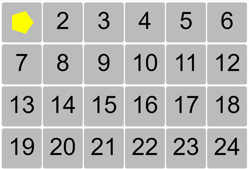

8. Cambiamos el número de puntos de `pointCount` a `10`, y el nombre de
la constante `radius` por otras dos nuevas:
```js
  const outerRadius = size / 2; // Defino el radio externo
  const innerRadius = size / 4; // Defino el radio interno
  const pointCount = 10; // Defino la cantidad de puntos
```
9. Justo después de obtener el `angle`, obtengo el `radius`:
```js
    const radius = (i % 2 === 0) ? outerRadius : innerRadius; // Defino el radio
```
* Así se ve la estrella como "rellenita":  


10. Cambio el valor de `innerRadius` de `size / 4` a 
`size / 5`, y se ve la estrella mejor:  

11. Finalmente encuentro una fórmula mejor para hacer la estrella
y cambio el código por esto:
```js
  ctx.fillStyle = 'yellow'; // Asigno el color
  ctx.beginPath(); // Comienzo el trazo
  ctx.moveTo(x, y - size / 2); // Muevo el trazo
  for (let i = 0; i < 10; i++) {
    const angle = (i * Math.PI) / 5; // Defino el ángulo
    const radius = i % 2 === 0 ? size * 0.5 : size * 0.2; // Defino el radio
    ctx.lineTo(x + radius * Math.sin(angle), y - radius * Math.cos(angle)); // Dibujo la línea
  }
  ctx.closePath(); // Cierro el trazo
  ctx.fill(); // Relleno
```
* Veo mejor la estrella de esta forma:  


12. El Instructor corrije el código para que se vea también la 
punta arriba, cambiando `surfaceX` y `surfaceY` de esta manera:
```js
    const surfaceX = x + radius * Math.sin(angle); // Defino la superficie x
    const surfaceY = y - radius * Math.cos(angle); // Defino la superficie y
```
13. El instructor también sugiere un cambio de colores de forma 
aleatoria, usando una constante `hue` y poniendo dicho color así:
```js
  const hue = Math.floor(Math.random() * 360); // Defino el color
  ctx.fillStyle = `hsl(${hue}, 50%, 50%)`; // Asigno el color
```
* Pero prefiero dejarlo en el color constante de `'yellow'`.

## 4. Día segundo con **`02-ball.js`**

1. En la función `setInit()` del archivo **`script.js`**, 
adicionamos la función para la posición `[2]`:
```js
  drawItemFunctions[2] = drawBall; // Asigno la función drawBall al array
```
2. Creamos enla carpeta **"items"** el archivo **`02-ball.js`**,
con al menos esta función:
```js
function drawBall(ctx, x, y, size) {}

export default drawBall;
```
3. Importamos en **`script.js`**, esta nueva función:
```js
import drawBall from './items/02-ball.js'; // Importo la función drawBall
```
4. Ahora si empiezo a poner el código en la función `drawBall()`
del archivo **`02-ball.js`**:
```js
  const top = y - size / 2;
  const left = x - size / 2;

  // Definimos el anillo de la bola
  const ring ={
    radius: size * 0.1,
    x,
    get y() {return top + this.radius},
    color: 'black'
  }

  //dibujamos el anillo
  ctx.beginPath();
  ctx.arc(ring.x, ring.y, ring.radius, 0, Math.PI * 2);
  ctx.strokeStyle = ring.color;
  ctx.stroke();
```
* Así se ve lo que llevamos de la segunda celda:  

5. Agrego en el objeto `ring` el valor de `lineWidth`:
```js
  const ring = {
    radius: size * 0.1,
    x,
    get y() {
      return top + this.radius;
    },
    lineWidth: size * 0.05,
    color: 'orange',
  };
```
6. Ajustamos en el dibujo del `arc()` con estos valores:
```js
  ctx.arc(ring.x, ring.y, ring.radius - ring.lineWidth / 2, 0, Math.PI * 2);
```
7. Mejoramos el código par dibuar el `ring` de esta manera:
```js
  draw.circle(ctx, ring.x, ring.y, ring.radius, {
    strokeStyle: ring.color,
    lineWidth: ring.lineWidth,
    outline: 'inside'
  });
```
8. Creamos una carpeta en la raíz de nombre **"utils"**.
9. En la carpeta **"utils"**, creamos el archivo **`draw.js`**,
con al menos la función `circle()`:
```js
const draw = {};

draw.circle = function(ctx, x, y, radius, { fillStyle, strokeStyle, lineWidth, outline }) {
  ctx.beginPath();
  if (outline === 'inside') { 
    radius -= lineWidth / 2;
  }
  ctx.arc(x, y, radius, 0, Math.PI * 2);
  if (fillStyle) {
    ctx.fillStyle = fillStyle;
    ctx.fill();
  }
  if (strokeStyle) {
    ctx.strokeStyle = strokeStyle;
    ctx.lineWidth = lineWidth;
    ctx.stroke();
  }

  ctx.closePath();
}

export default draw;
```
10. En el archivo **`02-ball.js`**, importamos este método
múltiple de nombre `draw`:
```js
import draw from '../utils/draw.js';
```
* Anillo dibujado con la utilidad `draw`:  

11. Definimos un nuevo objeto en el archivo **`02-ball.js`**:
```js
  const ball = {
    radius: size * 0.45,
    x,
    y() {
      return top + ring.radius + this.radius;
    },
    color: 'red',
  };
```
12. Usamos el `draw` para completar la bola:
```js
  draw.circle(ctx, ball.x, ball.y(), ball.radius, {
    fillStyle: ball.color,
  });
```
* Así se ve la bola y el anillo en la celda 2:  
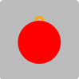

## 5. Implementar manejo de colores

1. Creamos el archivo **`color.js`** en la carpeta **"utils"**, 
añadimos el método `color`:
```js
const color = {}

color.darkest = (hue) => `hsl(${hue}, 100%, 10%)`;
color.dark = (hue) => `hsl(${hue}, 100%, 30%)`;
color.normal = (hue) => `hsl(${hue}, 100%, 50%)`;
color.light = (hue) => `hsl(${hue}, 100%, 70%)`;
color.lightest = (hue) => `hsl(${hue}, 100%, 90%)`;

export default color;
```
2. Agregamos el elemento `hue` en el archivo **`script.js`**,
en el método `fillCell()`:
```js
const fillCell = (canvas, index) => {
  ...
  const hue = Math.floor(Math.random() * 360); // Defino el color
  ...
  if (drawItem) drawItem(ctx, x, y, itemSize, hue); // Llamo la función drawItem
  else drawNumber(ctx, index, x, y, itemSize); // Llamo la función drawNumber
};
```
3. Ahora bien tanto para **`01-start.js`**, como para 
**`02-ball.js`**, agrego el parámetro `hue` y lo utilizo en
las definiciones del color:
* **`01-start.js`**
```js
import color from '../utils/color.js';

function drawStar(ctx, x, y, size, hue) {
  ...
  ctx.fillStyle = color.normal(hue); // Asigno el color
}
```
* **`02-ball.js`**
```js
import color from '../utils/color.js';
import draw from '../utils/draw.js';

function drawBall(ctx, x, y, size, hue) {
  ...
  const ring = {
    ...,
    color: color.darkest(hue),
  };
  ...
  const ball = {
    ...,
    color: color.normal(hue),
  };
}
```
4. Para darle volúmen a la `ball`, en el archivo **`ball.js`**
añadimos la constante `highlight`, antes de dibujar la `ball`:
```js
  const highlight = {
    x: ball.x - ball.radius * 0.3,
    y: ball.y - ball.radius * 0.3,
  };
```
5. Otra constante para el gradiente de nombre `grd`:
```js
  // Definimos el gradiente radial
  const grd = ctx.createRadialGradient(
    highlight.x, highlight.y, 0, 
    highlight.x, highlight.y, ball.radius
  );
```
6. Ajustamos el uso del gradiente en la bola
```js
  grd.addColorStop(0, color.light(hue));
  grd.addColorStop(1, color.dark(hue));

  //dibujamos la bola
  draw.circle(ctx, ball.x, ball.y(), ball.radius, {
    fillStyle: grd,
  });
```
* Así se ve la bola con el gradiente:  
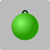
7. Mejoramos la gradiente y la imagen se verá mejor:
```js
  // Definimos el gradiente radial
  const grd = ctx.createRadialGradient(
    highlight.x, highlight.y, 0,
    highlight.x, highlight.y, ball.radius * 2
  );
  grd.addColorStop(0, color.lightest(hue));
  grd.addColorStop(0.3, color.normal(hue));
  grd.addColorStop(0.8, color.dark(hue));
  grd.addColorStop(1, color.darkest(hue));
```
* Así se ve con mas opciones en el gradiente:  
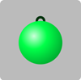
8. Borramos de **`02-ball.js`**, la variable innecesaria
`const left = x - size / 2;`

## 6. Día tercero con **`03-sock.js`**

1. En la función `setInit()` del archivo **`script.js`**, 
adicionamos la función para la posición `[3]`:
```js
  drawItemFunctions[3] = drawSock; // Asigno la función drawSock al array
```
2. Creamos en la carpeta **"items"** el archivo **`03-sock.js`**,
con al menos esta función:
```js
function drawSock(ctx, x, y, size, hue) {}

export default drawSock;
```
3. Importamos en **`script.js`**, esta nueva función:
```js
import drawSock from './items/03-sock.js'; // Importo la función drawSock
```
4. Agrego en **`draw.js`**, el comportamiento para `line`:
```js
draw.line = function (ctx, fromX, fromY, toX, toY, options) {
  ctx.beginPath();
  ctx.moveTo(fromX, fromY);
  ctx.lineTo(toX, toY);
  Object.assign(ctx, options);
  ctx.stroke();

  ctx.closePath();
}
```
5.. Ahora si empiezo a poner el código en la función `drawSock()`
del archivo **`03-sock.js`**:
```js
function drawSock(ctx, x, y, size, hue) {
  const top = y - size / 2; // Defino la parte superior del calcetín
  const ankleY = y + size * 0.1; // Defino la altura del tobillo
  draw.line(ctx, x, top, x, ankleY, {
    strokeStyle: color.normal(hue), 
  }); // Dibujo la pierna
}
```
6. Verificar que se tenga ambas importaciones en **`03-sock.js`**:
```js
import draw from '../utils/draw.js'; // Importo la función draw
import color from '../utils/color.js'; // Importo la función color  
```
7. Definimos la constante `footWidth` y la asignamos al momento
de `draw.line()`:
```js
function drawSock(ctx, x, y, size, hue) {
  const top = y - size / 2; // Defino la parte superior del calcetín
  ...
  const footWidth = size * 0.4; // Defino el ancho del pie
  draw.line(ctx, x, top, x, ankleY, {
    strokeStyle: color.normal(hue),
    lineWidth: footWidth,
  }); // Dibujo la pierna
}
```
8. Agrego un parámetro al momento de dibujar la línea de
nombre `lineCap`, para redondear las puntas:
```js
  draw.line(ctx, x, top, x, ankleY, {
    strokeStyle: color.normal(hue),
    lineWidth: footWidth,
    lineCap: 'round',
  });
```
9. Defino la constante `radius` y muevo la parte superior mas
abajo:
```js
  const radius = footWidth / 2; // Defino el radio del tobillo

  draw.line(ctx, x, top + radius , x, ankleY, {
    strokeStyle: color.normal(hue),
    lineWidth: footWidth,
    lineCap: 'round',
  });
```
* Así se ve la recta con las puntas redondeadas y la distancia
del `radius`:  

10. Defino la constante `sleeveWidth` y la uso para dibujar
la manga en pantalla:
```js
  const sleeveWidth = footWidth * 1.1; // Defino el ancho de la manga
  ...
  draw.line(ctx, x, top, x, top + radius, {
    strokeStyle: color.lightest(hue),
    lineWidth: sleeveWidth,
    lineCap: 'butt',
  }); // Dibujo la manga
```
* Así se ve la dos rectas:  

11. En el archivo **`03-sock.js`**, agrego el parámetro de
nombre `angle` con un valor inicial de `0`:
```js
function drawSock(ctx, x, y, size, hue, angle = 0) {
  ...
}
```
12. Definimos en el método `drawSock()` la constante de nombre
`footSize`:
```js
  const footSize = size * 0.3; // Defino el tamaño del pie
```
13. Calculamos el inicio del la recta con dos constantes de 
nombre `tipX` y `tipY`:
```js
  const tipX = x + Math.cos(angle) * footSize; // Defino la punta del pie en X
  const tipY = ankleY + Math.sin(angle) * footSize; // Defino la punta del pie en Y
```
14. Dibujamos otra línea con los nuevos elementos, entre el 
`// Dibujo la pierna` y `// Dibujo la manga` :
```js
  draw.line(ctx, x, ankleY, tipX, tipY, {
    strokeStyle: color.normal(hue),
    lineWidth: footWidth,
    lineCap: 'round',
  }); // Dibujo el pie
```
* Así se ve la imagen de `sock` con todo completo:  
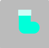 
15. Podemos cambiar el valor inicial de `angle`, por este valor:
```js
function drawSock(ctx, x, y, size, hue, angle = Math.PI / 4) {
  ...
}
```
* Así luce la `sock` o media o calcetín con un ángulo de `45°`:  
 

## 7. Día cuarto con **`04-cane.js`**

1. En la función `setInit()` del archivo **`script.js`**, 
adicionamos la función para la posición `[4]`:
```js
  drawItemFunctions[4] = drawCane; // Asigno la función drawCane al array
```
2. Creamos en la carpeta **"items"** el archivo **`04-cane.js`**,
con al menos esta función:
```js
function drawCane(ctx, x, y, size, hue) {}

export default drawCane;
```
3. Importamos en **`script.js`**, esta nueva función:
```js
import drawCane from './items/04-cane.js'; // Importo la función drawCane
```
4. Definimos las constantes para el `top`, `width` y `thickness`,
en **`04-cane.js`**:
```js
function drawCane(ctx, x, y, size, hue) {
  const top = y - size / 2; // Defino la parte superior del bastón

  const width = size * 0.5; // Defino el ancho del bastón
  const thickness = size * 0.1; // Defino el grosor del bastón
}
```
5. Creamos una constante para manejar el arco de nombre `arc`,
en el método `drawCane()`:
```js
  const arc = {
    radius: (width - thickness) / 2, // Defino el radio del arco
    x,
    y() { return top + this.radius + thickness / 2; }, // Defino la altura del arco
  }
```
6. Hacemos el dibujo correspondiente en el archivo 
**`04-cane.js`**, dentro del método `drawCane()`:
```js
  ctx.beginPath(); // Comienzo el trazo
  ctx.strokeStyle = color.normal(hue); // Asigno el color
  ctx.lineWidth = thickness; // Asigno el grosor
  ctx.arc(arc.x, arc.y(), arc.radius, Math.PI, 0); // Dibujo el arco
  ctx.stroke(); // Hago el trazo
```
* Así se ve la primera parte del bastón o `cane`:  
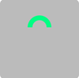
7. Añadimos en el mérodo `drawCane()`, antes de `ctx.stroke()`
lo siguiente:
```js
  ctx.lineTo(arc.x + arc.radius, bottom); // Dibujo la línea
```
8. Defino la constante `bottom` al principio de **`04-cane.js`**:
```js
  const bottom = y + size / 2; // Defino la parte inferior
```
* Así se ve hasta el momento el cuarto día:  

9. Vamos a dibujar los adornos del bastón debajo de
`ctx.stroke()`, en el método `drawCane()`:
```js
  ctx.strokeStyle = color.dark(hue); // Asigno el color
  ctx.setLineDash([thickness, thickness]); // Asigno el trazo
  ctx.stroke(); // Hago el trazo
```
* Así luce el bastón con los adornos:  
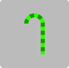
10. Cambiamos la definición de colores para los dos
`strokeStyle`:
```js
  ctx.beginPath(); // Comienzo el trazo
  ctx.strokeStyle = color.lightest(hue); // Asigno el color
  ...

  // Dibujamos los adornos del bastón 
  ctx.strokeStyle = color.normal(hue); // Asigno el color
  ...
```
* Así vemos el bastón del dia 4, con el cambio de definición de
colores:  
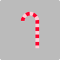

## 8. Día quinto con **`05-bow.js`**

1. En la función `setInit()` del archivo **`script.js`**, 
adicionamos la función para la posición `[5]`:
```js
  drawItemFunctions[5] = drawBow; // Asigno la función drawBow al array
```
2. Creamos en la carpeta **"items"** el archivo **`05-bow.js`**,
con al menos esta función:
```js
function drawBow(ctx, x, y, size, hue) {}

export default drawBow;
```
3. Importamos en **`script.js`**, esta nueva función:
```js
import drawBow from './items/05-bow.js'; // Importo la función drawBow
```
4. Definimos las constantes para el `top`, `left`, `right`, y
`bottom` en **`05-bow.js`**:
```js
function drawCane(ctx, x, y, size, hue) {
  const top = y - size / 2; // Defino la parte superior del moño
  const left = x - size / 2; // Defino la parte superior del moño
  const right = x + size / 2; // Defino la parte derecha del moño
  const bottom = y + size / 2; // Defino la parte inferior del moño
}
```
5. Importo la utilidad **`color.js`** en **`05-bow.js`**:
```js
import color from '../utils/color.js'; // Importo la función color
```
6. Empiezo dibujando esto en la función `drawBow()`:
```js
  ctx.beginPath(); // Comienzo el trazo
  ctx.fillStyle = color.normal(hue); // Asigno el color
  ctx.moveTo(x, y); // Muevo el trazo al centro
  ctx.lineTo(left, top); // Dibujo la esquina superior izquierda
  ctx.lineTo(left, bottom); // Dibujo la línea inferior izquierda
  ctx.lineTo(x, y); // Dibujo la línea de regreso al centro
  ctx.lineTo(right, bottom); // Dibujo la línea inferior derecha
  ctx.lineTo(right, top); // Dibujo la línea superior derecha
  ctx.fill(); // lleno la forma o imagen
```
* Así se ve el lazo o moño, hasta el momento:  

7. Vamos a hacer el lazo o el moño menos _puntudo_ añadiendo unas
curvas , por ejemplo cambiando `ctx.lineTo(left, top);`, por 
`ctx.quadraticCurveTo(left, top, left, y);` del primer 
`// Dibujo la esquina superior izquierda`:
```js
  ctx.quadraticCurveTo(left, top, left, y);
```
* Así se ve con esta primera curva:  

8. Cambiemos el segundo `ctx.lineTo(left, bottom);`, por
`ctx.quadraticCurveTo(left, bottom, x, y);` del 
`// Dibujo la línea inferior izquierda`:
```js
  ctx.quadraticCurveTo(left, bottom, x, y);
```
9. Elimininamos o comentamos la línea de 
`// Dibujo la línea de regreso al centro`
10. Cambiamos los otros dos trazos:
```js
  ctx.quadraticCurveTo(right, bottom, right, y); // Dibujo la línea inferior derecha
  ctx.quadraticCurveTo(right, top, x, y); // Dibujo la línea superior derecha
```
* Así se ve el lazo o moño con las curvas:  

11. Vamos a añadir el nudo o `knot` al centro y empezamos
definiendo las propiedades en el método `drawBow()` del archivo
**`05-bow.js`**:
```js
  const knot = {
    size: size * 0.3, // Defino el tamaño del nudo
    get top() {
      return y - this.size / 2;
    }, // Defino la parte superior del nudo
    get left() {
      return x - this.size / 2;
    }, // Defino la parte izquierda del nudo
    roudness: size * 0.1, // Defino la redondez del nudo
  };
```
12. Completo el trazo con un rectángulo redondeado:
```js
  ctx.beginPath(); // Comienzo el trazo
  ctx.fillStyle = color.dark(hue); // Asigno el color
  ctx.roundRect(knot.left, knot.top, knot.size, knot.size, knot.roudness); // Dibujo el nudo
  ctx.fill(); // lleno la forma o imagen
```
* Este el lazo o moño con el nudo:  

13. Cambiamos el tamaño del nudo, cambiando `size` y
`roudness` en el archivo **`05-bow.js`**:
```js
  const knot = {
    size: size * 0.25, // Defino el tamaño del nudo
    ...
    roudness: size * 0.05, // Defino la redondez del nudo
  };
```
* Este es el resultado final del dia cuarto:  


## 9. Día sexto con **`06-bell.js`**

1. En la función `setInit()` del archivo **`script.js`**, 
adicionamos la función para la posición `[6]`:
```js
  drawItemFunctions[6] = drawBell; // Asigno la función drawBell al array
```
2. Creamos en la carpeta **"items"** el archivo **`06-bell.js`**,
con al menos esta función:
```js
function drawBell(ctx, x, y, size, hue) {}

export default drawBell;
```
3. Importamos en **`script.js`**, esta nueva función:
```js
import drawBell from './items/06-bell.js'; // Importo la función drawBell
```
4. Definimos las constantes para el `top`, `left`, `right`, y
`bottom` en **`06-bell.js`**:
```js
function drawCane(ctx, x, y, size, hue) {
  const top = y - size / 2; // Defino la parte superior de la campana
  const left = x - size / 2; // Defino la parte superior de la campana
  const right = x + size / 2; // Defino la parte derecha de la campana
  const bottom = y + size / 2; // Defino la parte inferior de la campana
}
```
5. Importo la utilidad **`color.js`** en **`06-bell.js`**:
```js
import color from '../utils/color.js'; // Importo la función color
```
6. Copiamos el `ring` o anillo `drawBall()` dentro del archivo
**`06-bell.js`**:
```js
  // Definimos el anillo de la campana
  const ring = {
    radius: size * 0.1,
    x,
    get y() {
      return top + this.radius;
    },
    lineWidth: size * 0.05,
    color: color.darkest(hue),
  };

  //dibujamos el anillo
  draw.circle(ctx, ring.x, ring.y, ring.radius, {
    strokeStyle: ring.color,
    lineWidth: ring.lineWidth,
    outline: 'inside',
  });
```
7. Debemos importar en **`06-bell.js`**, la utilidad **`draw.js`**:
```js
import draw from '../utils/draw.js';  // Importo la función draw
```
8. Empezamos con el _badajo_ o `clapper` de la campana o `bell`:
```js
  // Definimos el badajo de la campana
  const clapper = {
    radius: size * 0.1,
    x,
    get y() {
      return bottom - this.radius;
    },
    color: color.dark(hue),
  };

  // dibujamos el badajo
  draw.circle(ctx, clapper.x, clapper.y, clapper.radius, {
    fillStyle: clapper.color,
  });
```
* Esto es lo que se ve de la `bell` con el `clapper`:  
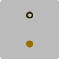

9. Para la campana o `bell`, empecemos por definirla:
```js
  const bell = {
    top: top + ring.radius * 2,
    bottom:bottom - clapper.radius,
    color: color.normal(hue),
  };
```
10. Ahora en **`06-bell.js`**, dibujamos el triángulo de la `bell`:
```js
  ctx.beginPath(); // Comienzo el trazado
  ctx.fillStyle = bell.color; // Asigno el color
  ctx.moveTo(x, bell.top); // Muevo a la esquina superior izquierda
  ctx.lineTo(left, bell.bottom); // Dibujo la línea abajo-izquierda 
  ctx.lineTo(right, bell.bottom); // Dibujo la línea abajo-derecha
  ctx.fill(); // Relleno
```
* Esto es la campana o `bell` en forma de triángulo:  
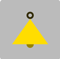

11. Similar como se hizo con el moño o lazo, vamos a darle algunas
curvas a la `bell` o campana, empezando por añadir elementos a la 
definición del objeto `bell`:
```js
  const bell = {
    top: top + ring.radius * 2,
    bottom:bottom - clapper.radius,
    color: color.normal(hue),
    controlOffset: size * 0.25,
  };
```
12. Cambiamos algunos elementos del trazo de la `bell`:
```js
  ctx.beginPath(); // Comienzo el trazado
  ctx.fillStyle = bell.color; // Asigno el color
  ctx.moveTo(x, bell.top); // Muevo a la esquina superior izquierda
  // ctx.lineTo(left, bell.bottom); // Dibujo la línea abajo-izquierda
  ctx.bezierCurveTo(
    // Dibujo la curva
    x - bell.controlOffset, // Punto de control izquierdo
    bell.top, // Punto de control derecho
    x - bell.controlOffset, // Punto de control izquierdo
    bell.bottom, // Punto de control derecho
    left,
    bell.bottom // Punto final
  );
  ctx.lineTo(right, bell.bottom); // Dibujo la línea abajo-derecha
  ctx.fill(); // Relleno
}
```
* Así luce la campana con las primeras curvas:  

13.Cambiamos la definición de `controlOffset` para cambiar el factor
de `0.25` por `0.3`.
14. Cambiamos la otra diagonal de la derecha en el método
`drawBell()` del archivo **`06-ball.js`**:
```js
  ctx.beginPath(); // Comienzo el trazado
  ctx.fillStyle = bell.color; // Asigno el color
  ctx.moveTo(x, bell.top); // Muevo a la esquina superior izquierda
  // ctx.lineTo(left, bell.bottom); // Dibujo la línea abajo-izquierda
  ctx.bezierCurveTo(
    // Dibujo la curva
    x - bell.controlOffset, // Punto de control izquierdo
    bell.top, // Punto de control derecho
    x - bell.controlOffset, // Punto de control izquierdo
    bell.bottom, // Punto de control derecho
    left,
    bell.bottom // Punto final
  );
  ctx.lineTo(right, bell.bottom); // Dibujo la línea abajo-derecha
  ctx.bezierCurveTo(
    // Dibujo la curva
    x + bell.controlOffset, // Punto de control izquierdo
    bell.bottom, // Punto de control derecho
    x + bell.controlOffset, // Punto de control izquierdo
    bell.top, // Punto de control derecho
    x,
    bell.top // Punto final
  );
  ctx.fill(); // Relleno
```
* Esto es como se ve la `bell` con ambas curvas:  


## 10. Día séptimo con **`07-snowBall.js`**

1. En la función `setInit()` del archivo **`script.js`**, 
adicionamos la función para la posición `[7]`:
```js
  drawItemFunctions[7] = drawSnowBall; // Asigno la función drawSnowBall al array
```
2. Creamos en la carpeta **"items"** el archivo **`07-snowBall.js`**,
con al menos esta función:
```js
function drawSnowBall(ctx, x, y, size, hue) {}

export default drawSnowBall;
```
3. Importamos en **`script.js`**, esta nueva función:
```js
import drawSnowBall from './items/07-snowBall.js'; // Importo la función drawSnowBall
```
4. Definimos las constantes para el `top`, `left`, `right`, y
`bottom` en **`07-snowBall.js`**:
```js
function drawSnowBall(ctx, x, y, size, hue) {
  const top = y - size / 2; // Defino la parte superior de la bola de nieve
  const left = x - size / 2; // Defino la parte superior de la bola de nieve
  const right = x + size / 2; // Defino la parte derecha de la bola de nieve
  const bottom = y + size / 2; // Defino la parte inferior de la bola de nieve
}
```
5. Importo la utilidad **`color.js`** en **`07-snowBall.js`**:
```js
import color from '../utils/color.js'; // Importo la función color
```
6. Definimos la constante `radius` y empezamos a hacer el dibujo:
```js
  const radius = size / 2; // Defino el radio
  ctx.beginPath(); // Comienzo el trazado
  for (let a = 0; a < Math.PI * 2; a += Math.PI / 60) {
    const surfaceX = x + radius * Math.cos(a); // Defino la superficie x
    const surfaceY = y + radius * Math.sin(a); // Defino la superficie y
    ctx.lineTo(surfaceX, surfaceY); // Dibujo la línea
  }
  ctx.fillStyle = color.lightest(hue); // Asigno el color
  ctx.fill(); // Relleno
```
* Así se la bola de nieve de forma inicial:  


7. Cambiamos la constante `radius` por `MaxRadius` y en el ciclo
`for` del método `drawSnowBall()`, definimos a `radius` con
algunos valores _aleatorios_:
```js
  const maxRadius = size / 2; // Defino el radio
  ctx.beginPath(); // Comienzo el trazado
  for (let a = 0; a < Math.PI * 2; a += Math.PI / 60) {
    const radius = maxRadius * (1 - Math.random() * 0.1); // Defino el radio
    ...
  }
```
* Así se ve la `snowBall` con con algo de valores _random_:  


8. Ajustamos el valor en el random para darle mas suavidad
de `0.1` a `0.05`.
9. Agregamos unas sombras en la parte inferior-derecha, 
empezamos encerrando todo en un nuevo método de nombre 
`drawNoisyBall()`, y llamándola al principio:
```js
  drawNoisyBall(ctx, x, y, size, color.normal(hue)); // Llamo la función drawNoisyBall

  function drawNoisyBall(ctx, x, y, size, color) {
    ...
    ctx.fillStyle = color; // Asigno el color
    ctx.fill(); // Relleno
  }
```
* La `snowBall` ya con el color normal y los bordes suaves:  

10. Duplicamos la llamada a la función `drawNoisyBall()`,
cambiando el color:
```js
  drawNoisyBall(ctx, x, y, size, color.normal(hue)); // Llamo la función drawNoisyBall
  drawNoisyBall(ctx, x, y, size, color.lightest(hue)); // Llamo la función drawNoisyBall
```
11. Añadimos un objeto `offset` en medio de las dos llamadas
a la función `drawNoisyBall()`:
```js
  drawNoisyBall(ctx, x, y, size, color.normal(hue)); // Llamo la función drawNoisyBall
  const offset = {
    x: x - size * 0.1,
    y: y - size * 0.1,
  };
  drawNoisyBall(ctx, offset.x, offset.y, size, color.lightest(hue)); // Llamo la función drawNoisyBall
```
* Así se ve la bola con el `offset`:  

12. Añado antes del segundo llamado a la función `drawNoisyBall()`,
un elemento de `ctx` en el archivo **`07-snowBall.js`**:
```js
  ctx.globalCompositeOperation = 'source-atop'; // Asigno la operación de composición
```
13. Borro las constantes del paso 4, que no las voy a necesitar.
* Así se ve finalmente la `snowBall` o bola de nieve:  


>[!WARNING]  
>En el archivo **`07-snowBall.js`**, se corrige el objeto `offset`:
>```js
>  const offset = {
>    x: x - size * 0.05,
>    y: y - size * 0.1,
>  };
>```
>Se añade debajo del segundo llamado a la función `drawNoisyBall()`,
>otro `ctx`:
>```js
>  ctx.globalCompositeOperation = 'source-over'; // Asigno la operación de composición
>```

## 11. Día octavo con **`08-candle.js`**

1. En la función `setInit()` del archivo **`script.js`**, 
adicionamos la función para la posición `[8]`:
```js
  drawItemFunctions[8] = drawCandle; // Asigno la función drawCandle al array
```
2. Creamos en la carpeta **"items"** el archivo **`08-candle.js`**,
con al menos esta función:
```js
function drawCandle(ctx, x, y, size, hue) {}

export default drawCandle;
```
3. Importamos en **`script.js`**, esta nueva función:
```js
import drawCandle from './items/08-candle.js'; // Importo la función drawCandle
```
4. Definimos las constantes para el `top`, `left`, `right`, y
`bottom` en **`08-candle.js`**:
```js
function drawCandle(ctx, x, y, size, hue) {
  const top = y - size / 2; // Defino la parte superior de la vela
  const left = x - size / 2; // Defino la parte superior de la vela
  const right = x + size / 2; // Defino la parte derecha de la vela
  const bottom = y + size / 2; // Defino la parte inferior de la vela
}
```
5. Importo la utilidad **`color.js`** en **`08-candle.js`**:
```js
import color from '../utils/color.js'; // Importo la función color
```
6. definimos la constate `stick` o cuerpo de la vela:
```js
  const stick = {
    // Defino el palo o cuerpo de la vela
    width: size * 0.3,
    height: size * 0.7,
    x: x,
    bottom: bottom,
    get top() {
      return this.bottom - this.height;
    },
    color: color.normal(hue),
  };
```
8. Importamos la utilidad `draw` de **`draw.js`**, en el archivo 
**`08-candle.js`**.
9. Usamos esa función `draw.line()` dentro del método 
`drawCandle()`:
```js
  draw.line(ctx, stick.x, stick.top, stick.x, stick.bottom, {
    strokeStyle: stick.color,
    lineWidth: stick.width,
  }); // Dibujo el palo
```
* Así se ve la primera parte de la vela:  

10. Para dibujar la llama, empezamos con una _elipse_, y se requiere
el objeto `flame`:
```js
  const flame = {
    // Defino la llama
    width: stick.width * 0.3,
    height: size - stick.height,
    x: x,
    get xRadius() {
      return this.width / 2;
    },
    get yRadius() {
      return this.height / 2;
    },
    get y() {
      return stick.top - this.yRadius;
    },
    color: color.normal(60), // Yellow o Amarillo
  };
```
>[!WARNING]  
>Aprovecho y hago ajustes a la función `draw.circle()` del 
>archivo **`draw.js`**:
>```js
>draw.circle = function (ctx, x, y, radius, options) {
>  ctx.beginPath();
>  if (options.outline === 'inside') {
>    radius -= options.lineWidth / 2;
>  }
>  ctx.arc(x, y, radius, 0, Math.PI * 2);
>  Object.assign(ctx, options);
>
>  options.fillStyle && ctx.fill();
>  options.strokeStyle && ctx.stroke();
>
>  ctx.closePath();
>}
>```

11. Creamos una nueva función en el archivo **`draw.js`**, con el
nombre de `ellipse`:
```js
draw.ellipse = function (ctx, x, y, xRadius, yRadius, options) {
  ctx.beginPath();
  ctx.ellipse(x, y, xRadius, yRadius, 0, 0, Math.PI * 2);
  Object.assign(ctx, options);
  
  options.fillStyle && ctx.fill();
  options.strokeStyle && ctx.stroke();

  ctx.closePath();
}
```
12. De regreso a **`08-candle.js`**, usamos la `ellipse()`:
```js
  draw.ellipse(ctx, flame.x, flame.y, flame.xRadius, flame.yRadius, {
    fillStyle: flame.color,
  }); // Dibujo la llama
```
* Así luce la `candle` con el cuerpo de la vela y la llama:  

13. Cambiamos el objeto `stick`, para obtener un cilindro mas que
un rectángulo:
```js
  const stick = {
    // Defino el palo o cuerpo de la vela
    width: size * 0.3,
    height: size * 0.7,
    x: x,
    get bottom() {
      return bottom - this.yRadius;
    },
    get top() {
      return this.bottom - this.height + this.yRadius;
    },
    get xRadius() {
      return this.width / 2;
    },
    get yRadius() {
      return this.xRadius / 2;
    },
    color: color.normal(hue),
  };
```
14. En el archivo **`08-candle.js`**, debajo de `draw.line()`,
llamamos otras dos funciones de `draw.ellipse()`:
```js
  draw.ellipse(ctx, stick.x, stick.bottom, stick.xRadius, stick.yRadius, {
    fillStyle: stick.color,
  }); // Dibujo la base

  draw.ellipse(ctx, stick.x, stick.top, stick.xRadius, stick.yRadius, {
    fillStyle: stick.color,
  }); // Dibujo la base
```
* Así se ve la vela como un _cilindro_:  
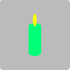
15. Añado un elemento al objeto `stick` de nombre `lightColor`
y lo uso en la elipse segunda que va en el tope de la vela:
```js
  const stick = {
    ...
    lightColor: color.lightest(hue),
  };
  ...
  draw.ellipse(ctx, stick.x, stick.top, stick.xRadius, stick.yRadius, {
    fillStyle: stick.lightColor,
  }); 
```
* Esta es la `candle` con la parte superior mas clara o brillante:  

16. Cambiamos en el objeto `stick` el color de `normal`
por `dark`.
* Así se ve la vela finalmente con los colores:  


## 12. Día noveno con **`09-glove.js`**

1. En la función `setInit()` del archivo **`script.js`**, 
adicionamos la función para la posición `[9]`:
```js
  drawItemFunctions[9] = drawGlove; // Asigno la función drawGlove al array
```
2. Creamos en la carpeta **"items"** el archivo **`09-glove.js`**,
con al menos esta función:
```js
function drawGlove(ctx, x, y, size, hue) {}

export default drawGlove;
```
3. Importamos en **`script.js`**, esta nueva función:
```js
import drawGlove from './items/09-glove.js'; // Importo la función drawGlove
```
4. Definimos las constantes para el `top`, `left`, `right`, y
`bottom` en **`09-glove.js`**:
```js
function drawGlove(ctx, x, y, size, hue) {
  const top = y - size / 2; // Defino la parte superior del guante
  const left = x - size / 2; // Defino la parte superior del guante
  const right = x + size / 2; // Defino la parte derecha del guante
  const bottom = y + size / 2; // Defino la parte inferior del guante
}
```
5. Importo la utilidad **`color.js`** en **`09-glove.js`**:
```js
import color from '../utils/color.js'; // Importo la función color
```
6. Definimos la constante `palmWidth` y `radius`:
```js
  const palmWidth = size / 2;
  const radius = palmWidth / 2;  
```
7. Importamos la utilidad `draw` de **`draw.js`**, en el archivo 
**`09-glove.js`**.
8. Empiezo dibujando una línea:
```js
  draw.line(ctx, x, top + radius, x, bottom - radius, {
    lineWidth: palmWidth,
    lineCap: 'round',
    strokeStyle: color.normal(hue),
  }); // Dibujo los cuatro dedos
```
* Así aparece nuestra primera línea:  
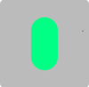
9. Definimos la variable para el pulgar de nombre `thumbWidth`:
```js
  const thumbWidth = palmWidth / 2;
```
10. Dibujamos el pulgar:
```js
  draw.line(ctx, x, top + radius, x - radius, y, {
    lineWidth: thumbWidth,
    lineCap: 'round',
    strokeStyle: color.normal(hue),
  }); // Dibujo el pulgar
```
* Este es el guante con el pulgar:  

11. Vamos a añadir la manga del guante, el nombre correcto debería
ser `mitten` o _mitón_ en vez de `glove`:
```js
  const sleeveWidth = palmWidth * 1.1;
  ...
  draw.line(ctx, x, top, x, top + radius, {
    lineWidth: sleeveWidth,
    lineCap: 'butt',
    strokeStyle: color.lightest(hue),
  }); // Dibujo la manga
```
* Este es el mitón con la manga:  


## 13. Día décimo con **`10-candy.js`**

1. En la función `setInit()` del archivo **`script.js`**, 
adicionamos la función para la posición `[10]`:
```js
  drawItemFunctions[10] = drawCandy; // Asigno la función drawCandy al array
```
2. Creamos en la carpeta **"items"** el archivo **`10-candy.js`**,
con al menos esta función:
```js
function drawCandy(ctx, x, y, size, hue) {}

export default drawCandy;
```
3. Importamos en **`script.js`**, esta nueva función:
```js
import drawCandy from './items/10-candy.js'; // Importo la función drawCandy
```
4. Definimos las constantes para el `top`, `left`, `right`, y
`bottom` en **`10-candy.js`**:
```js
function drawCandy(ctx, x, y, size, hue) {
  const top = y - size / 2; // Defino la parte superior del dulce
  const left = x - size / 2; // Defino la parte superior del dulce
  const right = x + size / 2; // Defino la parte derecha del dulce
  const bottom = y + size / 2; // Defino la parte inferior del dulce
}
```
5. Importo la utilidad **`color.js`** en **`10-candy.js`**:
```js
import color from '../utils/color.js'; // Importo la función color
```
6. Creamos el objeto `ball`:
```js
  const ball = { // Defino la bola de caramelo
    x,
    y,
    radius: size / 4,
    color: color.normal(hue),
  }
```
7. Importamos en **`10-candy.js`**, la utilidad `draw`:
```js
import draw from '../utils/draw.js'; // Importo la función draw
```
8. Dibujamos un círculo dentro del método `drawCandy()`:
```js
  draw.circle(ctx, ball.x, ball.y, ball.radius, {
    fillStyle: ball.color,
  }); // Dibujo la bola de caramelo
```
* Empieza la primera forma de la bola del caramelo o dulce:  

9. Agregamos un patrón de _stripes_ o rayas similar al bastón del
 día cuarto, añadimos debajo del `draw.circle()`:
```js
  ctx.beginPath(); // Comienzo el trazo
  ctx.moveTo(top, left); // Muevo el trazo a la esquina superior izquierda
  ctx.lineTo(bottom, right); // Dibujo una línea hasta la esquina superior derecha
  ctx.strokeStyle = color.lightest(hue); // Establezco el color del trazo
  ctx.stroke(); // Dibujo el trazo
```
* Vemos la bola de dulce y una diagonal:  

10. Antes del `ctx.stroke()`, agregamos este cambio:
```js
  ctx.beginPath(); // Comienzo el trazo
  ctx.moveTo(top, left); // Muevo el trazo a la esquina superior izquierda
  ctx.lineTo(bottom, right); // Dibujo una línea hasta la esquina superior derecha
  ctx.strokeStyle = color.lightest(hue); // Establezco el color del trazo
  ctx.lineWidth = size; // Establezco el ancho del trazo
  const stripeWidth = size * 0.05; // Defino el ancho de la franja
  ctx.setLineDash([stripeWidth, stripeWidth]); // Establezco el patrón de la línea discontinua
  ctx.stroke(); // Dibujo el trazo
```
* Esto es con varias rayas en diagonal:  
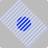
11. Vamos a limitar las rayas o _stripes_ a la bola de dulce,
añadimos esto justo después de `draw.circle()` y antes de 
empezar el trazo:
```js
  ctx.save(); // Guardo el contexto
  ctx.clip(); // Establezco la bola de caramelo como la región de recorte
```
* Estas son las rayas limitadas a la bola de caramelo:  

12. Agregamos un par de triángulos empezando por el de arriba
 en el archivo **`10-candy.js`**, debajo de `ctx.stroke()`, 
 adicional definimos mas elementos en el objeto `ball`:
```js
  const ball = {
    ...
    get top() {
      return y - this.radius;
    },
    get bottom() { return y + this.radius; },
    ...,
  };

  draw.circle(ctx, ball.x, ball.y, ball.radius, {
    fillStyle: ball.color,
  }); 
  ...
  ctx.restore(); // Restauro el contexto

  ctx.beginPath(); // Comienzo el trazo
  ctx.moveTo(x, ball.top); // Muevo el trazo a la esquina superior derecha
  ctx.arc(x, ball.top, ball.radius, (5 * Math.PI) / 4, (7 * Math.PI) / 4); // Dibujo un arco de 180 grados
  ctx.fill(); // Relleno el arco
```
* Este es el _candy_ con el primer triángulo arriba:  

13. Duplicamos lo último y le hacemos unos cambios:
```js
  ctx.beginPath(); // Comienzo el trazo
  ctx.moveTo(x, ball.bottom); // Muevo el trazo a la esquina superior derecha
  ctx.arc(x, ball.bottom, ball.radius, Math.PI / 4, (3 * Math.PI) / 4); // Dibujo un arco de 180 grados
  ctx.fill(); // Relleno el arco
```
* Este es el dulce con los dos triángulos:  


## 14. Día undécimo con **`11-snowFlake.js`**

1. En la función `setInit()` del archivo **`script.js`**, 
adicionamos la función para la posición `[11]`:
```js
  drawItemFunctions[11] = drawSnowFlake; // Asigno la función drawSnowFlake al array
```
2. Creamos en la carpeta **"items"** el archivo **`11-snowFlake.js`**,
con al menos esta función:
```js
function drawSnowFlake(ctx, x, y, size, hue) {}

export default drawSnowFlake;
```
3. Importamos en **`script.js`**, esta nueva función:
```js
import drawSnowFlake from './items/11-snowFlake.js'; // Importo la función drawSnowFlake
```
4. Definimos las constantes para el `top`, `left`, `right`, y
`bottom` en **`11-snowFlake.js`**:
```js
function drawSnowFlake(ctx, x, y, size, hue) {
  const top = y - size / 2; // Defino la parte superior del copo de nieve
  const left = x - size / 2; // Defino la parte superior del copo de nieve
  const right = x + size / 2; // Defino la parte derecha del copo de nieve
  const bottom = y + size / 2; // Defino la parte inferior del copo de nieve
}
```
5. Importo la utilidad **`color.js`** en **`11-snowFlake.js`**:
```js
import color from '../utils/color.js'; // Importo la función color
```
6. Importamos en **`11-snowFlake.js`**, la utilidad `draw`:
```js
import draw from '../utils/draw.js'; // Importo la función draw
```
7. Empiezo a dibujar una línea:
```js
  ctx.lineWidth = size * 0.05; // Establezco el ancho de la línea
  draw.line(ctx, x, y, x + size * 0.5, y, { strokeStyle: color.lightest(hue) }); // Dibujo una línea horizontal
```
* Esta es la primera línea:  

8. Vamos con otra línea en el método `drawSnowFlake()`:
```js
  draw.line(ctx, x + size * 0.3, y, x + size * 0.4, y + size * 0.15, {
    strokeStyle: color.lightest(hue),
  }); // Dibujo una línea diagonal
```
* La segunda línea es esta:  

9. Duplicamos la anterior hacia arriba:
```js
  draw.line(ctx, x + size * 0.3, y, x + size * 0.4, y - size * 0.15, {
    strokeStyle: color.lightest(hue),
  }); // Dibujo otra línea diagonal
```
10. Encerramos entre una función de nombre `drawBranch`, las tres
`draw.line()`:
```js
  function drawBranch(ctx,x, y, size) {
    draw.line(ctx, x, y, x + size * 0.5, y, {
      strokeStyle: color.lightest(hue),
    }); // Dibujo una línea horizontal
    draw.line(ctx, x + size * 0.3, y, x + size * 0.4, y + size * 0.15, {
      strokeStyle: color.lightest(hue),
    }); // Dibujo una línea diagonal
    draw.line(ctx, x + size * 0.3, y, x + size * 0.4, y - size * 0.15, {
      strokeStyle: color.lightest(hue),
    }); // Dibujo otra línea diagonal
  }
```
11. Añadimos antes de la función `drawBranch()`
un elemento `ctx.traslate()` en el método `drawSnowFlake()`, del
archivo **`11-snowFlake.js`**:
```js
  ctx.translate(x, y); // Traslado el origen al centro
```
12. Empezamos debajo de este `ctx.traslate()` un ciclo `for`:
```js
  for (let i = 0; i < 6; i++) {
    drawBranch(ctx, 0, 0, size); // Dibujo una rama
    ctx.rotate(Math.PI / 3); // Roto el canvas 60 grados
  }
```
* Así se ve finalmente el copo de nieve o `snowFlake`:  

13. Para evitar repetir en **`11-snowFlake.js`** al momento de 
llamar la utilidad `draw.line()` el 
`{strokeStyle: color.lightest(hue),}`, justo debajo de 
`ctx.lineWidth = size * 0.05`, añadimos esto:
```js
  ctx.strokeStyle = color.lightest(hue); // Establezco el color de la línea
```
14. Luego borro los objetos entre llaves `{}` de `draw.line()`.
15. Es buena idea antes de `ctx.translate(x, y);` guardar el
contexto:
```js
  ctx.save(); // Guardo el contexto
```
16. Al final del ciclo `for` restauro el contexto:
```js
  ctx.restore(); // Restauro el contexto
```
17. Quitamos las variables definidas en el paso 4.

## 15. Día duodécimo con **`12-sledge.js`**

1. En la función `setInit()` del archivo **`script.js`**, 
adicionamos la función para la posición `[12]`:
```js
  drawItemFunctions[12] = drawSledge; // Asigno la función drawSledge al array
```
2. Creamos en la carpeta **"items"** el archivo **`12-sledge.js`**,
con al menos esta función:
```js
function drawSledge(ctx, x, y, size, hue) {}

export default drawSledge;
```
3. Importamos en **`script.js`**, esta nueva función:
```js
import drawSledge from './items/12-sledge.js'; // Importo la función drawSledge
```
4. Definimos las constantes para el `top`, `left`, `right`,
`bottom` y trazo un rectángulo en **`12-sledge.js`**:
```js
function drawSledge(ctx, x, y, size, hue) {
  const top = y - size / 2; // Defino la parte superior del trineo
  const left = x - size / 2; // Defino la parte superior del trineo
  const right = x + size / 2; // Defino la parte derecha del trineo
  const bottom = y + size / 2; // Defino la parte inferior del trineo
  ctx.strokeRect(left, top, size, size); // Dibujo un rectángulo
}
```
5. Importo la utilidad **`color.js`** en **`12-sledge.js`**:
```js
import color from '../utils/color.js'; // Importo la función color
```
6. Definimos las constantes para `height`, `base` y `arc`:
```js
  const height = size * 0.25; // Defino la altura
  const base = {
    thickness: size * 0.1, // Defino el grosor de la base
    bottom: y + height / 2, // Defino la parte inferior de la base
  }
  const arc = {
    radius: height * 0.4, // Defino el radio del arco
    get x() { return right - this.radius }, // Defino la posición x del arco
    get y() { return base.bottom - this.radius }, // Defino la posición y del arco
```
7. Empezamos con los trazos en el archivo **`12-sledge.js`**:
```js
  ctx.beginPath(); // Comienzo el trazado
  ctx.strokeStyle = color.normal(hue); // Establezco el color de la línea
  ctx.lineWidth = base.thickness; // Establezco el ancho de la línea
  ctx.arc(arc.x, arc.y, arc.radius, -Math.PI / 2, Math.PI / 2); // Dibujo un arco
  ctx.stroke(); // Realizo el trazado

  ctx.closePath(); // Finalizo el trazado
```
* Así se ve el primer arco del trineo o `sledge`:  
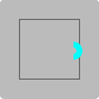
8. Ajustamoe en el objeto `arc`, la posición de `x`:
```js
  const arc = {
    ...
    get x() {
      return right - this.radius - base.thickness / 2;
    }, // Defino la posición x del arco
    ...
  };
```
9. Empezamos la base del trineo:
```js
  ctx.lineTo(left, base.bottom); // Dibujo una línea
```
* Este ya es el trineo con la curva y la base:  
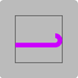
10. Añadimos el objeto `leg` o _pata_:
```js
  const leg = {
    bottom: base.bottom, // Defino la parte inferior de la pata
    top: base.bottom - height, // Defino la parte superior de la pata
    thickness: base.thickness * 0.5, // Defino el grosor de la pata
  };
```
11. Dentro del método `drawSledge()`, usamos el objeto `leg`, 
cambiando la posición `x` creamos dos objetos:
```js
  const leftLeg = {
    ...leg, // Copio las propiedades de la pata
    x: left + size * 0.2,
  }; // Defino la pata izquierda
  const rightLeg = {
    ...leg, // Copio las propiedades de la pata
    x: right - size * 0.4,
  }; // Defino la pata derecha
```
12. Importamos en **`12-sledge.js`**, la utilidad `draw`:
```js
import draw from '../utils/draw.js'; // Importo la función draw
```
13. Dibujamos las dos patas del trineo:
```js
  ctx.lineWidth = leg.thickness; // Establezco el ancho de la línea
  ctx.strokeStyle = color.light(hue); // Establezco el color de la línea
  draw.line(ctx, leftLeg.x, leftLeg.bottom, leftLeg.x, leftLeg.top); // Dibujo una línea
  draw.line(ctx, rightLeg.x, rightLeg.bottom, rightLeg.x, rightLeg.top); // Dibujo una línea
```
* Este es el `sledge` o trineo con las dos patas o `leg`:  
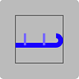
14. Agregamos el objeto `bench` o _banco_:
```js
  const bench = {
    y: leg.top, // Defino la parte superior del banco
    left,
    right: rightLeg.x + size * 0.2, // Defino la parte inferior del banco
  };
```
15. Dibujamos las líneas con base en el objeto `bench`:
```js
  draw.line(ctx, bench.left, bench.y, bench.right, bench.y); // Dibujo una línea
```
* Así es el trineo con el banco:  
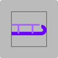
16. Oculto lo no requerido del paso 4.

## 16. Día decimotercero con **`13-tree.js`**

1. En la función `setInit()` del archivo **`script.js`**, 
adicionamos la función para la posición `[13]`:
```js
  drawItemFunctions[13] = drawTree; // Asigno la función drawTree al array
```
2. Creamos en la carpeta **"items"** el archivo **`13-tree.js`**,
con al menos esta función:
```js
function drawTree(ctx, x, y, size, hue) {}

export default drawTree;
```
3. Importamos en **`script.js`**, esta nueva función:
```js
import drawTree from './items/13-tree.js'; // Importo la función drawTree
```
4. Definimos las constantes para el `top`, `left`, `right`,
`bottom` y trazo un rectángulo en **`13-tree.js`**:
```js
function drawTree(ctx, x, y, size, hue) {
  const top = y - size / 2; // Defino la parte superior del árbol
  const left = x - size / 2; // Defino la parte superior del árbol
  const right = x + size / 2; // Defino la parte derecha del árbol
  const bottom = y + size / 2; // Defino la parte inferior del árbol
  ctx.strokeRect(left, top, size, size); // Dibujo un rectángulo
}
```
5. Importo la utilidad **`color.js`** en **`13-tree.js`**:
```js
import color from '../utils/color.js'; // Importo la función color
```
6. Empezamos con el tronco del árbol, estas serían la constante:
```js
  const trunkWidth = size * 0.1; // Defino el ancho del tronco
```
7. Importamos en **`13-tree.js`**, la utilidad `draw`:
```js
import draw from '../utils/draw.js'; // Importo la función draw
```
8. Definimos de `ctx` el `lineWidth` y `strokeStyle`:
```js
  ctx.lineWidth = trunkWidth; // Establezco el ancho de la línea
  ctx.strokeStyle = color.darkest(hue); // Establezco el color de la línea
  draw.line(ctx, x, bottom, x, y); // Dibujo una línea
```
9. Opto por poner solo el `draw.line()` con los parámetros en un
objeto y borro lo del paso 7:
```js
  draw.line(ctx, x, bottom, x, y, {
    lineWidth: trunkWidth,
    strokeStyle: color.darkest(hue),
  }); // Dibujo una línea
```
* Este es el tronco del árbol:  

10. Defino la constante `block`:
```js
  const block = {
    // Defino el bloque
    bottom: bottom - size * 0.2, // Defino la parte inferior del bloque
    top: bottom - size * 0.5, // Defino la parte superior del bloque
    width: size * 0.8, // Defino el ancho del bloque
    get left() {
      return x - this.width / 2;
    },
    get right() {
      return x + this.width / 2;
    },
    color: color.normal(hue),
  };
```
11. Vamos a dibujar el `block`:
```js
  ctx.fillStyle = block.color; // Establezco el color de relleno
  ctx.beginPath(); // Comienzo el trazado
  ctx.moveTo(block.left, block.bottom); // Muevo el trazado
  ctx.lineTo(block.right, block.bottom); // Dibujo una línea
  ctx.lineTo(x, block.top); // Dibujo una línea
  ctx.fill(); // Relleno el trazado
```
* Este es el primer bloque:  
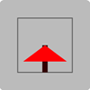
12. Lo que acabamos de hacer el la `base`, seguimos con el del
medio o `middle`:
```js
// middle
  block.bottom = bottom - size * 0.4; // Defino la parte inferior del bloque
  block.top = block.bottom - size * 0.3; // Defino la parte superior del bloque
  block.width = size * 0.6; // Defino el ancho del bloque

  ctx.beginPath(); // Comienzo el trazado
  ctx.moveTo(block.left, block.bottom); // Muevo el trazado
  ctx.lineTo(block.right, block.bottom); // Dibujo una línea
  ctx.lineTo(x, block.top); // Dibujo una línea
  ctx.fill(); // Relleno el trazado
```
* Bloque del medio se ve así:  
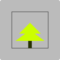
13. Vamos a completar el último bloque de arriba:
```js
    // top
    block.bottom = bottom - size * 0.6; // Defino la parte inferior del bloque
    block.top = top; // Defino la parte superior del bloque
    block.width = size * 0.4; // Defino el ancho del bloque

    ctx.beginPath(); // Comienzo el trazado
    ctx.moveTo(block.left, block.bottom); // Muevo el trazado
    ctx.lineTo(block.right, block.bottom); // Dibujo una línea
    ctx.lineTo(x, block.top); // Dibujo una línea
    ctx.fill(); // Relleno el trazado
```
* Este es el bonito árbol con las tres capas o `block`:  
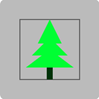
14. Elimino o comento lo no requerido del paso 4.
* Este es el árbol sin el marco o recuadro:  
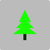

## 17. Día decimocuarto con **`14-hat.js`**

1. En la función `setInit()` del archivo **`script.js`**, 
adicionamos la función para la posición `[14]`:
```js
  drawItemFunctions[14] = drawHat; // Asigno la función drawHat al array
```
2. Creamos en la carpeta **"items"** el archivo **`14-hat.js`**,
con al menos esta función:
```js
function drawHat(ctx, x, y, size, hue) {}

export default drawHat;
```
3. Importamos en **`script.js`**, esta nueva función:
```js
import drawHat from './items/14-hat.js'; // Importo la función drawHat
```
4. Definimos las constantes para el `top`, `left`, `right`,
`bottom` y trazo un rectángulo en **`14-hat.js`**:
```js
function drawHat(ctx, x, y, size, hue) {
  const top = y - size / 2; // Defino la parte superior del gorro
  const left = x - size / 2; // Defino la parte superior del gorro
  const right = x + size / 2; // Defino la parte derecha del gorro
  const bottom = y + size / 2; // Defino la parte inferior del gorro
  ctx.strokeRect(left, top, size, size); // Dibujo un rectángulo
}
```
5. Importo la utilidad **`color.js`** en **`14-hat.js`**:
```js
import color from '../utils/color.js'; // Importo la función color
```
6. Empezamos definiendo las constantes a usar con el sombrero:
```js
  const width = size * 0.8; // Defino el ancho
  const xRadius = width / 2; // Defino el radio x del arco
  const yRadius = size ; // Defino el radio y del arco
```
7. Empezamos el dibujo:
```js
  ctx.beginPath(); // Comienzo el trazado
  ctx.fillStyle = color.normal(hue); // Establezco el color de relleno
  ctx.ellipse(x, bottom, xRadius, yRadius, 0, Math.PI, Math.PI * 2); // Dibujo un arco
  ctx.fill(); // Relleno el trazado

  ctx.closePath(); // Cierro el trazado
```
* Esta es la primera parte del gorro:  
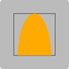
8. Antes de la constante `width`, definimos datos de la `ball`:
```js
  const ball = {
    radius: size * 0.1,
    x: x,
    get y(){
      return top + this.radius;
    },
    color: color.lightest(hue),
  }
```
9. Reusamos los datos de la `ball`, para alterar el valor de
`yRadius`:
```js
  const yRadius = size - ball.radius * 2; // Defino el radio y del arco
```
10. Importamos en **`14-hat.js`**, la utilidad `draw`:
```js
import draw from '../utils/draw.js'; // Importo la función draw
```
11. Completamos la bola de la punta del gorro o sombrero:
```js
  draw.circle(ctx, ball.x, ball.y, ball.radius, {
    fillStyle: ball.color,
  }); // Dibujo un círculo
```
* Este es el gorro con la bola:  

12. Definimos y dibujamos el `sleeve`:
```js
  const sleeve = {
    // Defino la manga
    width,
    height: size * 0.2,
    get y(){return bottom - this.height / 2},
    get left(){return x - this.width / 2},
    get right(){return x + this.width / 2},
    color: color.lightest(hue),
  };
  draw.line(ctx, sleeve.left, sleeve.y, sleeve.right, sleeve.y, {
    lineWidth: sleeve.height,
    strokeStyle: sleeve.color,
    lineCap: 'round',
  }); // Dibujo una línea 
```
* Este es el gorro completo:  
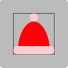
13. Borramos los elementos no requeridos del paso 4.

## 18. Día decimoquinto con **`15-calendar.js`**

1. En la función `setInit()` del archivo **`script.js`**, 
adicionamos la función para la posición `[15]`:
```js
  drawItemFunctions[15] = drawCalendar; // Asigno la función drawCalendar al array
```
2. Creamos en la carpeta **"items"** el archivo **`15-calendar.js`**,
con al menos esta función:
```js
function drawCalendar(ctx, x, y, size, hue) {}

export default drawCalendar;
```
3. Importamos en **`script.js`**, esta nueva función:
```js
import drawCalendar from './items/15-calendar.js'; // Importo la función drawCalendar
```
4. Definimos las constantes para el `top`, `left`, `right`,
`bottom` y trazo un rectángulo en **`15-calendar.js`**:
```js
function drawCalendar(ctx, x, y, size, hue) {
  const top = y - size / 2; // Defino la parte superior del calendario
  const left = x - size / 2; // Defino la parte superior del calendario
  const right = x + size / 2; // Defino la parte derecha del calendario
  const bottom = y + size / 2; // Defino la parte inferior del calendario
  ctx.strokeRect(left, top, size, size); // Dibujo un rectángulo
}
```
5. Importo la utilidad **`color.js`** en **`15-calendar.js`**:
```js
import color from '../utils/color.js'; // Importo la función color
```
6. Definimos las constantes a utilizar en el método 
`drawCalendar()` y empezamos el dibujo:
```js
  const roudness = size * 0.1; // Defino la redondez
  ctx.beginPath(); // Comienzo el trazado
  ctx.fillStyle = color.lightest(hue); // Establezco el color de relleno  
  ctx.roundRect(left, top, size, size, roudness); // Dibujo un rectángulo redondeado
  ctx.fill(); // Relleno el trazado

  ctx.closePath(); // Cierro el trazado
```
7. Oculto el marco inicial de punto 4.
* Esto lo que se ve del calendario hasta el momento:  

8. Agregamos el encabezado y lo dibujamos, antes del 
`ctx.closePath()`:
```js
  const headerHeight = size * 0.3; // Defino la altura del encabezado
  ctx.fillStyle = color.dark(hue); // Establezco el color de relleno
  ctx.fillRect(left, top, size, headerHeight); // Dibujo un rectángulo
```
* Así luce el calendario hasta el momento:  
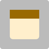
9. Para q las puntas de la parte superior del calendario se 
vean redondeadas, agregamos el llamado a la función
`ctx.clip()`, justo antes de la definición del `headerHeight`:
```js
  ctx.clip(); // Establezco la región de recorte para redondear el trazado arriba
```
* Calendario con las puntas redondeadas del encabezado:  

10. Importamos en **`15-calendar.js`**, la utilidad `draw`:
```js
import draw from '../utils/draw.js'; // Importo la función draw
```
11. Agregamos un _hueco_ en el encabezado, el color que sugieren
es el mas claro, pero yo utilizaré el `'#BBB'`, que está en el 
`background-color` del `canvas`( Paso 11 de 
[Los tres archivos básicos](#1-los-tres-archivos-básicos) ):
```js
  const hole = {
    x,
    y: top + headerHeight / 2,
    radius: headerHeight / 3,
    // color: color.lightest(hue),
    color: '#BBB',
  };
  draw.circle(ctx, hole.x, hole.y, hole.radius, {
    fillStyle: hole.color,
  }); // Dibujo un círculo
```
* Así se ve el calendario con el hueco en el encabezado:  

12. En el objeto `hole` cambiamos el atributo `x` por `xs` e
implemantamos un conjunto de valores:
```js
  const hole = {
    xs: [x - headerHeight, x, x + headerHeight],
    y: top + headerHeight / 2,
    radius: headerHeight / 3,
    // color: color.lightest(hue),
    color: '#BBB',
  };
```
13. Antes del `draw.circle()`, añadimos un `forEach`:
```js
  hole.xs.forEach((x) => {
    draw.circle(ctx, x, hole.y, hole.radius, {
      fillStyle: hole.color,
    }); // Dibujo un círculo
  }); // Dibujo varios círculos
```
* El Calendario con los tres huecos:  

14. Antes de la constante `hole` un elemento de `ctx`, que vuelve 
transparente el color de los huecos, es decir, dejo el color
previo:
```js
  ctx.globalCompositeOperation = 'destination-out'; // Establezco la operación de composición
  const hole = {
    ...
    color: color.lightest(hue),
    // color: '#BBB',
  };
```
15. En el método 
`drawCalendar()` y antes del proceso `ctx.clip()`, guardamos
el contexto y lo restauramos luego del `forEach()`:
```js
  ctx.save(); // Guardo el estado del contexto
  ctx.clip(); // Establezco la región de recorte para redondear el trazado arriba
  ...
  hole.xs.forEach((x) => {
    ...
  }); // Dibujo varios círculos

  ctx.restore(); // Restauro el estado del contexto
```
16. Definimos un objeto de nombre `text` debajo del `ctx.restore()`:
```js
  const text = {
    size : size * 0.5,
    x,
    y: y + headerHeight / 2,
  }
```
17. Dibujamos el texto:
```js
  ctx.beginPath(); // Comienzo el trazado
  ctx.fillStyle = color.dark(hue); // Establezco el color de relleno
  ctx.font = `${text.size}px Arial`; // Establezco el tamaño y tipo de fuente
  ctx.textAlign = 'center'; // Establezco la alineación horizontal
  ctx.textBaseline = 'middle'; // Establezco la alineación vertical
  ctx.fillText('15', text.x, text.y); // Dibujo el texto
  ctx.closePath(); // Cierro el trazado
```
* Este es nuestro calendario con el texto del día `15`:  

18. Para que el texto del día se vea mas grueso añadimos `bold`:
```js
  ctx.font = `bold ${text.size}px Arial`; // Establezco el tamaño y tipo de fuente
```
19. Cambiamos el valor de `15`, por la variable `day` y la ponemos
como parámetro al inicio del método `drawCalendar()`:
```js
function drawCalendar(ctx, x, y, size, hue, day = 15) {
  ...
  ctx.fillText(day, text.x, text.y); // Dibujo el texto
  ctx.closePath(); // Cierro el trazado
}
```
* Ya el calendario al final:  

20. Borramos u ocultamos las constantes del paso 4, no requeridas.

## 19. Día decimosexto con **`16-present.js`**

1. En la función `setInit()` del archivo **`script.js`**, 
adicionamos la función para la posición `[16]`:
```js
  drawItemFunctions[16] = drawPresent; // Asigno la función drawPresent al array
```
2. Creamos en la carpeta **"items"** el archivo **`16-present.js`**,
con al menos esta función:
```js
function drawPresent(ctx, x, y, size, hue) {}

export default drawPresent;
```
3. Importamos en **`script.js`**, esta nueva función:
```js
import drawPresent from './items/16-present.js'; // Importo la función drawPresent
```
4. Definimos las constantes para el `top`, `left`, `right`,
`bottom` y trazo un rectángulo en **`16-present.js`**:
```js
function drawPresent(ctx, x, y, size, hue) {
  const top = y - size / 2; // Defino la parte superior del regalo
  const left = x - size / 2; // Defino la parte superior del regalo
  const right = x + size / 2; // Defino la parte derecha del regalo
  const bottom = y + size / 2; // Defino la parte inferior del regalo
  ctx.strokeRect(left, top, size, size); // Dibujo un rectángulo
}
```
5. Importo la utilidad **`color.js`** en **`16-present.js`**:
```js
import color from '../utils/color.js'; // Importo la función color
```
6. Creamos el objeto `box`:
```js
  const box ={
    width: size * 0.8,
    height: size * 0.9,
    x,
    bottom,
    get top() {
      return this.bottom - this.height;
    },
    color: color.dark(hue),
  }
```
7. Importamos en **`16-present.js`**, la utilidad `draw`:
```js
import draw from '../utils/draw.js'; // Importo la función draw
```
8. Empezamos a dibujar una línea:
```js
  draw.line(ctx, box.x , box.top, box.x , box.bottom, {
    lineWidth: box.width,
    strokeStyle: box.color,
  });
```
* Esta es la base de la caja para el regalo:  
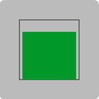
9. Añadimos decoraciones y una cinta o cuerda en el medio:
```js
  const ropeWidth = size * 0.1; //  Defino el ancho de la cuerda
  draw.line(ctx, box.x, box.top, box.x, box.bottom, {
    lineWidth: ropeWidth,
    strokeStyle: color.normal(hue),
  });
```
* Este es el regalo con la cinta vertical:  

10. Añadimos a la utilidad **`color.js`**, otro método de nombre
`reverse`, para hacer un color opuesto o negativo del `hue`:
```js
color.reverse = (hue) => (hue + 180) % 360;
```
11. De regreso a **`16-present.js`**, añadimos en el objeto
`ropeWidth` al `color.normal()` el `color.reverse()`:
```js
    strokeStyle: color.normal(color.reverse(hue)),
```
* Este es el regalo con la cinta en un color opuesto:  

12. Definimos la tapa de nombre `lid` y la dibujamos:
```js
  const lid = {
    height: size * 0.2,
    width: size,
    x,
    top: box.top,
    get bottom() {
      return this.top + this.height;
    },
    color: color.light(hue),
  };
  draw.line(ctx, lid.x, lid.top, lid.x, lid.bottom, {
    lineWidth: lid.width,
    strokeStyle: lid.color,
  });
```
* Regalo con cinta vertical y la tapa arriba:  
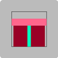
13. Importamos en **`16-present.js`**, el método 
`drawBow()`, que está en el archivo **`05-bow.js`**:
```js
import drawBow from './05-bow.js'; // Importo la función drawBow
```
14. En el archivo **`16-present.js`**, usamos este método:
```js
  drawBow(ctx, lid.x, lid.top, lid.width * 0.8, color.reverse(hue)); // Dibujo el lazo
```
* Ya el regalo con el lazo o moño encima:  

15. Cambio la posición del `drawBow()`, justo debajo de la 
definicón dle objeto `lid`.
* El solo moño encima de la tapa del regalo:  

16. Borramos u ocultamos los elementos no requeridos del paso 4.

## 20. Día decimoséptimo con **`17-cookie.js`**

1. En la función `setInit()` del archivo **`script.js`**, 
adicionamos la función para la posición `[17]`:
```js
  drawItemFunctions[17] = drawCookie; // Asigno la función drawCookie al array
```
2. Creamos en la carpeta **"items"** el archivo **`17-cookie.js`**,
con al menos esta función:
```js
function drawCookie(ctx, x, y, size, hue) {}

export default drawCookie;
```
3. Importamos en **`script.js`**, esta nueva función:
```js
import drawCookie from './items/17-cookie.js'; // Importo la función drawCookie
```
4. Definimos las constantes para el `top`, `left`, `right`,
`bottom` y trazo un rectángulo en **`17-cookie.js`**:
```js
function drawCookie(ctx, x, y, size, hue) {
  const top = y - size / 2; // Defino la parte superior del galleta
  const left = x - size / 2; // Defino la parte superior del galleta
  const right = x + size / 2; // Defino la parte derecha del galleta
  const bottom = y + size / 2; // Defino la parte inferior del galleta
  ctx.strokeRect(left, top, size, size); // Dibujo un rectángulo
}
```
5. Importo la utilidad **`color.js`** en **`17-cookie.js`**:
```js
import color from '../utils/color.js'; // Importo la función color
```
6. Defino la constante `radius`:
```js
  const radius = size / 4; // Defino el radio
```
7. Importamos en **`17-cookie.js`**, la utilidad `draw`:
```js
import draw from '../utils/draw.js'; // Importo la función draw
```
8. Dibujo un círculo con `draw.circle()`:
```js
  draw.circle(ctx, x, y , radius, {
    lineWidth: radius,
    strokeStyle: color.dark(hue),
  });
```
* La primer parte de la galleta, luce como una dona:  

9. Cambio al momento de `draw.circle()`, en vez de 
`lineWidth: radius,`, pongo `lineWidth: radius * 2,`.
10. Defino dos constantes mas:
```js
  const length = 2 * Math.PI * radius; // Defino la longitud
  const dashLength = length / 6; // Defino la longitud del guión
```
11. Configuro y dibujo las linea lineas punteadas:
```js
  ctx.setLineDash([0, dashLength]); // Establezco la longitud del guión
```
* No se ve la galleta en pantalla
12. Agrego otro parámetro al `draw.circle()`:
```js
  draw.circle(ctx, x, y, radius, {
    ...
    lineCap: 'round',
  });
```
* Este sería un mejor modelo de la galleta:  

13. Vamos a decorarla y para empezar importamos el método
`drawSnowFlake()` dentro de **`17-cookie.js`**:
```js
import drawSnowflake from './11-snowflake.js'; // Importo la función drawSnowflake
```
14. Llamamos otra función `ctx.setLineDash()` debajo de 
`draw.circle()`, y luego invocamos el `drawSnowFlake()`:
```js
  drawSnowflake(ctx, x, y, size * 0.8, hue); // Dibujo un copo de nieve
```
* Esta es la galleta con el adorno en el medio:  

15. El instructor sugiere usar entes del `drawSnowFlake()`, al
`ctx`, ponerle un filtro, pero no lo requerimos dado que 
nuestro _copo de nieve_, ya esta en estado muy claro.
```js
  // ctx.filter = 'blur(1px)'; // Aplico un filtro de desenfoque
  // ctx.filter = 'brightness(1)'; // Aplico un filtro de brillo
```
16. Otro filtro para que se vea blanco del todo:
```js
  ctx.filter = 'grayscale(1)'; // Aplico un filtro de escala de grises
```
17. Llegó la hora de borrar u ocultar los elementos no requeridos 
del paso 4.
* Esta es la galleta definitiva:  


## 21. Día decimoctavo con **`18-globe.js`**

1. En la función `setInit()` del archivo **`script.js`**, 
adicionamos la función para la posición `[18]`:
```js
  drawItemFunctions[18] = drawGlobe; // Asigno la función drawGlobe al array
```
2. Creamos en la carpeta **"items"** el archivo **`18-globe.js`**,
con al menos esta función:
```js
function drawGlobe(ctx, x, y, size, hue) {}

export default drawGlobe;
```
3. Importamos en **`script.js`**, esta nueva función:
```js
import drawGlobe from './items/18-globe.js'; // Importo la función drawGlobe
```
4. Definimos las constantes para el `top`, `left`, `right`,
`bottom` y trazo un rectángulo en **`18-globe.js`**:
```js
function drawGlobe(ctx, x, y, size, hue) {
  const top = y - size / 2; // Defino la parte superior del globo
  const left = x - size / 2; // Defino la parte superior del globo
  const right = x + size / 2; // Defino la parte derecha del globo
  const bottom = y + size / 2; // Defino la parte inferior del globo
  ctx.strokeRect(left, top, size, size); // Dibujo un rectángulo
}
```
5. Importo la utilidad **`color.js`** en **`18-globe.js`**:
```js
import color from '../utils/color.js'; // Importo la función color
```
6. Definimos el objeto `ball`:
```js
  const ball = {
    radius: size * 0.45, // Defino el radio
    x,
    get y() {
      return top + this.radius;
    },
    color: 'rgba( 255, 255, 255, 0.3', // Defino el color a `white`
  }
```
7. Importamos en **`18-globe.js`**, la utilidad `draw`:
```js
import draw from '../utils/draw.js'; // Importo la función draw
```
8. Dibujamos un círculo:
```js
  draw.circle(ctx, ball.x, ball.y, ball.radius, {
    fillStyle: ball.color,
  });
```
* Este es nuestra bola inicial:  

9. Creamos el objeto `base`:
```js
  const base = {
    height: size * 0.2,
    width: size * 0.6,
    get y() {
      return bottom - base.height / 2;
    },
    get left () {
      return x - base.width / 2;
    },
    get right () {
      return x + base.width / 2;
    },
    color: color.dark(hue), // Defino el color
  };
```
10. Dibujamos una línea:
```js
  draw.line(ctx, base.left, base.y, base.right, base.y, {
    strokeStyle: base.color,
    lineWidth: base.height,
    lineCap: 'round',
  });
```
* Este el el Globo de nieve hasta el momento:  
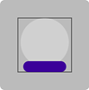
11. Reducimos el tamaño de `height` dentro del la `base` a
`0.15`.
11. Defino el objeto `tree`, justo debajo de `ball` y antes
de `draw.circle()`:
```js
  const tree = {
    size: ball.radius * 1.2,
    x,
    y: ball.y,
    hue: color.reverse(hue), // Defino el color
  };
```
12. Importo el método `drawTree()` dentro del **`18-globe.js`**:
```js
import drawTree from './13-tree.js'; // Importo la función drawTree
```
13. Invoco este método debajo de la definición del objeto `tree`:
```js
  drawTree(ctx, tree.x, tree.y, tree.size, tree.hue); // Llamo la función drawTree
```
* Este el globo de nieve con el árbol adentro:  

14. Antes del objeto `tree` y debajo del `ball` defino la
nieve o `// snow`:
```js
  // snow
  ctx.fillStyle = 'white'; // Defino el color a `white`
  ctx.beginPath(); // Comienzo el trazado
  ctx.arc(ball.x, ball.y, ball.radius, 0.3, Math.PI - 0.3); // Dibujo un círculo  
  ctx.fill(); // Relleno el trazado
```
* Esta es el globo, con el árbol y algo de nieve abajo:  
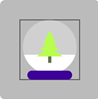
15. Cambio uno de los parámetros del `ctx.arc()` de `0.3` a
`0.5`, para q se vea algo inclinada la nieve:
```js
  ctx.arc(ball.x, ball.y, ball.radius, 0.3, Math.PI - 0.5); // Dibujo un círculo  
```
16. Borro u oculto lo no requerido del paso 4.
* Este es el Globo final con la nieve inclinada:  
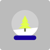

## 22. Día decimonoveno con **`19-bells.js`**

1. En la función `setInit()` del archivo **`script.js`**, 
adicionamos la función para la posición `[19]`:
```js
  drawItemFunctions[19] = drawBells; // Asigno la función drawBells al array
```
2. Creamos en la carpeta **"items"** el archivo **`19-bells.js`**,
con al menos esta función:
```js
function drawBells(ctx, x, y, size, hue) {}

export default drawBells;
```
3. Importamos en **`script.js`**, esta nueva función:
```js
import drawBells from './items/19-bells.js'; // Importo la función drawBells
```
4. Definimos las constantes para el `top`, `left`, `right`,
`bottom` y trazo un rectángulo en **`19-bells.js`**:
```js
function drawBells(ctx, x, y, size, hue) {
  const top = y - size / 2; // Defino la parte superior de las campanas
  const left = x - size / 2; // Defino la parte superior de las campanas
  const right = x + size / 2; // Defino la parte derecha de las campanas
  const bottom = y + size / 2; // Defino la parte inferior de las campanas
  ctx.strokeRect(left, top, size, size); // Dibujo un rectángulo
}
```
5. Importo la utilidad **`color.js`** en **`19-bells.js`**:
```js
import color from '../utils/color.js'; // Importo la función color
```
6. Vamos a usar el **`06-bell.js`**, por tanto debemos impotar 
el método `drawBell()` dentro del nuevo **`19-bell.js`**:
```js
import drawBell from './06-bell.js'; // Importo la función drawBell
```
7. Creamos el objeto `bell`, con lo siguiente:
```js
  const bell = {
    size: size * 0.5 ,
    y,
    xOffset: size * 0.2,
    rotation: Math.PI / 6,
  }
```
8. Usamos del contexto, el `translate()` y `rotate()`, para luego
dibujar la campana:
```js
  ctx.translate(x, bell.y); // Traslado el contexto
  ctx.rotate(bell.rotation); // Roto el contexto
  drawBell(ctx, -bell.xOffset, 0, bell.size, hue); // Dibujo la campana
```
* Va la primera campana del grupo de campanas:  
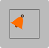
9. Cambio en el objeto `bell` el valor de `y` por
`y: y + size * 0.15`.
10. Agregamos otra campana, copiando desde `ctx.rotate()` y
cambiando algunos datos:
```js
  ctx.rotate(-2 * bell.rotation); // Roto el contexto
  drawBell(ctx, +bell.xOffset, 0, bell.size, hue); // Dibujo la campana
```
* Segunda campana:  
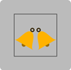
11. Como le vamos a poner un moño o un lazo, lo importamos tambien
dentro de **`19-bell.js`** el método `drawBow()`:
```js
import drawBow from './05-bow.js'; // Importo la función drawBow
```
12. Encerramos el proceso de las campanas entre un 
`ctx.save()` y un `ctx.restore()`.
13. Creamos el objeto `bow`:
```js
  const bow = {
    size: size * 0.7,
    y: y - size * 0.15,
  };
  drawBow(ctx, x, bow.y, bow.size, color.reverse(hue)); // Dibujo el lazo
```
14. Quitamos u ocultamos los elementos no requeridos del paso 4.
* Este es el resultado final de las campanas y el moño o lazo:  


## 23. Día vigésimo con **`20-snowMan.js`**

1. En la función `setInit()` del archivo **`script.js`**, 
adicionamos la función para la posición `[20]`:
```js
  drawItemFunctions[20] = drawSnowMan; // Asigno la función drawSnowMan al array
```
2. Creamos en la carpeta **"items"** el archivo **`20-snowMan.js`**,
con al menos esta función:
```js
function drawSnowMan(ctx, x, y, size, hue) {}

export default drawSnowMan;
```
3. Importamos en **`script.js`**, esta nueva función:
```js
import drawSnowMan from './items/20-snowMan.js'; // Importo la función drawSnowMan
```
4. Definimos las constantes para el `top`, `left`, `right`,
`bottom` y trazo un rectángulo en **`20-snowMan.js`**:
```js
function drawSnowMan(ctx, x, y, size, hue) {
  const top = y - size / 2; // Defino la parte superior del Hombre de Nieve
  const left = x - size / 2; // Defino la parte superior del Hombre de Nieve
  const right = x + size / 2; // Defino la parte derecha del Hombre de Nieve
  const bottom = y + size / 2; // Defino la parte inferior del Hombre de Nieve
  ctx.strokeRect(left, top, size, size); // Dibujo un rectángulo
}
```
5. Importo la utilidad **`color.js`** en **`20-snowMan.js`**:
```js
import color from '../utils/color.js'; // Importo la función color
```
6. Como vamos a usar el método `snowBall()`, empezamos haciendo
la importación dentro de **`20-snowMan.js`**:
```js
import snowBall from './07-snowBall.js'; // Importo la función snowBall
```
7. Creamos el objeto para la bola de abajo y llamamos la función
de `snowBall()`:
```js
  const bottomBall = {
    size: size * 0.6,
    x,
    y: y + size * 0.2,
  };
  drawSnowBall(ctx, bottomBall.x, bottomBall.y, bottomBall.size, hue); // Dibujo la bola inferior
```
* Esta es la bola inferior del muñeco:  
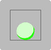
8. Copiamos la bola inferior y hacemos unos cambios:
```js
  const topBall = {
    size: size * 0.4,
    x,
    y: y - size * 0.2,
  };
  drawSnowBall(ctx, topBall.x, topBall.y, topBall.size, hue); // Dibujo la bola superior
```
* Así se ve hasta el momento el muñeco de nieve:  
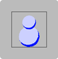
9. Importamos en **`20-snowMAn.js`**, la utilidad `draw`:
```js
import draw from '../utils/draw.js'; // Importo la función draw
```
10. Vamos a dibujar los ojos, con la estrategia del `xOffset`,
empezando con el izquierdo:
```js
  const eye = {
    radius: size * 0.03,
    xOffset: size * 0.06,
    y: topBall.y,
  };

  draw.circle(ctx, x - eye.xOffset, eye.y, eye.radius, {
    fillStyle: color.darkest(hue),
  }); // Dibujo el ojo izquierdo
```
11. Ahora el ojo derecho:
```js
  draw.circle(ctx, x + eye.xOffset, eye.y, eye.radius, {
    fillStyle: color.darkest(hue),
  }); // Dibujo el ojo derecho
```
* Así luche el muñeco de nieve con ambos ojos:  
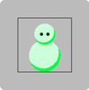
12. Defino el objeto `hat`, 
```js
  const hat = {
    width: size * 0.3,
    height: size * 0.2,
    x,
    bottom: topBall.y - size * 0.05,
    top,
    hue: color.reverse(hue),
  };
```
13. Dibujo una línea:
```js
  draw.line(ctx, hat.x, hat.bottom, hat.x, hat.top, {
    lineWidth: hat.width,
    strokeStyle: color.dark(hat.hue),
  });
```
14. Añadimos al objeto `hat` la altura del _borde_ o `brim`:
```js
  const hat = {
    ...
    brimHeight: size * 0.1,
    brimWidth: size * 0.4,
    hue: color.reverse(hue),
  };
```
15. Dibujamos otra línea:
```js
  draw.line(ctx, hat.x , hat.bottom, hat.x , hat.bottom - hat.brimHeight, {
    lineWidth: hat.brimWidth,
    strokeStyle: color.normal(hat.hue),
  });
```
16. Quitamos u ocultamos los elementos no requeridos del paso 4.
* Este es el muñeco de nieve al final:  
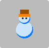

## 24. Día vigésimoprimero con **`21-wreath.js`**

>[!TIP]  
>### El instructor se refiere al objeto como `crown`, siendo mejor el término de `wreath`

1. En la función `setInit()` del archivo **`script.js`**, 
adicionamos la función para la posición `[21]`:
```js
  drawItemFunctions[21] = drawWreath; // Asigno la función drawWreath al array
```
2. Creamos en la carpeta **"items"** el archivo **`21-wreath.js`**,
con al menos esta función:
```js
function drawWreath(ctx, x, y, size, hue) {}

export default drawWreath;
```
3. Importamos en **`script.js`**, esta nueva función:
```js
import drawWreath from './items/21-wreath.js'; // Importo la función drawWreath
```
4. Definimos las constantes para el `top`, `left`, `right`,
`bottom` y trazo un rectángulo en **`21-wreath.js`**:
```js
function drawWreath(ctx, x, y, size, hue) {
  const top = y - size / 2; // Defino la parte superior de la corona navideña
  const left = x - size / 2; // Defino la parte superior de la corona navideña
  const right = x + size / 2; // Defino la parte derecha de la corona navideña
  const bottom = y + size / 2; // Defino la parte inferior de la corona navideña
  ctx.strokeRect(left, top, size, size); // Dibujo un rectángulo
}
```
5. Importo la utilidad **`color.js`** en **`21-wreath.js`**:
```js
import color from '../utils/color.js'; // Importo la función color
```
6. Definimos las constantes `thickness` y `radius`:
```js
  const thickness = size * 0.2; // Defino el grosor de la corona
  const radius = size * 0.5; // Defino el radio de la corona
```
7. Importamos en **`21-wreath.js`**, la utilidad `draw`:
```js
import draw from '../utils/draw.js'; // Importo la función draw
```
8. Dibujo un círculo:
```js
  draw.circle(ctx, x, y, radius, {
    strokeStyle: color.light(hue),
    lineWidth: thickness,
    outline: 'inside',
  }); // Dibujo un círculo
```
* Así se ve la corona navideña, a modo de dona:  

9. Para algunas lineas adicionamos esto:
```js
  const length = Math.PI * 2 * radius; // Defino la longitud de la guirnalda
  const dashLength = length / 30; // Defino la longitud de las líneas de la guirnalda
  ctx.setLineDash([dashLength, dashLength]); // Establezco el patrón de la línea 
```
10. Repito el código de `draw.circle()`, con algunos cambios
y restauro el patrón de línea:
```js
  draw.circle(ctx, x, y, radius, {
    strokeStyle: color.dark(hue),
    lineWidth: thickness,
    outline: 'inside',
  }); // Dibujo un círculo
  ctx.setLineDash([]); // Restauro el patrón de la línea
```
* Y esto es el resultado de la guirnalda con las líneas hasta 
ahora:  

11. Cambio para la constante `dashLength` el valor de dividir
por `30` a `40`.
12. Definimos el objeto `bow` para el moño o lazo:
```js
  const bow = {
    x: x,
    y: top + thickness,
    size: radius,
  }
```
13. Importamos el método `drawBow()` dentro de **`21-wreath.js`**:
```js
import drawBow from './05-bow.js';  // Importo la función drawBow
```
14. Empiezo a utilizar dicho método:
```js
  drawBow(ctx, bow.x, bow.y, bow.size, color.reverse(hue)); // Dibujo un lazo
```
* Así se ve la corona navideña o guirnalda:  

15. Oculto o borro los elementos no rqueridos del paso 4.

## 25. Día vigésimosegundo con **`22-skate.js`**

1. En la función `setInit()` del archivo **`script.js`**, 
adicionamos la función para la posición `[22]`:
```js
  drawItemFunctions[22] = drawSkate; // Asigno la función drawSkate al array
```
2. Creamos en la carpeta **"items"** el archivo **`22-skate.js`**,
con al menos esta función:
```js
function drawSkate(ctx, x, y, size, hue) {}

export default drawSkate;
```
3. Importamos en **`script.js`**, esta nueva función:
```js
import drawSkate from './items/22-skate.js'; // Importo la función drawSkate
```
4. Definimos las constantes para el `top`, `left`, `right`,
`bottom` y trazo un rectángulo en **`22-skate.js`**:
```js
function drawSkate(ctx, x, y, size, hue) {
  const top = y - size / 2; // Defino la parte superior del patín
  const left = x - size / 2; // Defino la parte superior del patín
  const right = x + size / 2; // Defino la parte derecha del patín
  const bottom = y + size / 2; // Defino la parte inferior del patín
  ctx.strokeRect(left, top, size, size); // Dibujo un rectángulo
}
```
5. Importo la utilidad **`color.js`** en **`22-skate.js`**:
```js
import color from '../utils/color.js'; // Importo la función color
```
6. Defino el objeto para el filo o `sledge` o como trineo:
```js
  const sledge = {
    x,
    bottom: y + size * 0.35,
    size: size * 0.9,
  };
```
7. Importamos el método `drawSledge()` dentro de **`22-skate.js`**:
```js
import drawSledge from './12-sledge.js'; // Importo la función drawSledge
```
8. Usamos el método que importamos:
```js
  drawSledge(ctx, sledge.x, sledge.bottom, sledge.size, hue);
```
* Este es la primera parte del patín, así se ve:  
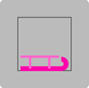
9. Ya que vamos a usar el método `drawSock()`, de una vez lo importamos:
```js
import drawSock from './03-sock.js'; // Importo la función drawSock
```
10. Definimos el objeto `sock` y lo dibujamos de una vez:
```js
  const sock = {
    x : x - size * 0.25,
    y: y + size * 0.05,
    size: size * 1.1,
  };
  drawSock(ctx, sock.x, sock.y, sock.size, color.reverse(hue), 0);
```
11. Quitamos u ocultamos los elementos del paso 4 no requeridos.
* Así queda nuestro patín al final:  
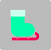

## 26. Día vigésimotercero con **`23-reindeer.js`**

1. En la función `setInit()` del archivo **`script.js`**, 
adicionamos la función para la posición `[23]`:
```js
  drawItemFunctions[23] = drawReindeer; // Asigno la función drawReindeer al array
```
2. Creamos en la carpeta **"items"** el archivo **`23-reindeer.js`**,
con al menos esta función:
```js
function drawReindeer(ctx, x, y, size, hue) {}

export default drawReindeer;
```
3. Importamos en **`script.js`**, esta nueva función:
```js
import drawReindeer from './items/23-reindeer.js'; // Importo la función drawReindeer
```
4. Definimos las constantes para el `top`, `left`, `right`,
`bottom` y trazo un rectángulo en **`23-reindeer.js`**:
```js
function drawReindeer(ctx, x, y, size, hue) {
  const top = y - size / 2; // Defino la parte superior del reno
  const left = x - size / 2; // Defino la parte superior del reno
  const right = x + size / 2; // Defino la parte derecha del reno
  const bottom = y + size / 2; // Defino la parte inferior del reno
  ctx.strokeRect(left, top, size, size); // Dibujo un rectángulo
}
```
5. Importo la utilidad **`color.js`** en **`23-reindeer.js`**:
```js
import color from '../utils/color.js'; // Importo la función color
```
6. Vamos a hacer unos cambios en el archivo **`11-snowFlake.js`**,
agregando el parámetro `pattern` y sumando su contenido:
```js
function drawSnowFlake(ctx, x, y, size, hue, pattern = [1, 1, 1, 1, 1, 1]) {
  const sum = pattern.reduce((one, two) => one + two, 0);
  ...
  ctx.strokeStyle = sum == 6 ? color.lightest(hue) : color.normal(hue); // Establezco el color de la línea
  ...
  for (let i = 0; i < 6; i++) {
    pattern[i] && drawBranch(ctx, 0, 0, size); // Dibujo una rama
    ...
  }
  ...
}
```
7. Importo el método `drawSnowFlake()` dentro de 
**`23-reindeer.js`**:
```js
import drawSnowFlake from './11-snowFlake.js'; // Importo la función drawSnowFlake
```
8. Uso el método de la siguiente manera:
```js
  drawSnowFlake(ctx, x, y, size, hue, [0, 0, 0, 0, 1, 1]); // Dibujo un copo de nieve a modo de cuernos
```

>[!WARNING]  
>### Corrijo de **`17-cookie.js`** la importación del método `drawSnowFlake()` y agrego un filtro adicional.

* Estos son los cuernos de nuestro reno:  
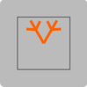
9. Ajusto los cuernos un poco arriba, cambiando el `y` por
`y - size * 0.05`.
10. Importo la función `draw` en **`23-reindeer.js`**:
```js
import draw from '../utils/draw.js'; // Importo la función draw
```
11. Defino y dibujo un círculo para la cabeza del reno:
```js
  const headRadius = size * 0.2; // Defino el radio de la cabeza
  draw.circle(ctx, x, y, headRadius, {
    fillStyle: color.dark(hue),
  }); // Dibujo la cabeza
```
12. Para los ojos , hacemos algo parecido a lo de 
**`20-snowMan.js`**:
```js
  const eye = {
    radius: size * 0.05,
    xOffset: size * 0.1,
    y,
  };
  draw.circle(ctx, x - eye.xOffset, eye.y, eye.radius, {
    fillStyle: color.darkest(hue),
  }); // Dibujo el ojo izquierdo
  draw.circle(ctx, x + eye.xOffset, eye.y, eye.radius, {
    fillStyle: color.darkest(hue),
  }); // Dibujo el ojo derecho
```
13. Creamos el objeto `snout` u _hocico_ y lo dibujamos:
```js
  const snout = {
    x,
    y: y + size * 0.25,
    xRadius: size * 0.3,
    yRadius: size * 0.25,
  };
  draw.ellipse(ctx, snout.x, snout.y, snout.xRadius, snout.yRadius, {
    fillStyle: color.light(hue),
  }); // Dibujo el hocico
```
* Este es el reno, con cuernos, cabeza, ojos y hocico:  
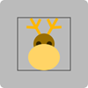
14. Ponemos la nariz:
```js
  // Dibujo la nariz
  draw.circle(ctx, x, y + size * 0.2, size * 0.1, {
    fillStyle: 'red',
  });
```
15. Quito u oculto lo no requerido del paso 4.
* Este es resultado final de nuestro hermoso reno:  
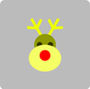

## 27. Día vigésimocuarto con **`24-gingerBread.js`**

>[!NOTE]  
>### Este código está en este sitio [gingerBread.js](https://github.com/gniziemazity/christmas_calendar/blob/main/items/gingerBread.js), **By Francisco Dorsman**

1. En la función `setInit()` del archivo **`script.js`**, 
adicionamos la función para la posición `[24]`:
```js
  drawItemFunctions[24] = drawGingerBread; // Asigno la función drawGingerBread al array
```
2. Creamos en la carpeta **"items"** el archivo **`24-gingerBread.js`**,
con al menos esta función:
```js
function drawGingerBread(ctx, x, y, size, hue) {}

export default drawGingerBread;
```
3. Importamos en **`script.js`**, esta nueva función:
```js
import drawGingerBread from './items/24-gingerBread.js'; // Importo la función drawGingerBread
```
4. Definimos las constantes para el `top`, `left`, `right`,
`bottom` y trazo un rectángulo en **`24-gingerBread.js`**:
```js
function drawGingerBread(ctx, x, y, size, hue) {
  const top = y - size / 2; // Defino la parte superior del hombre de gengibre
  const left = x - size / 2; // Defino la parte superior del hombre de gengibre
  const right = x + size / 2; // Defino la parte derecha del hombre de gengibre
  const bottom = y + size / 2; // Defino la parte inferior del hombre de gengibre
  ctx.strokeRect(left, top, size, size); // Dibujo un rectángulo
}
```
5. Importo la utilidad **`color.js`** en **`24-gingerBread.js`**:
```js
import color from '../utils/color.js'; // Importo la función color
```
6. Importo la función `draw` en **`24-gingerBread.js`**:
```js
import draw from '../utils/draw.js'; // Importo la función draw
```
7. Defino el objeto `head` o _cabeza_ y lo dibujo:
```js
  // Dibujo la cabeza
  const head = {
    radius: size * 0.22,
    x,
    get y() {
      return top + this.radius;
    },
    color: color.dark(hue),
  };
  draw.circle(ctx, head.x, head.y, head.radius, {
    fillStyle: head.color,
  }); 
```
8. Defino el objeto `body` o el _cuerpo_:
```js
  const body = {
    x,
    y: top + head.radius * 1.75,
  };
```
9. Defino el objeto `leg` y dibujo ambas _piernas_:
```js
  // Dibujo las piernas
  const leg = {
    x,
    y: body.y,
    color: color.dark(hue),
    width: size * 0.23,
    angle: Math.PI / 6,
    get footY() {
      return bottom - this.width / 2;
    },
    get offsetX() {
      return Math.cos(this.angle) * this.width;
    },
  };
  // Dibujo la pierna izquierda
  draw.line(ctx, leg.x, leg.y, leg.x + leg.offsetX, leg.footY, {
    strokeStyle: leg.color,
    lineWidth: leg.width,
    lineCap: 'round',
  });
  // Dibujo la pierna derecha
  draw.line(ctx, leg.x, leg.y, leg.x - leg.offsetX, leg.footY, {
    strokeStyle: leg.color,
    lineWidth: leg.width,
    lineCap: 'round',
  });
```
* Así luce nuestro muñeco o galleta de gengibre:  

10. Defino el objeto `arm` y dibujo ambos brazos:
```js
  // Dibujo los brazos
  const arm = {
    x,
    y: body.y + 0.3 * head.radius,
    width: size * 0.2,
    angle: 0,
    length: 1.5,
    get offsetX() {
      return Math.cos(arm.angle) * arm.width * arm.length;
    },
    get offsetY() {
      return Math.sin(arm.angle) * arm.width * arm.length;
    },
    color: color.dark(hue),
  };
  // Dibujo el brazo derecho
  draw.line(
    ctx,
    arm.x - arm.width / 2,
    arm.y,
    arm.x - arm.offsetX,
    arm.y + arm.offsetY,
    {
      strokeStyle: arm.color,
      lineWidth: arm.width,
      lineCap: 'round',
    }
  );
  // Dibujo el brazo izquierdo
  draw.line(
    ctx,
    arm.x + arm.width / 2,
    arm.y,
    arm.x + arm.offsetX,
    arm.y + arm.offsetY,
    {
      strokeStyle: arm.color,
      lineWidth: arm.width,
      lineCap: 'round',
    }
  );
```
* Nuestro muñeco de gengibre está casi completo:  

11. Defino el objeto `decoration`, que lo vamos usar en otros
elementos:
```js
  const decoration = {
    size: size * 0.025,
    color: color.light(hue),
  };
```
12. Agregando los ojos en el objeto `eye`:
```js
  // Dibujo los ojos
  const eye = {
    x,
    y: top + head.radius / 1.5,
    offsetX: head.radius / 2.5,
    radius: decoration.size,
    color: decoration.color,
  };
  draw.circle(ctx, eye.x - eye.offsetX, eye.y, eye.radius, {
    fillStyle: eye.color,
  });
  draw.circle(ctx, eye.x + eye.offsetX, eye.y, eye.radius, {
    fillStyle: eye.color,
  });
```
13. Le ponemos la boca usando el objeto `mouth` y la dibujamos:
```js
  // Dibujo la boca
  const mouth = {
    radius: head.radius / 2.5,
    x,
    y: top + head.radius,
    thickness: decoration.size,
    color: decoration.color,
  };
  ctx.beginPath(); // Dibujo la boca
  ctx.strokeStyle = mouth.color;
  ctx.lineWidth = mouth.thickness;
  ctx.arc(mouth.x, mouth.y, mouth.radius, Math.PI / 8, (7 * Math.PI) / 8);
  ctx.stroke();
  ctx.closePath();
```
* Este es el muñeco con la expresión sonriente:  

14. Importamos el método `drawBow()`, para agregar un lindo moño 
o lazo:
```js
import drawBow from './05-bow.js'; // Importo la función drawBow
```
15. Dibujamos un pequeño lazo con los elementos de `bow`:
```js
  // Dibujo el lazo
  const bow = {
    x: body.x,
    y: body.y,
    size: size * 0.2,
    color: color.reverse(hue),
  };
  drawBow(ctx, bow.x, bow.y, bow.size, bow.color);
```
16. Ponemos los _botones_ usando el objeto `decoration` 
en el método `draw.circle()`:
```js
  // Dibujo los botones
  draw.circle(ctx, x, y - decoration.size, decoration.size, {
    fillStyle: decoration.color,
  });
  draw.circle(ctx, x, y + decoration.size * 2, decoration.size, {
    fillStyle: decoration.color,
  });
  draw.circle(ctx, x, y + decoration.size * 5, decoration.size, {
    fillStyle: decoration.color,
  });
```
17. Quito u oculto lo elementos no necesarios del paso 4.
* Así luce al final nuestro hermoso muñeco de gengibre:  


## 28. Día vigésimoquinto con **`25-lights.js`**

>[!NOTE]  
>### Este código está en este sitio [lights.js](https://github.com/gniziemazity/christmas_calendar/blob/main/items/lights.js), **By Francisco Dorsman**

>[!WARNING]  
> Como vamos a hacer el sitio `25` del array, hacemos un cambio en 
>el archivo **`script.js`**, en los límites del `for`, en vez
> de usar el valor fijo de `24`, usamos esto: 
>```js
>  for (let day = 1; day < drawItemFunctions.length; day++) {
>    const canvas = document.createElement('canvas'); // Creo un canvas
>    canvas.width = cellSize; // Asigno el ancho
>    canvas.height = cellSize; // Asigno el alto
>    calendar.appendChild(canvas); // Agrego el canvas al div
>
>    fillCell(canvas, day); // Llamo la función fillCell
>  }
>```

1. En la función `setInit()` del archivo **`script.js`**, 
adicionamos la función para la posición `[25]`:
```js
  drawItemFunctions[25] = drawLights; // Asigno la función drawLights al array
```
2. Creamos en la carpeta **"items"** el archivo **`25-lights.js`**,
con al menos esta función:
```js
function drawLights(ctx, x, y, size, hue) {}

export default drawLights;
```
3. Importamos en **`script.js`**, esta nueva función:
```js
import drawLights from './items/25-lights.js'; // Importo la función drawLights
```
4. Definimos las constantes para el `top`, `left`, `right`,
`bottom` y trazo un rectángulo en **`25-lights.js`**:
```js
function drawLights(ctx, x, y, size, hue) {
  const top = y - size / 2; // Defino la parte superior de las luces
  const left = x - size / 2; // Defino la parte superior de las luces
  const right = x + size / 2; // Defino la parte derecha de las luces
  const bottom = y + size / 2; // Defino la parte inferior de las luces
  ctx.strokeRect(left, top, size, size); // Dibujo un rectángulo
}
```
5. Importo la utilidad **`color.js`** en **`25-lights.js`**:
```js
import color from '../utils/color.js'; // Importo la función color
```
6. Importo la función `draw` en **`25-lights.js`**:
```js
import draw from '../utils/draw.js'; // Importo la función draw
```
7. Defino una constante para el número de luces:
```js
  const numberOfLights = 3; // Defino la cantidad de luces
```
8. Defino el objeto `bulb` para el _bombillo_:
```js
  // defino el bombillo
  const bulb = {
    position: 0,
    width: size / numberOfLights,
    y_radius: ((size / numberOfLights) * 0.9) / 2,
    get x_radius() {
      return this.y_radius / 3;
    },
    get x() {
      return left + this.width / 2 + this.position * this.width;
    },
    get y() {
      return top + this.y_radius + (size / numberOfLights) * 0.1;
    },
    get left() {
      return left + this.width * this.position;
    },
    get right() {
      return this.left + this.width;
    },
    color: color.normal(hue),
    glow: color.lightest(hue),
  };
```
9. Defino el _soporte_ en el objeto `holder`:
```js
  // Defino el soporte
  const holder = {
    size: bulb.x_radius,
    bottom: bulb.x_radius * 1.5,
    get x() {
      return bulb.x;
    },
    y: bulb.y - bulb.y_radius,
    get left() {
      return this.x - this.size / 2;
    },
    top,
    color: color.darkest(hue),
  };
```
10. Defino en el objeto `cord` el _cordón_:
```js
  // Defino el cordón
  const cord = {
    get x() {
      return thread.x;
    },
    y: top + thread.bottom,
    color: color.darkest(hue),
  };
```
11. Creo tres funciones, para dibujar los tres objetos definidos
anteriormente:
```js
  function drawHolder() {
    ctx.fillStyle = holder.color;
    ctx.fillRect(holder.left, holder.top, holder.size, holder.bottom);
  }

  function drawCords() {
    ctx.strokeStyle = thread.color;
    ctx.beginPath();
    ctx.moveTo(bulb.left, cord.y);
    ctx.bezierCurveTo(
      thread.x - bulb.width / 2,
      cord.y,
      thread.x,
      cord.y,
      thread.x,
      top
    );
    ctx.bezierCurveTo(
      thread.x,
      cord.y,
      thread.x + bulb.width / 2,
      cord.y,
      bulb.right,
      cord.y
    );
    ctx.stroke();
  }

  function drawBulb() {
    draw.ellipse(ctx, bulb.x, bulb.y, bulb.x_radius, bulb.y_radius, {
      fillStyle: bulb.color,
      shadowColor: bulb.glow,
      shadowBlur: bulb.x_radius * 0.7,
      shadowOffsetX: 0,
      shadowOffsetY: 0,
    });
```
12. Ahora si, en un ciclo `for`, llamamos estas tres nuevas 
funciones:
```js
  for (let index = 0; index < numberOfLights; index++) {
    bulb.position = index;
    bulb.color = color.normal(hue + (360 / numberOfLights) * index);
    drawHolder();
    drawCords();
    drawBulb();
  }
```
13. Eliminamos u ocultamos los elementos no requeridos del paso 4.
* Estos son los bombillos listos:  
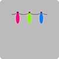

## 29. Día vigésimosexto con **`26-santa.js`**

>[!NOTE]  
>### Este código está en este sitio [santa.js](https://github.com/gniziemazity/christmas_calendar/blob/main/items/santa.js), **By Francisco Dorsman**


1. En la función `setInit()` del archivo **`script.js`**, 
adicionamos la función para la posición `[26]`:
```js
  drawItemFunctions[26] = drawSanta; // Asigno la función drawSanta al array
```
2. Creamos en la carpeta **"items"** el archivo **`26-santa.js`**,
con al menos esta función:
```js
function drawSanta(ctx, x, y, size, hue) {}

export default drawSanta;
```
3. Importamos en **`script.js`**, esta nueva función:
```js
import drawSanta from './items/26-santa.js'; // Importo la función drawSanta
```
4. Definimos las constantes para el `top`, `left`, `right`,
`bottom` y trazo un rectángulo en **`26-santa.js`**:
```js
function drawSanta(ctx, x, y, size, hue) {
  const top = y - size / 2; // Defino la parte superior de Santa
  const left = x - size / 2; // Defino la parte superior de Santa
  const right = x + size / 2; // Defino la parte derecha de Santa
  const bottom = y + size / 2; // Defino la parte inferior de Santa
  ctx.strokeRect(left, top, size, size); // Dibujo un rectángulo
}
```
5. Importo la utilidad **`color.js`** en **`26-santa.js`**:
```js
import color from '../utils/color.js'; // Importo la función color
```
6. Importo la función `draw` en **`26-santa.js`**:
```js
import draw from '../utils/draw.js'; // Importo la función draw
```
7. Definimos el objeto `beard` para la _barba_ y la dibujamos:
```js
  // Barba
  const beard = {
    x,
    y: y + size / 8,
    xRadius: size * 0.2,
    yRadius: size * 0.35,
    color: 'white',
  };
  draw.ellipse(ctx, beard.x, beard.y, beard.xRadius, beard.yRadius, {
    fillStyle: beard.color,
  }); // Dibujamos la barba
```
8. Ponemos la _cara_ en el objeto `face`:
```js
// Cara
const face = {
  x,
  y: beard.y - size * 0.05,
  radius: size * 0.2,
  color: 'pink',
};
draw.circle(ctx, face.x, face.y, face.radius, {
  fillStyle: face.color,
}); // Dibujamos la cara
```
* Esto es la base del `santa` o Papa Noel:  
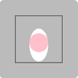
9. Defino el objeto para el _bigote_ de nombre `mustache`:
```js
  // Bigote
  const mustache = {
    y: face.y + size * 0.05,
    offset: size * 0.075,
    xRadius: size * 0.1,
    yRadius: size * 0.04,
    angle: Math.PI / 8,
    color: beard.color,
  }; // Definimos los bigotes
```
10. Salvo el conteto, dibujo los bigotes y restauro el contexto:
```js
  // Dibujamos los bigotes
  ctx.save();
  ctx.translate(x, mustache.y);
  ctx.rotate(-mustache.angle);
  draw.ellipse(ctx, -mustache.offset, 0, mustache.xRadius, mustache.yRadius, {
    fillStyle: mustache.color,
  });
  ctx.rotate(2 * mustache.angle);
  draw.ellipse(ctx, +mustache.offset, 0, mustache.xRadius, mustache.yRadius, {
    fillStyle: mustache.color,
  });
  ctx.restore();
```
11. Defino el objeto `eye` y los dibujo dos veces para los _ojos_:
```js
  // Ojos
  const eye = {
    offset: size * 0.075,
    y: face.y - size * 0.025,
    radius: size * 0.025,
    color: color.darkest(hue),
  };
  draw.circle(ctx, x - eye.offset, eye.y, eye.radius, {
    fillStyle: eye.color,
  });
  draw.circle(ctx, x + eye.offset, eye.y, eye.radius, {
    fillStyle: eye.color,
  });
```
* Así va con los ojos y los bigotes:  

12. Defino el objeto `hat` y dibujo este _gorro_:
```js
  // Gorro
  const hat = {
    x: face.x + face.radius,
    y: face.y - size / 6,
    radius: face.radius * 2,
    color: 'red',
  };
  // dibujamos el gorro
  ctx.beginPath();
  ctx.fillStyle = hat.color;
  ctx.moveTo(hat.x, hat.y);
  ctx.arc(hat.x, hat.y, hat.radius, Math.PI, Math.PI * 1.5);
  ctx.fill();
  ctx.closePath();
  // Bola o pompón del gorro
  draw.circle(ctx, hat.x, top + size / 10, size / 10, {
    fillStyle: 'white',
  });
```
13. Completamos con el objeto `rim` o _borde del gorro_:
```js
  // Borde del gorro
  const rim = {
    x,
    y: hat.y,
    radius: face.radius,
    height: size * 0.1,
    color: 'white',
  };

  ctx.save();
  ctx.beginPath();
  ctx.strokeStyle = rim.color;
  ctx.lineWidth = rim.height;
  ctx.lineCap = 'round';
  ctx.moveTo(rim.x - rim.radius, rim.y);
  ctx.bezierCurveTo(
    rim.x - rim.radius,
    rim.y - rim.height / 2,
    rim.x + rim.radius,
    rim.y - rim.height / 2,
    rim.x + rim.radius,
    rim.y
  );
  ctx.stroke();
  ctx.closePath();
  ctx.restore();
```
14. Quitamos u ocultamos los elementos del paso 4 que no se
necesitan.
* Este es el Santa Claus o Papa Noel, ya terminado:  
 
