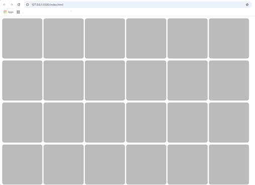

# JavaScript Christmas Calendar Tutorial 🎄 de freeCodeCamp.org 
## 2 horas y 49 minutos

[](https://www.youtube.com/watch?v=07vQARYrJgw&t=155s)

## 1. Los tres archivos básicos
1. Empezamos con el archivo **`index.html`**, digitando en 
`Visual Studio Code` el _snippet_ de `html:5` y añadiendo el elemento
`<footer>` debajo de `<body>`:
```html
<!DOCTYPE html>
<html lang="en">
<head>
  <meta charset="UTF-8">
  <meta name="viewport" content="width=html:5, initial-scale=1.0">
  <title>Document</title>
</head>
<body>
  
</body>
<footer></footer>
</html>
```
2. Cambiamos el título a `Diciembre`.
3. En el `<head>` debajo del `<title>` agregamos el `<script>`
llamando un archivo de nombre **`script.js`** de tipo `module`:
```html
  <script type="module" src="script.js"></script>
```
4. Se da `[ctrl]` + click en el nombre `"script.js"` para
crear y abrir el archivo **`script.js`**.
5. En el `<body>` creamos un `<div>` con el `id` de `calendar`:
```html
  <div id = "calendar"></div>
```
6. En el archivo **`script.js`**, agregamos estas líneas:
```js
// Cuando se muestra la pantalla
window.onload = () => {
  setInit(); // Llamo esta función
};

// Función para inicializar el ambiente
const setInit = () => {}
```
7. Añadimos este código dentro de **`script.js`**, justo en el inicio:
```js
const cellSize = 200; // Tamaño de la celda
const calendar = document.getElementById('calendar'); // Obtengo el div con id calendar
```
8. Dentro del método `setInit()` , añadimos un `for`:
```js
const setInit = () => {
  for (let day = 1; day <= 24; day++) {
    const canvas = document.createElement('canvas'); // Creo un canvas
    canvas.width = cellSize; // Asigno el ancho
    canvas.height = cellSize; // Asigno el alto
    calendar.appendChild(canvas); // Agrego el canvas al div  
  }
}
```
9. En el `<footer>`, agregamos un `link` invocando un archivo
de nombre **`style.css`**:
```html
  <link rel="stylesheet" href="style.css">
```
10. Se da `[ctrl]` + click en el nombre `"style.css"` para
crear y abrir el archivo **`style.css`**.
11. Poner esto en el archivo **`style.css`**:
```css
canvas {
  background-color: #BBB;
  margin: 3px;
  border-radius: 10px;
}
```

>[!TIP]  
>Así se ve el browser hasta el momento:  
>

## 2. Dibujando números en las celdas

1. Empezamos a llenar las celdas con algo. En el archivo 
**`script.js`**, en el `for` de `setInit()`, debajo del 
`appendChild`, agregamos esto:
```js
    fillCell(canvas, day); // Llamo la función fillCell
```
2. Creo la función `fillCell()` y empiezo esto en el código:
```js
// Función para llenar la celda
const fillCell = (canvas, index) => {
  const ctx = canvas.getContext('2d'); // Obtengo el contexto del canvas
  const x = canvas.width / 2; // Obtengo la mitad del ancho
  const y = canvas.height / 2; // Obtengo la mitad del alto 
}
```
3. Definimos el tamaño de los elementos en el canvas con esto dentro
de la función `fillCell()`:
```js
  const itemSize = canvas.width * 0.6; // Defino el tamaño del item
```
4. Por ahora vamos a dibujar un número en cada una de las celdas, 
en la función `fillCell()`:
```js
  drawNmber(ctx, index, x, y, itemSize); // Llamo la función drawNumber
```
5. Creo la función `drawNumber()`:
```js
// Función para dibujar el número
const drawNmber = (ctx, number, x, y, size) => {
  ctx.font = size + 'px Arial'; // Asigno la fuente
  ctx.fillText(number, x, y); // Dibujo el número
  ctx.fillStyle = 'black'; // Asigno el color 
}
``` 

>[!TIP]  
>En cada celda aparece un número:  
>

6. Añadimos en la función `drawNmber()`, un `textAlign` y un
`textBaseline`:
```js
  ctx.textAlign = 'center'; // Asigno la alineación
  ctx.textBaseline = 'middle'; // Asigno la base del texto
```

>[!TIP]  
>Los números aparecen centrados en cada celda:  
>

## 3. Día primero con **`01-start.js`**

1. Creamos en la parte superior de **`script.js`** la definicón
de un arreglo de nombre `drawImtemFunctions`:
```js
const drawItemFunctions = []; // Creo un array para guardar las funciones
```
2. En el método `setInit()`, antes del `for`, cargo el primer valor
como `drawStar`;
```js
  drawItemFunctions[1] = drawStar; // Asigno la función drawStar al array
```
3. En la función `fillCell` colocamos esto antes de llamar la función
`drawNumber()`:
```js
  const drawItem = drawItemFunctions[index]; // Obtengo la función a dibujar
  if (drawItem)
    drawItem(ctx, x, y, itemSize); // Llamo la función drawItem
  else drawNumber(ctx, index, x, y, itemSize); // Llamo la función drawNumber
``` 
4. Creamos la carpeta de nombre **"items"**.
5. La función la vamos a crear en un archivo nuevo de nombre
**`01-start.js`**, dentro de la carpeta **"items"**, con al menos
este código:
```js
function drawStar(ctx, x, y, size) {}

export default drawStar;
```
6. Regreso a **`script.js`** y en el principio añado la importación
de la función del archivo **`01-start.js`**:
```js
import drawStar from './items/01-start.js'; // Importo la función drawStar
```
7. En la función `drawStar()` de  **`01-start.js`**, coloco
este código:
```js
  const radius = size / 2; // Defino el radio
  const pointCount = 5; // Defino la cantidad de puntos
  ctx.beginPath(); // Comienzo el trazo
  for (let i = 0; i < pointCount; i++) {
    const angle = (i / pointCount) * Math.PI * 2; // Defino el ángulo
    const surfaceX = x + radius * Math.cos(angle); // Defino la superficie x
    const surfaceY = y + radius * Math.sin(angle); // Defino la superficie y
    ctx.lineTo(surfaceX, surfaceY); // Dibujo la línea
  }
  ctx.fillStyle = 'yellow'; // Asigno el color
  ctx.fill(); // Relleno
```

>[!TIP]  
>Tenemos un pentágono en la primer celda:  
>

8. Cambiamos el número de puntos de `pointCount` a `10`, y el nombre de
la constante `radius` por otras dos nuevas:
```js
  const outerRadius = size / 2; // Defino el radio externo
  const innerRadius = size / 4; // Defino el radio interno
  const pointCount = 10; // Defino la cantidad de puntos
```
9. Justo después de obtener el `angle`, obtengo el `radius`:
```js
    const radius = (i % 2 === 0) ? outerRadius : innerRadius; // Defino el radio
```
* Así se ve la estrella como "rellenita":  


10. Cambio el valor de `innerRadius` de `size / 4` a 
`size / 5`, y se ve la estrella mejor:  

11. Finalmente encuentro una fórmula mejor para hacer la estrella
y cambio el código por esto:
```js
  ctx.fillStyle = 'yellow'; // Asigno el color
  ctx.beginPath(); // Comienzo el trazo
  ctx.moveTo(x, y - size / 2); // Muevo el trazo
  for (let i = 0; i < 10; i++) {
    const angle = (i * Math.PI) / 5; // Defino el ángulo
    const radius = i % 2 === 0 ? size * 0.5 : size * 0.2; // Defino el radio
    ctx.lineTo(x + radius * Math.sin(angle), y - radius * Math.cos(angle)); // Dibujo la línea
  }
  ctx.closePath(); // Cierro el trazo
  ctx.fill(); // Relleno
```
* Veo mejor la estrella de esta forma:  


12. El Instructor corrije el código para que se vea también la 
punta arriba, cambiando `surfaceX` y `surfaceY` de esta manera:
```js
    const surfaceX = x + radius * Math.sin(angle); // Defino la superficie x
    const surfaceY = y - radius * Math.cos(angle); // Defino la superficie y
```
13. El instructor también sugiere un cambio de colores de forma 
aleatoria, usando una constante `hue` y poniendo dicho color así:
```js
  const hue = Math.floor(Math.random() * 360); // Defino el color
  ctx.fillStyle = `hsl(${hue}, 50%, 50%)`; // Asigno el color
```
* Pero prefiero dejarlo en el color constante de `'yellow'`.

## 4. Dia segundo con **`02-ball.js`**

1. En la función `setInit()` del archivo **`script.js`**, 
adicionamos la función para la posición `[2]`:
```js
  drawItemFunctions[2] = drawBall; // Asigno la función drawBall al array
```
2. Creamos enla carpeta **"items"** el archivo **`02-ball.js`**,
con al menos esta función:
```js
function drawBall(ctx, x, y, size) {}

export default drawBall;
```
3. Importamos en **`script.js`**, esta nueva función:
```js
import drawBall from './items/02-ball.js'; // Importo la función drawBall
```
4. Ahora si empiezo a poner el código en la función `drawBall()`
del archivo **`02-ball.js`**:
```js
  const top = y - size / 2;
  const left = x - size / 2;

  // Definimos el anillo de la bola
  const ring ={
    radius: size * 0.1,
    x,
    get y() {return top + this.radius},
    color: 'black'
  }

  //dibujamos el anillo
  ctx.beginPath();
  ctx.arc(ring.x, ring.y, ring.radius, 0, Math.PI * 2);
  ctx.strokeStyle = ring.color;
  ctx.stroke();
```
* Así se ve lo que llevamos de la segunda celda:  

5. Agrego en el objeto `ring` el valor de `lineWidth`:
```js
  const ring = {
    radius: size * 0.1,
    x,
    get y() {
      return top + this.radius;
    },
    lineWidth: size * 0.05,
    color: 'orange',
  };
```
6. Ajustamos en el dibujo del `arc()` con estos valores:
```js
  ctx.arc(ring.x, ring.y, ring.radius - ring.lineWidth / 2, 0, Math.PI * 2);
```
7. Mejoramos el código par dibuar el `ring` de esta manera:
```js
  draw.circle(ctx, ring.x, ring.y, ring.radius, {
    strokeStyle: ring.color,
    lineWidth: ring.lineWidth,
    outline: 'inside'
  });
```
8. Creamos una carpeta en la raíz de nombre **"utils"**.
9. En la carpeta **"utils"**, creamos el archivo **`draw.js`**,
con al menos la función `circle()`:
```js
const draw = {};

draw.circle = function(ctx, x, y, radius, { fillStyle, strokeStyle, lineWidth, outline }) {
  ctx.beginPath();
  if (outline === 'inside') { 
    radius -= lineWidth / 2;
  }
  ctx.arc(x, y, radius, 0, Math.PI * 2);
  if (fillStyle) {
    ctx.fillStyle = fillStyle;
    ctx.fill();
  }
  if (strokeStyle) {
    ctx.strokeStyle = strokeStyle;
    ctx.lineWidth = lineWidth;
    ctx.stroke();
  }

  ctx.closePath();
}

export default draw;
```
10. En el archivo **`02-ball.js`**, importamos este método
múltiple de nombre `draw`:
```js
import draw from '../utils/draw.js';
```
* Anillo dibujado con la utilidad `draw`:  

11. Definimos un nuevo objeto en el archivo **`02-ball.js`**:
```js
  const ball = {
    radius: size * 0.45,
    x,
    y() {
      return top + ring.radius + this.radius;
    },
    color: 'red',
  };
```
12. Usamos el `draw` para completar la bola:
```js
  draw.circle(ctx, ball.x, ball.y(), ball.radius, {
    fillStyle: ball.color,
  });
```
* Así se ve la bola y el anillo en la celda 2:  


## 5. Implementar manejo de colores

1. Creamos el archivo **`color.js`** en la carpeta **"utils"**, 
añadimos el método `color`:
```js
const color = {}

color.darkest = (hue) => `hsl(${hue}, 100%, 10%)`;
color.dark = (hue) => `hsl(${hue}, 100%, 30%)`;
color.normal = (hue) => `hsl(${hue}, 100%, 50%)`;
color.light = (hue) => `hsl(${hue}, 100%, 70%)`;
color.lightest = (hue) => `hsl(${hue}, 100%, 90%)`;

export default color;
```
2. Agregamos el elemento `hue` en el archivo **`script.js`**,
en el método `fillCell()`:
```js
const fillCell = (canvas, index) => {
  ...
  const hue = Math.floor(Math.random() * 360); // Defino el color
  ...
  if (drawItem) drawItem(ctx, x, y, itemSize, hue); // Llamo la función drawItem
  else drawNumber(ctx, index, x, y, itemSize); // Llamo la función drawNumber
};
```
3. Ahora bien tanto para **`01-start.js`**, como para 
**`02-ball.js`**, agrego el parámetro `hue` y lo utilizo en
las definiciones del color:
* **`01-start.js`**
```js
import color from '../utils/color.js';

function drawStar(ctx, x, y, size, hue) {
  ...
  ctx.fillStyle = color.normal(hue); // Asigno el color
}
```
* **`02-ball.js`**
```js
import color from '../utils/color.js';
import draw from '../utils/draw.js';

function drawBall(ctx, x, y, size, hue) {
  ...
  const ring = {
    ...,
    color: color.darkest(hue),
  };
  ...
  const ball = {
    ...,
    color: color.normal(hue),
  };
}
```
4. Para darle volúmen a la `ball`, en el archivo **`ball.js`**
añadimos la constante `highlight`, antes de dibujar la `ball`:
```js
  const highlight = {
    x: ball.x - ball.radius * 0.3,
    y: ball.y - ball.radius * 0.3,
  };
```
5. Otra constante para el gradiente de nombre `grd`:
```js
  // Definimos el gradiente radial
  const grd = ctx.createRadialGradient(
    highlight.x, highlight.y, 0, 
    highlight.x, highlight.y, ball.radius
  );
```
6. Ajustamos el uso del gradiente en la bola
```js
  grd.addColorStop(0, color.light(hue));
  grd.addColorStop(1, color.dark(hue));

  //dibujamos la bola
  draw.circle(ctx, ball.x, ball.y(), ball.radius, {
    fillStyle: grd,
  });
```
* Así se ve la bola con el gradiente:  

7. Mejoramos la gradiente y la imagen se verá mejor:
```js
  // Definimos el gradiente radial
  const grd = ctx.createRadialGradient(
    highlight.x, highlight.y, 0,
    highlight.x, highlight.y, ball.radius * 2
  );
  grd.addColorStop(0, color.lightest(hue));
  grd.addColorStop(0.3, color.normal(hue));
  grd.addColorStop(0.8, color.dark(hue));
  grd.addColorStop(1, color.darkest(hue));
```
* Así se ve con mas opciones en el gradiente:  

8. Borramos de **`02-ball.js`**, la variable innecesaria
`const left = x - size / 2;`

## 6. Dia tercero con **`03-sock.js`**

1. En la función `setInit()` del archivo **`script.js`**, 
adicionamos la función para la posición `[3]`:
```js
  drawItemFunctions[3] = drawSock; // Asigno la función drawSock al array
```
2. Creamos en la carpeta **"items"** el archivo **`03-sock.js`**,
con al menos esta función:
```js
function drawSock(ctx, x, y, size, hue) {}

export default drawSock;
```
3. Importamos en **`script.js`**, esta nueva función:
```js
import drawSock from './items/03-sock.js'; // Importo la función drawSock
```
4. Agrego en **`draw.js`**, el comportamiento para `line`:
```js
draw.line = function (ctx, fromX, fromY, toX, toY, options) {
  ctx.beginPath();
  ctx.moveTo(fromX, fromY);
  ctx.lineTo(toX, toY);
  Object.assign(ctx, options);
  ctx.stroke();

  ctx.closePath();
}
```
5.. Ahora si empiezo a poner el código en la función `drawSock()`
del archivo **`03-sock.js`**:
```js
function drawSock(ctx, x, y, size, hue) {
  const top = y - size / 2; // Defino la parte superior del calcetín
  const ankleY = y + size * 0.1; // Defino la altura del tobillo
  draw.line(ctx, x, top, x, ankleY, {
    strokeStyle: color.normal(hue), 
  }); // Dibujo la pierna
}
```
6. Verificar que se tenga ambas importaciones en **`03-sock.js`**:
```js
import draw from '../utils/draw.js'; // Importo la función draw
import color from '../utils/color.js'; // Importo la función color  
```
7. Definimos la constante `footWidth` y la asignamos al momento
de `draw.line()`:
```js
function drawSock(ctx, x, y, size, hue) {
  const top = y - size / 2; // Defino la parte superior del calcetín
  ...
  const footWidth = size * 0.4; // Defino el ancho del pie
  draw.line(ctx, x, top, x, ankleY, {
    strokeStyle: color.normal(hue),
    lineWidth: footWidth,
  }); // Dibujo la pierna
}
```
8. Agrego un parámetro al momento de dibujar la línea de
nombre `lineCap`, para redondear las puntas:
```js
  draw.line(ctx, x, top, x, ankleY, {
    strokeStyle: color.normal(hue),
    lineWidth: footWidth,
    lineCap: 'round',
  });
```
9. Defino la constante `radius` y muevo la parte superior mas
abajo:
```js
  const radius = footWidth / 2; // Defino el radio del tobillo

  draw.line(ctx, x, top + radius , x, ankleY, {
    strokeStyle: color.normal(hue),
    lineWidth: footWidth,
    lineCap: 'round',
  });
```
* Así se ve la recta con las puntas redondeadas y la distancia
del `radius`:  

10. Defino la constante `sleeveWidth` y la uso para dibujar
la manga en pantalla:
```js
  const sleeveWidth = footWidth * 1.1; // Defino el ancho de la manga
  ...
  draw.line(ctx, x, top, x, top + radius, {
    strokeStyle: color.lightest(hue),
    lineWidth: sleeveWidth,
    lineCap: 'butt',
  }); // Dibujo la manga
```
* Así se ve la dos rectas:  

11. En el archivo **`03-sock.js`**, agrego el parámetro de
nombre `angle` con un valor inicial de `0`:
```js
function drawSock(ctx, x, y, size, hue, angle = 0) {
  ...
}
```
12. Definimos en el método `drawSock()` la constante de nombre
`footSize`:
```js
  const footSize = size * 0.3; // Defino el tamaño del pie
```
13. Calculamos el inicio del la recta con dos constantes de 
nombre `tipX` y `tipY`:
```js
  const tipX = x + Math.cos(angle) * footSize; // Defino la punta del pie en X
  const tipY = ankleY + Math.sin(angle) * footSize; // Defino la punta del pie en Y
```
14. Dibujamos otra línea con los nuevos elementos, entre el 
`// Dibujo la pierna` y `// Dibujo la manga` :
```js
  draw.line(ctx, x, ankleY, tipX, tipY, {
    strokeStyle: color.normal(hue),
    lineWidth: footWidth,
    lineCap: 'round',
  }); // Dibujo el pie
```
* Así se ve la imagen de `sock` con todo completo:  
 
15. Podemos cambiar el valor inicial de `angle`, por este valor:
```js
function drawSock(ctx, x, y, size, hue, angle = Math.PI / 4) {
  ...
}
```
* Así luce la `sock` o media o calcetín con un ángulo de `45°`:  
 

## 7. Dia cuarto con **`04-cane.js`**

1. En la función `setInit()` del archivo **`script.js`**, 
adicionamos la función para la posición `[4]`:
```js
  drawItemFunctions[4] = drawCane; // Asigno la función drawCane al array
```
2. Creamos en la carpeta **"items"** el archivo **`04-cane.js`**,
con al menos esta función:
```js
function drawCane(ctx, x, y, size, hue) {}

export default drawCane;
```
3. Importamos en **`script.js`**, esta nueva función:
```js
import drawCane from './items/04-cane.js'; // Importo la función drawCane
```
4. Definimos las constantes para el `top`, `width` y `thickness`,
en **`04-cane.js`**:
```js
function drawCane(ctx, x, y, size, hue) {
  const top = y - size / 2; // Defino la parte superior del bastón

  const width = size * 0.5; // Defino el ancho del bastón
  const thickness = size * 0.1; // Defino el grosor del bastón
}
```
5. Creamos una constante para manejar el arco de nombre `arc`,
en el método `drawCane()`:
```js
  const arc = {
    radius: (width - thickness) / 2, // Defino el radio del arco
    x,
    y() { return top + this.radius + thickness / 2; }, // Defino la altura del arco
  }
```
6. Hacemos el dibujo correspondiente en el archivo 
**`04-cane.js`**, dentro del método `drawCane()`:
```js
  ctx.beginPath(); // Comienzo el trazo
  ctx.strokeStyle = color.normal(hue); // Asigno el color
  ctx.lineWidth = thickness; // Asigno el grosor
  ctx.arc(arc.x, arc.y(), arc.radius, Math.PI, 0); // Dibujo el arco
  ctx.stroke(); // Hago el trazo
```
* Así se ve la primera parte del bastón o `cane`:  

7. Añadimos en el mérodo `drawCane()`, antes de `ctx.stroke()`
lo siguiente:
```js
  ctx.lineTo(arc.x + arc.radius, bottom); // Dibujo la línea
```
8. Defino la constante `bottom` al principio de **`04-cane.js`**:
```js
  const bottom = y + size / 2; // Defino la parte inferior
```
* Así se ve hasta el momento el cuarto día:  

9. Vamos a dibujar los adornos del bastón debajo de
`ctx.stroke()`, en el método `drawCane()`:
```js
  ctx.strokeStyle = color.dark(hue); // Asigno el color
  ctx.setLineDash([thickness, thickness]); // Asigno el trazo
  ctx.stroke(); // Hago el trazo
```
* Así luce el bastón con los adornos:  

10. Cambiamos la definición de colores para los dos
`strokeStyle`:
```js
  ctx.beginPath(); // Comienzo el trazo
  ctx.strokeStyle = color.lightest(hue); // Asigno el color
  ...

  // Dibujamos los adornos del bastón 
  ctx.strokeStyle = color.normal(hue); // Asigno el color
  ...
```
* Así vemos el bastón del dia 4, con el cambio de definición de
colores:  


## 8. Dia quinto con **`05-bow.js`**

1. En la función `setInit()` del archivo **`script.js`**, 
adicionamos la función para la posición `[5]`:
```js
  drawItemFunctions[5] = drawBow; // Asigno la función drawBow al array
```
2. Creamos en la carpeta **"items"** el archivo **`05-bow.js`**,
con al menos esta función:
```js
function drawBow(ctx, x, y, size, hue) {}

export default drawBow;
```
3. Importamos en **`script.js`**, esta nueva función:
```js
import drawBow from './items/05-bow.js'; // Importo la función drawBow
```
4. Definimos las constantes para el `top`, `left`, `right`, y
`bottom` en **`05-bow.js`**:
```js
function drawCane(ctx, x, y, size, hue) {
  const top = y - size / 2; // Defino la parte superior del moño
  const left = x - size / 2; // Defino la parte superior del moño
  const right = x + size / 2; // Defino la parte derecha del moño
  const bottom = y + size / 2; // Defino la parte inferior del moño
}
```
5. Importo la utilidad **`color.js`** en **`05-bow.js`**:
```js
import color from '../utils/color.js'; // Importo la función color
```
6. Empiezo dibujando esto en la función `drawBow()`:
```js
  ctx.beginPath(); // Comienzo el trazo
  ctx.fillStyle = color.normal(hue); // Asigno el color
  ctx.moveTo(x, y); // Muevo el trazo al centro
  ctx.lineTo(left, top); // Dibujo la esquina superior izquierda
  ctx.lineTo(left, bottom); // Dibujo la línea inferior izquierda
  ctx.lineTo(x, y); // Dibujo la línea de regreso al centro
  ctx.lineTo(right, bottom); // Dibujo la línea inferior derecha
  ctx.lineTo(right, top); // Dibujo la línea superior derecha
  ctx.fill(); // lleno la forma o imagen
```
* Así se ve el lazo o moño, hasta el momento:  

7. Vamos a hacer el lazo o el moño menos _puntudo_ añadiendo unas
curvas , por ejemplo cambiando `ctx.lineTo(left, top);`, por 
`ctx.quadraticCurveTo(left, top, left, y);` del primer 
`// Dibujo la esquina superior izquierda`:
```js
  ctx.quadraticCurveTo(left, top, left, y);
```
* Así se ve con esta primera curva:  

8. Cambiemos el segundo `ctx.lineTo(left, bottom);`, por
`ctx.quadraticCurveTo(left, bottom, x, y);` del 
`// Dibujo la línea inferior izquierda`:
```js
  ctx.quadraticCurveTo(left, bottom, x, y);
```
9. Elimininamos o comentamos la línea de 
`// Dibujo la línea de regreso al centro`
10. Cambiamos los otros dos trazos:
```js
  ctx.quadraticCurveTo(right, bottom, right, y); // Dibujo la línea inferior derecha
  ctx.quadraticCurveTo(right, top, x, y); // Dibujo la línea superior derecha
```
* Así se ve el lazo o moño con las curvas:  

11. Vamos a añadir el nudo o `knot` al centro y empezamos
definiendo las propiedades en el método `drawBow()` del archivo
**`05-bow.js`**:
```js
  const knot = {
    size: size * 0.3, // Defino el tamaño del nudo
    get top() {
      return y - this.size / 2;
    }, // Defino la parte superior del nudo
    get left() {
      return x - this.size / 2;
    }, // Defino la parte izquierda del nudo
    roudness: size * 0.1, // Defino la redondez del nudo
  };
```
12. Completo el trazo con un rectángulo redondeado:
```js
  ctx.beginPath(); // Comienzo el trazo
  ctx.fillStyle = color.dark(hue); // Asigno el color
  ctx.roundRect(knot.left, knot.top, knot.size, knot.size, knot.roudness); // Dibujo el nudo
  ctx.fill(); // lleno la forma o imagen
```
* Este el lazo o moño con el nudo:  

13. Cambiamos el tamaño del nudo, cambiando `size` y
`roudness` en el archivo **`05-bow.js`**:
```js
  const knot = {
    size: size * 0.25, // Defino el tamaño del nudo
    ...
    roudness: size * 0.05, // Defino la redondez del nudo
  };
```
* Este es el resultado final del dia cuarto:  


## 9. Dia sexto con **`06-bell.js`**

1. En la función `setInit()` del archivo **`script.js`**, 
adicionamos la función para la posición `[6]`:
```js
  drawItemFunctions[6] = drawBell; // Asigno la función drawBell al array
```
2. Creamos en la carpeta **"items"** el archivo **`06-bell.js`**,
con al menos esta función:
```js
function drawBell(ctx, x, y, size, hue) {}

export default drawBell;
```
3. Importamos en **`script.js`**, esta nueva función:
```js
import drawBell from './items/06-bell.js'; // Importo la función drawBell
```
4. Definimos las constantes para el `top`, `left`, `right`, y
`bottom` en **`06-bell.js`**:
```js
function drawCane(ctx, x, y, size, hue) {
  const top = y - size / 2; // Defino la parte superior de la campana
  const left = x - size / 2; // Defino la parte superior de la campana
  const right = x + size / 2; // Defino la parte derecha de la campana
  const bottom = y + size / 2; // Defino la parte inferior de la campana
}
```
5. Importo la utilidad **`color.js`** en **`06-bell.js`**:
```js
import color from '../utils/color.js'; // Importo la función color
```
6. Copiamos el `ring` o anillo `drawBall()` dentro del archivo
**`06-bell.js`**:
```js
  // Definimos el anillo de la campana
  const ring = {
    radius: size * 0.1,
    x,
    get y() {
      return top + this.radius;
    },
    lineWidth: size * 0.05,
    color: color.darkest(hue),
  };

  //dibujamos el anillo
  draw.circle(ctx, ring.x, ring.y, ring.radius, {
    strokeStyle: ring.color,
    lineWidth: ring.lineWidth,
    outline: 'inside',
  });
```
7. Debemos importar en **`06-bell.js`**, la utilidad **`draw.js`**:
```js
import draw from '../utils/draw.js';  // Importo la función draw
```
8. Empezamos con el _badajo_ o `clapper` de la campana o `bell`:
```js
  // Definimos el badajo de la campana
  const clapper = {
    radius: size * 0.1,
    x,
    get y() {
      return bottom - this.radius;
    },
    color: color.dark(hue),
  };

  // dibujamos el badajo
  draw.circle(ctx, clapper.x, clapper.y, clapper.radius, {
    fillStyle: clapper.color,
  });
```
* Esto es lo que se ve de la `bell` con el `clapper`:  


9. Para la campana o `bell`, empecemos por definirla:
```js
  const bell = {
    top: top + ring.radius * 2,
    bottom:bottom - clapper.radius,
    color: color.normal(hue),
  };
```
10. Ahora en **`06-bell.js`**, dibujamos el triángulo de la `bell`:
```js
  ctx.beginPath(); // Comienzo el trazado
  ctx.fillStyle = bell.color; // Asigno el color
  ctx.moveTo(x, bell.top); // Muevo a la esquina superior izquierda
  ctx.lineTo(left, bell.bottom); // Dibujo la línea abajo-izquierda 
  ctx.lineTo(right, bell.bottom); // Dibujo la línea abajo-derecha
  ctx.fill(); // Relleno
```
* Esto es la campana o `bell` en forma de triángulo:  


11. Similar como se hizo con el moño o lazo, vamos a darle algunas
curvas a la `bell` o campana, empezando por añadir elementos a la 
definición del objeto `bell`:
```js
  const bell = {
    top: top + ring.radius * 2,
    bottom:bottom - clapper.radius,
    color: color.normal(hue),
    controlOffset: size * 0.25,
  };
```
12. Cambiamos algunos elementos del trazo de la `bell`:
```js
  ctx.beginPath(); // Comienzo el trazado
  ctx.fillStyle = bell.color; // Asigno el color
  ctx.moveTo(x, bell.top); // Muevo a la esquina superior izquierda
  // ctx.lineTo(left, bell.bottom); // Dibujo la línea abajo-izquierda
  ctx.bezierCurveTo(
    // Dibujo la curva
    x - bell.controlOffset, // Punto de control izquierdo
    bell.top, // Punto de control derecho
    x - bell.controlOffset, // Punto de control izquierdo
    bell.bottom, // Punto de control derecho
    left,
    bell.bottom // Punto final
  );
  ctx.lineTo(right, bell.bottom); // Dibujo la línea abajo-derecha
  ctx.fill(); // Relleno
}
```
* Así luce la campana con las primeras curvas:  

13.Cambiamos la definición de `controlOffset` para cambiar el factor
de `0.25` por `0.3`.
14. Cambiamos la otra diagonal de la derecha en el método
`drawBell()` del archivo **`06-ball.js`**:
```js
  ctx.beginPath(); // Comienzo el trazado
  ctx.fillStyle = bell.color; // Asigno el color
  ctx.moveTo(x, bell.top); // Muevo a la esquina superior izquierda
  // ctx.lineTo(left, bell.bottom); // Dibujo la línea abajo-izquierda
  ctx.bezierCurveTo(
    // Dibujo la curva
    x - bell.controlOffset, // Punto de control izquierdo
    bell.top, // Punto de control derecho
    x - bell.controlOffset, // Punto de control izquierdo
    bell.bottom, // Punto de control derecho
    left,
    bell.bottom // Punto final
  );
  ctx.lineTo(right, bell.bottom); // Dibujo la línea abajo-derecha
  ctx.bezierCurveTo(
    // Dibujo la curva
    x + bell.controlOffset, // Punto de control izquierdo
    bell.bottom, // Punto de control derecho
    x + bell.controlOffset, // Punto de control izquierdo
    bell.top, // Punto de control derecho
    x,
    bell.top // Punto final
  );
  ctx.fill(); // Relleno
```
* Esto es como se ve la `bell` con ambas curvas:  

