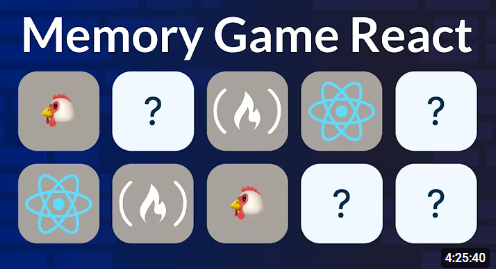
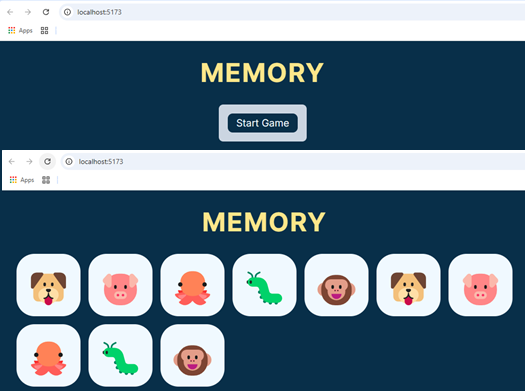
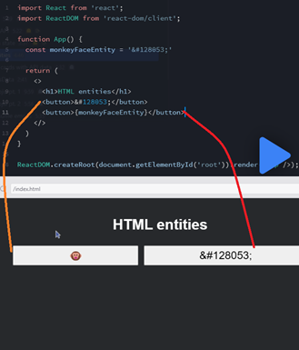
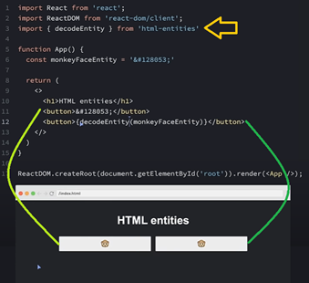
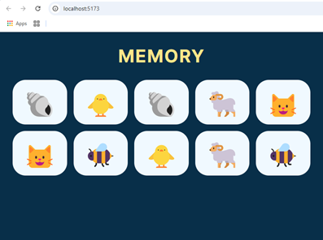

# Build a Memory Game in React Tutorial

[](https://www.youtube.com/watch?v=MzVbgZgGON4&amp;t=360s)

# 1. Intro.

## 1.1. Precondiciones
1. Instalar `NODEJS` y `npm` en su sistema, usando el `nvm`:
  [Instalar múltiples versiones de Node.js en Windows](https://rafaelneto.dev/blog/instalar-multiples-versiones-nodejs-windows/).
```bash
   nvm install [version]
   nvm use [version]
```
2. Verificar las versiones de `NODEJS` instaladas en una `TERMINAL`:
 ```bash
   nvm list
 ```
3. Instalar también el `pnpm` [pnpm installation](https://pnpm.io/installation), es mas rápido que el  `npm`.
4. Instalar [Visual Studio Code](https://code.visualstudio.com/insiders/).}

## 1.2. Inicializar el proyecto
1. Abrir una `TERMINAL` en `Visual Studio Code`,
y estar seguro de estar en la carpeta o directorio 
**"pruebas-tecnicas"**
1. Crear el proyecto con el comando `npm create vite@latest`:
```bash
√ Project name: ... 20250216-react-memory-game
√ Target directory "20250216-react-memory-game" is not empty. ignore files and continue? ... yes
√ Package name: ... 20250216-react-memory-game
√ Select a framework: » Vanilla
? Select a variant: » TypeScript
```
2. Vamos a instalar **Vanilla**, para crear de forma manual el punto de entrada y luego lo que falte del **React**.
3. Ejecutar este `plugin` para completar iniciar el **React**:
```bash
pnpm install @vitejs/plugin-react -E
```
4. Instalar dos dependencias para el uso de **React**:
```bash
pnpm install react react-dom -E
```
5. Como nos vamos por el camino mas difícil (`TipeScript`), se debe
instalar lo relacionado con el `TypeScript`:
```bash
pnpm i --save-dev @types/react -E
pnpm i --save-dev @types/react-dom -E
```
6. Creamos la configuracion de vite, con el archivo **vite.config.ts**:
```js
import { defineConfig } from 'vite' //Importamos el `defineConfig`
import react from '@vitejs/plugin-react' //Importamos el plugin

export default defineConfig({ //Exportamos el `defineConfig`
  plugins: [react()], // Con único plugin de `react()` en el arreglo
})
```

## 1.3. Creamos el punto de Entrada a la Aplicación
1. Borramos dos archivos **src/main.ts** y **src/counter.ts**, no requeridos en este ejercicio.
2. Creamos el archivo de punto de entrada con la extensión **.tsx**: **src/App.tsx**, con estas líneas:
```js
    import { createRoot } from 'react-dom/client';

    const root = createRoot(document.getElementById('app'));
    root.render(<h1> Hola Mundo</h1>)
```
3. hacemos un cambio en **index.html** , para el punto de entrada: `<script type="module" src="/src/App.tsx"></script>`.
4. Ejecutamos en la `TERMINAL` , estando ubicados en la carpeta de
 este proyecto de nombre **"20250216-react-memory-game"**, este
 comando:
```bash
pnpm dev
```
* Esto ejecuta de forma local en [`localhost:5173`](http://localhost:5173/).

>[!WARNING]  
>### Revisar el archivo **`tsconfig.json`**, pues a mi me apareció el error de `"Unknown compiler option"` para `noUncheckedSideEffectImports`, así que solo borré esa línea.

>[!IMPORTANT]  
>### Siempre es sugerente quitar los `^` o _carets_ del archivo **`package.json`**.

# 2. Building the Foundation

## 0:06:00 - Boilerplate code

1. Creamos la carpeta dentro de **"src"** de nombre **"components"**.
2. Creamos tres archivos en la carpeta **"components"**:
    * **`Form.tsx`**
    * **`MemoryCard.tsx`**
    * **`RegularButton.tsx`**
### **`src/App.tsx`**
3. Editamos el archivo **`App.tsx`** y ponemos este código:
```js
import React, { useState } from 'react';
import Form from './components/Form';
import MemoryCard from './components/MemoryCard';

export default function App() {
  const [isGameOn, setIsGameOn] = useState(false);

  function startGame(e: React.FormEvent) {
    e.preventDefault();
    setIsGameOn(true);
  }

  function turnCard() {
    console.log('Memory card clicked');
  }

  return (
    <main>
      <h1>Memory</h1>
      {!isGameOn && <Form handleSubmit={startGame} />}
      {isGameOn && <MemoryCard handleClick={turnCard} />}
    </main>
  );
}
```
### **`src/components/RegularButton.tsx`**
4. Completemos el archivo **`RegularButton.tsx`**:
```js
import React, { ReactNode } from 'react';

export default function RegularButton({
  children,
  type,
  handleClick,
}: {
  children: ReactNode;
  type?: 'submit' | 'reset' | 'button' | undefined;
  handleClick?: () => void;
}) {
  return (
    <button className='btn btn--text' onClick={handleClick} type={type}>
      {children}
    </button>
  );
}
```
### **`src/components/MemoryCard.tsx`**
5. Vamos por el archivo **`MemoryCard.tsx`**:
```js
import React from 'react';

export default function MemoryCard({
  handleClick,
}: {
  handleClick: () => void;
}) {
  const emojiArray = [
    '🐶',
    '🐷',
    '🐙',
    '🐛',
    '🐵',
    '🐶',
    '🐷',
    '🐙',
    '🐛',
    '🐵',
  ];

  const emojiEl = emojiArray.map((emoji, index) => (
    <li key={index} className='card-item'>
      <button className='btn btn--emoji' onClick={handleClick}>
        {emoji}
      </button>
    </li>
  ));

  return <ul className='card-container'>{emojiEl}</ul>;
}
```
### **`src/components/Form.tsx`**
6. Completemos el último `tsx`, el **`Form.tsx`**:
```js
import React from 'react';
import RegularButton from './RegularButton';

export interface FormProps {
  handleSubmit: (e: React.FormEvent<HTMLFormElement>) => void;
}

export default function Form({ handleSubmit }: FormProps) {
  return (
    <form className='wrapper' onSubmit={handleSubmit}>
      <RegularButton type='submit'>Start Game</RegularButton>
    </form>
  );
}
```
### **`src/Index.tsx`**
7. Requerimos de un Ingreso entre entre los `JSX` de `React` y el
**`index.html`**, y este se hace con el archivo **`Index.tsx`**,
dentro de la carpeta **"src"**:
```js
import React from 'react';
import ReactDOM from 'react-dom/client';
import App from './App'

ReactDOM.createRoot(document.getElementById('root')!).render(<App />);
```
### **`src/styles.css`**
8. Creamos un archivo de estilos dentro de la carpeta **"src"** de 
nombre **`styles.css`**:
```css
* {
  margin: 0;
}

:root {
  --dark-primary: #082f49;
  --light-primary: #f0f9ff;
  --light-secondary: #cbd5e1;
  --accent: #fde68a;
  --btn-disabled: #a8a29e;
}

/*===========================
Layout
============================*/
body {
  font-family: 'Inter', sans-serif;
  background: var(--dark-primary);
  color: var(--light-primary);
  text-align: center;
  min-height: 100vh;
}

main {
  display: flex;
  flex-direction: column;
  align-items: center;
  gap: 2em;
  height: 100%;
  min-height: 100vh;
  padding: 2em;
}

.wrapper {
  display: flex;
  flex-direction: column;
  gap: 1.5em;
  background-color: var(--light-secondary);
  color: var(--dark-primary);
  border-radius: .5em;
}

.wrapper--accent {
  padding: 2em 3em;
  border: 1px solid var(--dark-primary);
  box-shadow: 0 0 5px 2px var(--light-primary);
  
}

/*===========================
Typography
============================*/

h1 {
  color: var(--accent);
  font-size: 2.25rem;
  letter-spacing: 2px;
  text-transform: uppercase;
  margin: 0;
}

.p--large {
  font-size: 1.5rem;
}

.p--regular {
  font-size: 1.125em;    
}

/*===========================
Buttons
============================*/
.btn {
  background-color: var(--light-primary);
  color: var(--dark-primary);
  font-family: inherit;
  border: 2px solid var(--dark-primary);
  border-radius: .5em;
  cursor: pointer;
}

.btn--text {
  background-color: var(--dark-primary);
  color: var(--light-primary);
  font-size: 1.25rem;
  width: max-content;
  margin: 0 auto;
  padding: .25em .75em;
}

.btn--emoji {
  width: 100%;
  height: 100px;
  font-size: 3rem;
  border: 2px solid var(--light-primary);
}

.btn--text:hover,
.btn--text:focus {
  background-color: var(--light-primary);
  color: var(--dark-primary);
  box-shadow: 0 0 5px 1px var(--dark-primary);
}

/*===========================
Form
============================*/

.form-container {
  display: flex;
  flex-direction: column;
  gap: 1.5em;
  text-align: start;
}

form {
  gap: 2em;
  font-size: 1.125rem;
  padding: 1em;
  border-radius: .5em;
}

.form__inner-wrapper {
  display: flex;
  flex-direction: column;
  gap: .5em;
}

select {
  background-color: var(--dark-primary);
  color: var(--light-primary);
  font-family: inherit;
  padding: .5em;
  border: 1px solid var(--dark-primary);
  border-radius: .5em;
  cursor: pointer;
}

select:hover,
select:focus {
  background-color: var(--light-primary);
  color: var(--dark-primary);
  box-shadow: 0 0 2px 1px var(--dark-primary);
}

/*===========================
Game
============================*/
.card-container {
  padding-left: 0;
  display: grid;
  grid-template-columns: repeat(auto-fit, minmax(100px, 1fr));
  gap: 1em;
  width: 100%;
}

.card-item {
  list-style: none;
}

/* Animated memory card */
.card-item--selected,
.card-item--matched,
.btn--emoji__back--selected,
.btn--emoji__back--matched {
  transform: rotateY(180deg);
}

.card-item--selected {
  transition: .6s;
  transform-style: preserve-3d;
}

.btn--emoji__front,
.btn--emoji__back--selected {
  backface-visibility: hidden;    
}

.btn--emoji__back--matched {
  backface-visibility: unset;
  background-color: var(--btn-disabled);
  border: 2px solid var(--btn-disabled);
  cursor: not-allowed;
}

.btn--emoji__front:hover,
.btn--emoji__front:focus {
  background-color: var(--accent);
  border: 2px solid var(--dark-primary);
  box-shadow: 0 0 5px 2px var(--light-primary);
  cursor: pointer;
}

.card-item--selected .btn--emoji__back--selected {
  border: 2px solid var(--dark-primary);
  box-shadow: 0 0 5px 2px var(--light-primary);
}

/*===========================
Screen reader only
============================*/
.sr-only {
border: 0 !important;
clip: rect(1px, 1px, 1px, 1px) !important;
-webkit-clip-path: inset(50%) !important;
  clip-path: inset(50%) !important;
height: 1px !important;
margin: -1px !important;
overflow: hidden !important;
padding: 0 !important;
position: absolute !important;
width: 1px !important;
white-space: nowrap !important;
}

/*===========================
Media queries
============================*/
@media (min-width: 768px) {
  h1 {
      font-size: 2.75rem;
  }

  .btn--emoji {
      font-size: 4rem;
      height: 110px;
  }

  .card-container {
      grid-template-columns: repeat(auto-fit, minmax(110px, 1fr));
  }
}

@media (min-width: 1024px) {
  h1 {
      font-size: 3.25rem;
  }

  .btn--emoji {
      font-size: 4.5rem;
      height: 125px;
  }

  .card-container {
      grid-template-columns: repeat(auto-fit, minmax(125px, 1fr));
  }
}
```
### **`index.html`**
9. Corregimos el archivo **`index.html`**, para que reconozca tanto
los stilos de **`styles.css`**, como la entrada al `React` en el
archivo **`Intex.tsx`**:
```html
<!DOCTYPE html>
<html lang="en">
    <head>
        <link rel="stylesheet" href="/src/styles.css">
        <title>Memory game</title>
        <meta name="viewport" content="width=device-width, initial-scale=1"/>
        <link rel="preconnect" href="https://fonts.googleapis.com">
        <link rel="preconnect" href="https://fonts.gstatic.com" crossorigin>
        <link href="https://fonts.googleapis.com/css2?family=Inter:wght@100..900&display=swap" rel="stylesheet">
    </head>
    <body>
        <div id="root"></div>
        <script src="/src/Index.tsx" type="module"></script>
    </body>
</html>
```
* Así se ve el aplicativo corriendo en el browser:  

### **`src/data/data.json`**
10. Por último creamos un archivo de nombre **`data.json`** dentro de
una carpeta nueva de nombre **"data"**:
```json
{
  "category": [
    {
      "name": "Animals and nature",
      "value": "animals-and-nature"
    },
    {
      "name": "Food and drink",
      "value": "food-and-drink"
    },
    {
      "name": "Travel and places",
      "value": "travel-and-places"
    },
    {
      "name": "Objects",
      "value": "objects"
    },
    {
      "name": "Symbols",
      "value": "symbols"
    }
  ],
  "number": [
    {
      "value": "10"
    },
    {
      "value": "20"
    },
    {
      "value": "30"
    },
    {
      "value": "40"
    },
    {
      "value": "50"
    }
  ]
}
```
11. En esta prueba como estoy en un proyecto mas grande, borro o ignoro
el arhivo de esta carpeta o proyecto de nombre **`.gitignore`**

## 0:11:53 - Fetch data from API

>[!IMPORTANT]  
>### Desafío:
>1) Convierte `startGame()` en una función asincrónica.
>2) Utiliza la sintaxis try...catch y realiza una solicitud de búsqueda a la `API` de emojis, utilizando esta URL: "https://emojihub.yurace.pro/api/all/category/animals-and-nature". Almacena la respuesta en una constante "`response`".
>3) Comprueba si la respuesta es correcta.
>   * Si es así, almacena los datos obtenidos en una constante "`data`". Registra los datos en la consola. Llama a `setIsGameOn(true)`.
>   * Si no, genera un error con un mensaje de error personalizado y, dentro del bloque `catch`, registra el mensaje de error en la consola
> 
>💡 Sugerencia: ¡Recuerda la palabra clave `await`!  
>⚠️ Advertencia: Los emojis renderizados seguirán siendo los de la matriz codificada.
1. En el archivo **`App.tsx`**, para la función `startGame()` agregamos
el comando `async`:
```js
  async function startGame(e: React.FormEvent) {
    e.preventDefault();
    setIsGameOn(true);
  }
```
2. En la misma función `startGame()`, antes del `setIsGameOn(true)`
creamos un bloque `try/catch` y agregamos el llamado al `API`:
```js
  async function startGame(e: React.FormEvent) {
    e.preventDefault();
    try {
      const response = await fetch(
        'https://emojihub.yurace.pro/api/all/category/animals-and-nature'
      );
    } catch (error) {}
    setIsGameOn(true);
  }
    setIsGameOn(true);
  }
```
3. Luego de obtener la constante `response`, hacemos una condicional, para
el manejo de erroers y el que vamos a procesar o proceder:
```js
    try {
      ...
      if (!response.ok) {
        throw new Error('Could not fetch data from API');
      }
    } catch (error) {}
```
4. Luego del condicional cargamos la constante `data`:
```js
    try {
      ...
      const data = await response.json();
      console.log(data);
    } catch (error) {}
```
5. Movemos el llamado a la función `setIsGameOn(true)`, dentro del 
`try/catch`, debajo de `console.log(data)`.
6. Completamos lo que haría el `catch`:
```js
    try {
      ...
      setIsGameOn(true);
    } catch (error) {
        console.error(error);
    }
```

## 0:17:18 - Store API data in state

>[!IMPORTANT]  
>### Desafío:
>1) Crea una nueva variable de estado, "`emojisData`", con una función de establecimiento correspondiente e inicialízala como una matriz vacía.
>2) Dentro del bloque `try` de la función `startGame()`, crea una nueva variable, "`dataSample`", y configúrala igual a los primeros 5 elementos de "`data`".
>3) Almacena "`dataSample`" como "`emojisData`" en el estado.
>4) Registra "`emojisData`" en la consola.
>
>💡 Sugerencia: En el paso 2, usa el método `.slice()` de `JavaScript` para obtener la muestra de datos.  
>⚠️ Advertencia: Aún estamos renderizando nuestros emojis codificados.

1. En el archivo **`App.tsx`**, debajo del primer `useState`, creamos
otra constante tambien para almacenar otro `useState`:
```js
  const [emojisData, setEmojisData] = useState([]);
```
2. Cambiamos dentro del `try/catch` el `console.log`, para asignar la
`data` dentro del `dataSample`, usando el `.slice()`:
```js
    try {
      ...
      const data = await response.json();
      const dataSample = data.slice(0, 5);
      ...
    } catch (error) {
      ...
    }
```
3. Almacenamos el `dataSample` dentro del estado con `setEmojisData`:
```js
    try {
      ...;
      setEmojisData(dataSample);
      ...
    } catch (error) {
      ...
    }
```
4. Hacemos un `console.log` de `emojisData`, antes del a función 
`startGame()` del archivo **`App.tsx`**:
```js
export default function App() {
  const [isGameOn, setIsGameOn] = useState(false);
  const [emojisData, setEmojisData] = useState([]);

  //Mostramos el valor de `emojisData` en la consola
  console.log(emojisData);
  
  async function startGame(e: React.FormEvent) {
    ...
  }
  ...
```
* Esto lo muestra en consola con los valores cargados, 
justo después de presionar el botón `[Start Game]`. 

## 0:21:19 - Aside: HTML entities

>[!NOTE]  
>Códigos especiales son utilizados en `HTML` para representar caracteres
>reservados o caracteres que no son facilmente digitados en el teclado.  
>**`&#128053;`** === 🐵
>
>**¿Cómo decodificar entidades HTML?**  
>|Entidades codificadas: | Entidades dinámicas:
>|-|-|
>Una entidad HTML codificada en el `HTML` se decodificará automáticamente.<br/><br/> _No se necesitan más acciones._|Una Entidad HTML almacenada en una variable, no se decodificará automáticamente cuando la variable se representa en el HTML.<br/><br/> _¡Tenemos que decodificarlo!_|
>
>En este ejemplo de código, en el primero muestro el valor directo y 
>aparece la imagen del `monkey`, en el segundo lo asigno a una variable
> pero este no se capaz de mostrar el resultado:  
>
>
>### Se requiere instalar una librería de nombre: `html-entities`
>```bash
>pnpm install html-entities -E
>```
>Luego del cambio en el código este sería el resultado:  
>

## 0:26:08 - Render memory cards with API data

>[!IMPORTANT]  
>### Desafío:
>1) Pasa "emojisData" como el valor de una propiedad "data" al componente >MemoryCard.
>2) Usa "data" que estás recibiendo como propiedad para representar los emojis obtenidos de la API. Recuerda que "data" es una matriz de objetos emoji. Registra los datos en la consola para ver qué propiedad de este objeto deberías representar como contenido del botón.  
>
>💡 Sugerencia: ¡Sabes cómo decodificar entidades HTML!
1. Empiezo eliminando del archivo **`App.tsx`**, el `console.log`
a `emojisData`.
2. En el archivo **`App.tsx`** agregamos un parámetro al llamado del
componente `MemoryCard` con el valor de `data`:
```js
export default function App() {
  ...
  return (
    <main>
      ...
      {isGameOn && <MemoryCard handleClick={turnCard} data={emojisData} />}
    </main>
  );
}
```
3. En el componente **`MemorytCard.tsx`** se añade el nuevo parámetro
de nombre `data` de tipo objeto ("`{}`") y lo mostramos en un 
`console.log`:
```js
export default function MemoryCard({
  handleClick,
  data,
}: {
  handleClick: () => void;
  data: [] | any[];
}) {
  console.log(data);

  ...
}
```
4. En **`MemoryCard.tsx`** importamos la biblioteca `'html-entities'`.
5. Cambio el `emojiArray` por el nuevo valor recibido de `data`.
6. Muestro el elemento `htmlCode`, que está dentro del arreglo `data`,
en el componente **`MemorytCard.tsx`** y de una vez aplicamos el 
`decodeEntity`:
```js
import { decodeEntity } from 'html-entities';

export default function MemoryCard({handleClick, data}: {
  handleClick: () => void;data: [] | any[]}) {
  console.log(data);
  ...
  const emojiEl = data.map((emoji, index) => (
    <li key={index} className='card-item'>
      <button className='btn btn--emoji' onClick={handleClick}>
        {decodeEntity(emoji.htmlCode[0])}
      </button>
    </li>
  ));
  ...
}
```
7. Podemos borrar dentro de **`MemoryCard.tsx`**, lo siguiente:
* `console.log`
* `emojiArray`
8. Luego de presionar el botón `[Start Game]` esto es lo que saldrá
en el broser:  
![decodeEntity(emoji.htmlCode[0])](images/2025-02-18_115832.png "decodeEntity(emoji.htmlCode[0])")

## 0:30:45 - Issue with emojisData

>[!NOTE]  
>#### To do:
>* Paso 1: Obtener emojis aleatorios de la API
>* Paso 2: Duplicar emojis únicos
>* Paso 3: Mezclar los datos de emojis

### 0:33:29 - Get random emojis pt. 1

>[!NOTE]  
>#### Mini desafío:
>* ¿Cómo podemos obtener emojis en índices aleatorios en la matriz de datos en lugar de obtener siempre los primeros 5?
>* ¿Cómo podemos obtener números aleatorios dentro de un rango que nos permita usarlos como índices en la matriz "datos"?

>[!IMPORTANT]  
>#### Desafío:
>1) Crea una nueva función, "`getRandomIndices()`", justo debajo de la función "`startGame()`". Debería recibir "`data`" como parámetro.
>2) En esta nueva función, declara una nueva variable, "`randomIndicesArray`", e inicialízala como una matriz vacía.
>3) Después de declarar "`randomIndicesArray`", usa un bucle for para generar 5 números aleatorios dentro de un rango equivalente a la longitud de la matriz "`data`" y envía estos números a "`randomIndicesArray`". Devuelve "`randomIndicesArray`" en la parte inferior de la función.
>4) En el bloque try de la función "`startGame()`", registra el valor de retorno de "`getRandomIndices()`" a la consola, pasándole "`data`" como argumento.
>
>💡 Sugerencia: Queremos exactamente 5 números aleatorios únicos. ¿Qué puedes hacer dentro del bucle for para asegurarte de que los obtengamos?

1. En el archivo **`App.tsx`**, Creamos una nueva función de nombre
`getRandomIndices()`:
```js
  function getRandomIndices(data: any[]) {}
```
2. Creamos un arreglo dentro de la función `getRandomIndices()` de
nombre `randomIndicesArray`, como un arreglo vacío
3. Dentro de la función y debajo de la definición del nuevo arreglo
creamos un ciclo `for`:
```js
  function getRandomIndices(data: any[]) {
    const ramdonInidicesArray = [] as number[];

    for (let i = 0; i < 5; i++) {
      const randomNum = Math.floor(Math.random() * data.length);
    }
  }
```
4. Justo después de definir la constante `randomNum`, y
dentro del ciclo `for` ponemos un condicional:
```js
      if (!ramdonInidicesArray.includes(randomNum)) {
        ramdonInidicesArray.push(randomNum);
      } else {
        i--;
      }
```
5. Luego del ciclo `for` en la función `getRandomIndices()`, hacemos
el `return` del arreglo `ramdonInidicesArray`.
6. En la función `startGame()`, justo depués de cargar la constante
`dataSample`, invoco la nueva función `getRandomIndices()` dentro
de un `console.log`, para ver la respuesta.  
7. Podemos borrar este último `console.log`.

### 0:43:32 - Get random emojis pt. 2

>[!IMPORTANT]  
>#### Desafío:
>1) Debajo de la función "`startGame()`", crea una nueva función llamada "`getDataSlice()`". La función debe recibir "`data`" como parámetro.
>2) Dentro de esta función, realiza una llamada a "`getRandomIndicies()`" y almacena el valor de retorno en una variable llamada "`randomIndices`".
>3) Mapea sobre "`randomIndices`" y usa los números aleatorios almacenados en esta matriz para crear una nueva matriz de emojis aleatorios seleccionados de "`data`". Almacena esta nueva matriz en una variable llamada "`dataSlice`" y devuélvela al final de la función.
>4) Dentro del bloque try de la función "`startGame()`", realiza una llamada a "`getDataSlice()`", pasando "`data`" como argumento. Guarda el valor de retorno en una variable llamada "`dataSlice`".
>5) Elimina la variable "`dataSample`" y reemplaza "`dataSample`" con la nueva variable "`dataSlice`" en la función "`setEmojisData()`".
>6) Ejecuta el código e inicia un nuevo juego para comprobar que tu código funciona.
1. En el archivo **`App.tsx`**, Creamos una nueva función de nombre
`getDataSlice()`:
```js
  function getDataSlice(data: any[]) {}
```
2. En la nueva función `getDataSlice()`, llamamos la función
`getRandomIndices()` y la lamacenamos en `randomIndices`:
```js
  function getDataSlice(data: any[]) {
    const randomIndices = getRandomIndices(data);
  }
```
3. Usando el `map` en el arreglo `randomIndices`, cargamos una constante
de nombre `dataSlice` y la exponemos en un `return`:
```js
  function getDataSlice(data: any[]) {
    const randomIndices = getRandomIndices(data);
    const dataSlice = randomIndices.map((index) => data[index]);
    return dataSlice;
  }
```
4. En la función `startGame()` y dentro del bloque `try/catch`, cargamos
una constante de nombre `dataSlice` con el valor de la función
`getDataSlice()`:
```js
      const dataSlice = getDataSlice(data);
```
5. Borramos o comentamos la creación y asignación de la constante
`dataSample` y el momento de llamar la función `setEmojisData()`,
lo hacemos con la nueva `dataSlice`.
6. Esto me saca un mensaje a corregir y es cuando defino el
`useState` para `emojisData`:
```js
export default function App() {
  ...
  const [emojisData, setEmojisData] = useState([] as any[]);

  async function startGame(e: React.FormEvent) {
    ...
    try {
      ...
      const data = await response.json();
      // const dataSample = data.slice(0, 5);
      const dataSlice = getDataSlice(data);

      setEmojisData(dataSlice);
      ...
    } catch (error) {
      ...
    }
  }
  ...
  return (
    ...
  );
}
```

### 0:49:32 - Duplicate and shuffle emojis

1. Debajo de la función `getRandomIndices()`, creams una nueva de nombre
`getEmojisArray()`:
```js
  function getEmojisArray(data: any[]) {}
```
2. Esta nueva función la llamaremos después de obtener la constante
`dataSlice`, justo con esa constante como parámetro y la cargamos en
la constante de nombre `emojisArray`:
```js
      const emojisArray = getEmojisArray(dataSlice);
```

>[!NOTE]
>#### Desafío:
>1) Crea una nueva variable, "`pairedEmojisArray`". Esta variable debe ser una matriz que incluya cada objeto emoji de la matriz "`data`" dos veces.
>2) Usa el algoritmo `Fisher-Yates` para mezclar "`pairedEmojisArray`" y devolverlo al final de la función.
>3) Ejecuta el código y comienza un nuevo juego.
>
>💡 Consejos: En el paso 1, usa el operador de propagación de matrices para crear una nueva matriz. En el paso 2, ¡busca en _Google_ el algoritmo `Fisher-Yates`!

3. Dentro de la nueva función `getEmojisArray()`, creamos la constante
`pairedEmojisArray` y le asignamos el valor de `data` a modo de _spread_,
por dos veces es decir, duplicando la `data`: 
```js
    const pairedEmojisArray = [...data, ...data] ;
```
4. Hacemos el algoritmo de nombre `Fisher-Yates`, usando un cilo `for`:
```j
    // Algoritmo `Fisher-Yates`
    for (let i = pairedEmojisArray.length - 1; i > 0; i--) {
      const j = Math.floor(Math.random() * (i + 1));
      const temp = pairedEmojisArray[i];
      pairedEmojisArray[i] = pairedEmojisArray[j];
      pairedEmojisArray[j] = temp;
    }
```
5. Devolvemos el valor obtenido dentro de la función `getEmojisArray()`.
6. En el llamado a la función `setEmojisData()`, cambiamos el parámetro 
enviado de `dataSlice`, por el nuevo obtenido de `emojisArray`.
* Este es el resultado obtenido hasta el momento:  



# 3. Core Game Functionality

## 0:55:10 - Side note: Address future discrepancies

1. Para el archivo **`App.tsx`**, faltó adicionar los `await` 
cuando obtengo las constantes:
* `dataSlice`
* `emojisArray` 
```js
      const dataSlice = await getDataSlice(data); 
      const emojisArray = await getEmojisArray(dataSlice); 
```
* Aunque me sale el mensaje de advertencia : 
`has no effect on the type of this expression`, 
es por que faltan mas pasos con las funciones que estoy llamando.
2. A la función `getDataSlice()` le antecedo el comando `async`.
3. Lo mismo para la función `getEmojisArray()`.

## 0:58:59 - Select a memory card pt. 1

>[!NOTE] 
>#### Mini desafío:
>¿Qué información de una tarjeta de memoria podemos usar para:
>1) Identificar en qué tarjeta se hizo clic?
>2) Identificar pares de emojis que coincidan
>* La respuesta al número `1` es el `index` o índice.
>* La respuesta al número `2` es el `name of emoji` o nombre del _emoji_.

>[!IMPORTANT]
>### Desafío:
>1) En el archivo **`MemoryCard.tsx`**, pasa `emoji.name` e `index` como argumentos a la función `handleClick()` que se llama al hacer clic en el botón.
>2) En el archivo **`App.tsx`**, para la función `turnCard()`, recibe `name` e `index` como parámetros y regístralos en la consola.

1. Empeamos en el componente `MemoryCard`, añadiendo como nuevos parámetros
a la función `handleClick()`, el `emoji.name` y el `index`, pero tener
en cuenta que al trabaja con `typeScript` debemos definir los valores
antes de usuarlos, asi queda todo el componente con los cambios:
```js
export default function MemoryCard({
  handleClick,
  data,
}: {
  // Definición de la función con los dos parámetros nuevos 
  handleClick: (name: string, index: number) => void; 
  data: [] | any[];
}) {
  const emojiEl = data.map((emoji, index) => (
    <li key={index} className='card-item'>
      <button
        className='btn btn--emoji'
        // Llamado de la función dentro de otra función con los parámetros
        onClick={() => handleClick(emoji.name, index)}
      >
        {decodeEntity(emoji.htmlCode[0])}
      </button>
    </li>
  ));

  return <ul className='card-container'>{emojiEl}</ul>;
}
```
2. En el arcchivo **`App.tsx`**, en la función `turnCard()`, recibimos
los nuevo parámetros y los mostramos en la consola:
```js
  function turnCard(name: string, index: number) {
    console.log(`The emoji '${name}' at index '${index}' was clicked`);
  }
```

## 1:05:22 - Select a memory card pt. 2

>[!IMPORTANT] 
>### Desafío:
>1) Crear una nueva variable en el estado "`selectedCards`" con una función de establecimiento correspondiente. Inicializarla como una matriz vacía.
>2) En la función `turnCard()`, establecer el valor de "`selectedCards`" para que sea una matriz que contenga un elemento: un objeto con dos pares clave-valor, donde los valores son los parámetros de la función.
>3) Registrar "`selectedCards`" en la consola.

1. En el archivo **`App.tsx`**, agregamos un `useState` de nombre
`selectedCards`, como un arreglo vacío:
```js
  const [selectedCards, setSelectedCards] = useState([] as any[]);
```
2. En la función `turnCard()`, eliminamos o comentamos el `console.log`.
3. Llamo el recién definido `useState` con el `setSelectedCards():`,
dentro de la función `turnCard()`:
```js
  function turnCard(name: string, index: number) {
    // console.log(`The emoji '${name}' at index '${index}' was clicked`);
    setSelectedCards([{ name, index }]);
  }
```
4. Justo depués de la definición del último `useState`, hacemos un
`console.log` de `selectedCards`.
* Solo me muestra la última carta seleccionada.

## 1:10:37 - Select a memory card pt. 3

>[!NOTE]
>#### Mini desafío:
>Basándonos en las reglas y mecánicas de un juego de memoria, defina las condiciones que necesitamos incorporar a nuestra función "turnCard". Asegúrese de tener en cuenta los siguientes aspectos:
>1) ¿Cuántas veces puede aparecer una carta en la matriz "selectedCards"?
>2) ¿Cuál es la cantidad máxima de cartas en la matriz "selectedCards" en un momento dado?
>
>**Respuestas:**
>1. Una vez o `1`.
>2. Máximo dos (`2`).

>[!IMPORTANT]
>### Desafío:
>1) Comprueba si la carta en la que has hecho clic ya está en la matriz "`selectedCards`". Guarda el resultado de esta comprobación en una variable llamada "`selectedCardEntry`".
>2) Actualiza el código que añade una carta en la que has hecho clic a "`selectedCards`". Asegúrate de que se cumplan las siguientes condiciones:
>     - Cada carta solo se puede añadir una vez en la misma ronda.
>     - La longitud de la matriz "`selectedCards`" nunca debe superar los 2 caracteres.
>3) Registra "`selectedCards`" en la consola.
>
>💡 Sugerencia: utiliza el método `.find()` de JavaScript para resolver el paso 1.
1. En el archivo **`App.tsx`**, comentamos el llamado a la función 
`setSelectedCards()`, dentro de la función `turnCard()`.
2. Añadimos en la función `turnCard()`, el uso de la constante
`selectedCards`, con un `find()`:
```js
    const selectedCardEntry = selectedCards.find(
      (card) => card.index === index
    );
```
3. En la misma función `turnCard()`, añadimos una condicional con lo
siguiente:
```js
    if (!selectedCardEntry && selectedCards.length < 2) {
      setSelectedCards([...selectedCards, { name, index }]);
    } else if (!selectedCardEntry && selectedCards.length === 2) {
      setSelectedCards([{ name, index }]);
    }
```
4. El mostrar en consola, ya existe (`console.log(selectedCards);`)
y está debajo de la definición de la constante `selectedCards` como 
un `useState`.

>[!TIP]  
>* Al ejecutar y tratar de dar clic dos veces en la misma carta, solo
>se adiciona una vez en este arreglo.  
>* Al dar clic en dos cartas diferentes, se almacenan las dos cartas
>en el arreglo.
>* Al dar clic una tercera vez en otra carta, se borra el arreglo y vuelve
>al paso inicial de un solo elemento en el arreglo.
