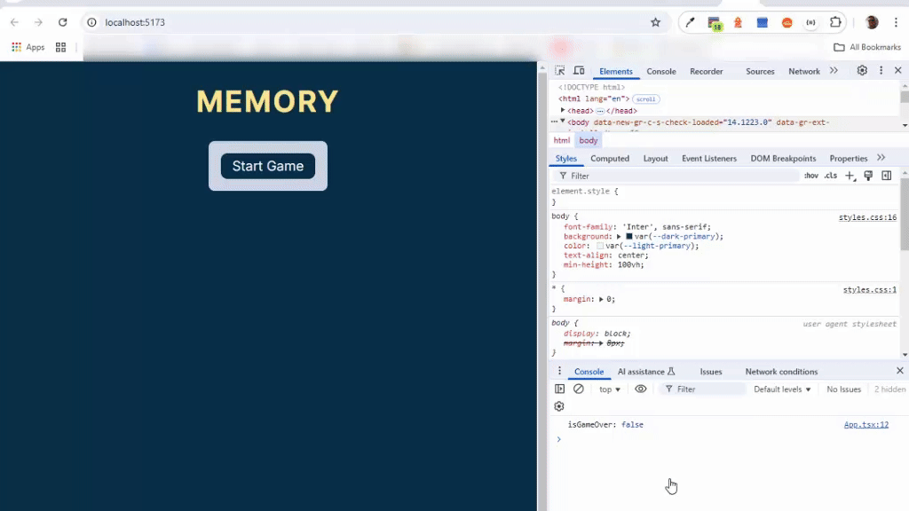

# Build a Memory Game in React Tutorial

[](https://www.youtube.com/watch?v=MzVbgZgGON4&amp;t=360s)

# 1. Intro.

## 1.1. Precondiciones
1. Instalar `NODEJS` y `npm` en su sistema, usando el `nvm`:
  [Instalar múltiples versiones de Node.js en Windows](https://rafaelneto.dev/blog/instalar-multiples-versiones-nodejs-windows/).
```bash
   nvm install [version]
   nvm use [version]
```
2. Verificar las versiones de `NODEJS` instaladas en una `TERMINAL`:
 ```bash
   nvm list
 ```
3. Instalar también el `pnpm` [pnpm installation](https://pnpm.io/installation), es mas rápido que el  `npm`.
4. Instalar [Visual Studio Code](https://code.visualstudio.com/insiders/).}

## 1.2. Inicializar el proyecto
1. Abrir una `TERMINAL` en `Visual Studio Code`,
y estar seguro de estar en la carpeta o directorio 
**"pruebas-tecnicas"**
1. Crear el proyecto con el comando `npm create vite@latest`:
```bash
√ Project name: ... 20250216-react-memory-game
√ Target directory "20250216-react-memory-game" is not empty. ignore files and continue? ... yes
√ Package name: ... 20250216-react-memory-game
√ Select a framework: » Vanilla
? Select a variant: » TypeScript
```
2. Vamos a instalar **Vanilla**, para crear de forma manual el punto de entrada y luego lo que falte del **React**.
3. Ejecutar este `plugin` para completar iniciar el **React**:
```bash
pnpm install @vitejs/plugin-react -E
```
4. Instalar dos dependencias para el uso de **React**:
```bash
pnpm install react react-dom -E
```
5. Como nos vamos por el camino mas difícil (`TipeScript`), se debe
instalar lo relacionado con el `TypeScript`:
```bash
pnpm i --save-dev @types/react -E
pnpm i --save-dev @types/react-dom -E
```
6. Creamos la configuracion de vite, con el archivo **vite.config.ts**:
```js
import { defineConfig } from 'vite' //Importamos el `defineConfig`
import react from '@vitejs/plugin-react' //Importamos el plugin

export default defineConfig({ //Exportamos el `defineConfig`
  plugins: [react()], // Con único plugin de `react()` en el arreglo
})
```

## 1.3. Creamos el punto de Entrada a la Aplicación
1. Borramos dos archivos **src/main.ts** y **src/counter.ts**, no requeridos en este ejercicio.
2. Creamos el archivo de punto de entrada con la extensión **.tsx**: **src/App.tsx**, con estas líneas:
```js
    import { createRoot } from 'react-dom/client';

    const root = createRoot(document.getElementById('app'));
    root.render(<h1> Hola Mundo</h1>)
```
3. hacemos un cambio en **index.html** , para el punto de entrada: `<script type="module" src="/src/App.tsx"></script>`.
4. Ejecutamos en la `TERMINAL` , estando ubicados en la carpeta de
 este proyecto de nombre **"20250216-react-memory-game"**, este
 comando:
```bash
pnpm dev
```
* Esto ejecuta de forma local en [`localhost:5173`](http://localhost:5173/).

>[!WARNING]  
>### Revisar el archivo **`tsconfig.json`**, pues a mi me apareció el error de `"Unknown compiler option"` para `noUncheckedSideEffectImports`, así que solo borré esa línea.

>[!IMPORTANT]  
>### Siempre es sugerente quitar los `^` o _carets_ del archivo **`package.json`**.

# 2. Building the Foundation

## 0:06:00 - Boilerplate code

1. Creamos la carpeta dentro de **"src"** de nombre **"components"**.
2. Creamos tres archivos en la carpeta **"components"**:
    * **`Form.tsx`**
    * **`MemoryCard.tsx`**
    * **`RegularButton.tsx`**
### **`src/App.tsx`**
3. Editamos el archivo **`App.tsx`** y ponemos este código:
```js
import React, { useState } from 'react';
import Form from './components/Form';
import MemoryCard from './components/MemoryCard';

export default function App() {
  const [isGameOn, setIsGameOn] = useState(false);

  function startGame(e: React.FormEvent) {
    e.preventDefault();
    setIsGameOn(true);
  }

  function turnCard() {
    console.log('Memory card clicked');
  }

  return (
    <main>
      <h1>Memory</h1>
      {!isGameOn && <Form handleSubmit={startGame} />}
      {isGameOn && <MemoryCard handleClick={turnCard} />}
    </main>
  );
}
```
### **`src/components/RegularButton.tsx`**
4. Completemos el archivo **`RegularButton.tsx`**:
```js
import React, { ReactNode } from 'react';

export default function RegularButton({
  children,
  type,
  handleClick,
}: {
  children: ReactNode;
  type?: 'submit' | 'reset' | 'button' | undefined;
  handleClick?: () => void;
}) {
  return (
    <button className='btn btn--text' onClick={handleClick} type={type}>
      {children}
    </button>
  );
}
```
### **`src/components/MemoryCard.tsx`**
5. Vamos por el archivo **`MemoryCard.tsx`**:
```js
import React from 'react';

export default function MemoryCard({
  handleClick,
}: {
  handleClick: () => void;
}) {
  const emojiArray = [
    '🐶',
    '🐷',
    '🐙',
    '🐛',
    '🐵',
    '🐶',
    '🐷',
    '🐙',
    '🐛',
    '🐵',
  ];

  const emojiEl = emojiArray.map((emoji, index) => (
    <li key={index} className='card-item'>
      <button className='btn btn--emoji' onClick={handleClick}>
        {emoji}
      </button>
    </li>
  ));

  return <ul className='card-container'>{emojiEl}</ul>;
}
```
### **`src/components/Form.tsx`**
6. Completemos el último `tsx`, el **`Form.tsx`**:
```js
import React from 'react';
import RegularButton from './RegularButton';

export interface FormProps {
  handleSubmit: (e: React.FormEvent<HTMLFormElement>) => void;
}

export default function Form({ handleSubmit }: FormProps) {
  return (
    <form className='wrapper' onSubmit={handleSubmit}>
      <RegularButton type='submit'>Start Game</RegularButton>
    </form>
  );
}
```
### **`src/Index.tsx`**
7. Requerimos de un Ingreso entre entre los `JSX` de `React` y el
**`index.html`**, y este se hace con el archivo **`Index.tsx`**,
dentro de la carpeta **"src"**:
```js
import React from 'react';
import ReactDOM from 'react-dom/client';
import App from './App'

ReactDOM.createRoot(document.getElementById('root')!).render(<App />);
```
### **`src/styles.css`**
8. Creamos un archivo de estilos dentro de la carpeta **"src"** de 
nombre **`styles.css`**:
```css
* {
  margin: 0;
}

:root {
  --dark-primary: #082f49;
  --light-primary: #f0f9ff;
  --light-secondary: #cbd5e1;
  --accent: #fde68a;
  --btn-disabled: #a8a29e;
}

/*===========================
Layout
============================*/
body {
  font-family: 'Inter', sans-serif;
  background: var(--dark-primary);
  color: var(--light-primary);
  text-align: center;
  min-height: 100vh;
}

main {
  display: flex;
  flex-direction: column;
  align-items: center;
  gap: 2em;
  height: 100%;
  min-height: 100vh;
  padding: 2em;
}

.wrapper {
  display: flex;
  flex-direction: column;
  gap: 1.5em;
  background-color: var(--light-secondary);
  color: var(--dark-primary);
  border-radius: .5em;
}

.wrapper--accent {
  padding: 2em 3em;
  border: 1px solid var(--dark-primary);
  box-shadow: 0 0 5px 2px var(--light-primary);
  
}

/*===========================
Typography
============================*/

h1 {
  color: var(--accent);
  font-size: 2.25rem;
  letter-spacing: 2px;
  text-transform: uppercase;
  margin: 0;
}

.p--large {
  font-size: 1.5rem;
}

.p--regular {
  font-size: 1.125em;    
}

/*===========================
Buttons
============================*/
.btn {
  background-color: var(--light-primary);
  color: var(--dark-primary);
  font-family: inherit;
  border: 2px solid var(--dark-primary);
  border-radius: .5em;
  cursor: pointer;
}

.btn--text {
  background-color: var(--dark-primary);
  color: var(--light-primary);
  font-size: 1.25rem;
  width: max-content;
  margin: 0 auto;
  padding: .25em .75em;
}

.btn--emoji {
  width: 100%;
  height: 100px;
  font-size: 3rem;
  border: 2px solid var(--light-primary);
}

.btn--text:hover,
.btn--text:focus {
  background-color: var(--light-primary);
  color: var(--dark-primary);
  box-shadow: 0 0 5px 1px var(--dark-primary);
}

/*===========================
Form
============================*/

.form-container {
  display: flex;
  flex-direction: column;
  gap: 1.5em;
  text-align: start;
}

form {
  gap: 2em;
  font-size: 1.125rem;
  padding: 1em;
  border-radius: .5em;
}

.form__inner-wrapper {
  display: flex;
  flex-direction: column;
  gap: .5em;
}

select {
  background-color: var(--dark-primary);
  color: var(--light-primary);
  font-family: inherit;
  padding: .5em;
  border: 1px solid var(--dark-primary);
  border-radius: .5em;
  cursor: pointer;
}

select:hover,
select:focus {
  background-color: var(--light-primary);
  color: var(--dark-primary);
  box-shadow: 0 0 2px 1px var(--dark-primary);
}

/*===========================
Game
============================*/
.card-container {
  padding-left: 0;
  display: grid;
  grid-template-columns: repeat(auto-fit, minmax(100px, 1fr));
  gap: 1em;
  width: 100%;
}

.card-item {
  list-style: none;
}

/* Animated memory card */
.card-item--selected,
.card-item--matched,
.btn--emoji__back--selected,
.btn--emoji__back--matched {
  transform: rotateY(180deg);
}

.card-item--selected {
  transition: .6s;
  transform-style: preserve-3d;
}

.btn--emoji__front,
.btn--emoji__back--selected {
  backface-visibility: hidden;    
}

.btn--emoji__back--matched {
  backface-visibility: unset;
  background-color: var(--btn-disabled);
  border: 2px solid var(--btn-disabled);
  cursor: not-allowed;
}

.btn--emoji__front:hover,
.btn--emoji__front:focus {
  background-color: var(--accent);
  border: 2px solid var(--dark-primary);
  box-shadow: 0 0 5px 2px var(--light-primary);
  cursor: pointer;
}

.card-item--selected .btn--emoji__back--selected {
  border: 2px solid var(--dark-primary);
  box-shadow: 0 0 5px 2px var(--light-primary);
}

/*===========================
Screen reader only
============================*/
.sr-only {
border: 0 !important;
clip: rect(1px, 1px, 1px, 1px) !important;
-webkit-clip-path: inset(50%) !important;
  clip-path: inset(50%) !important;
height: 1px !important;
margin: -1px !important;
overflow: hidden !important;
padding: 0 !important;
position: absolute !important;
width: 1px !important;
white-space: nowrap !important;
}

/*===========================
Media queries
============================*/
@media (min-width: 768px) {
  h1 {
      font-size: 2.75rem;
  }

  .btn--emoji {
      font-size: 4rem;
      height: 110px;
  }

  .card-container {
      grid-template-columns: repeat(auto-fit, minmax(110px, 1fr));
  }
}

@media (min-width: 1024px) {
  h1 {
      font-size: 3.25rem;
  }

  .btn--emoji {
      font-size: 4.5rem;
      height: 125px;
  }

  .card-container {
      grid-template-columns: repeat(auto-fit, minmax(125px, 1fr));
  }
}
```
### **`index.html`**
9. Corregimos el archivo **`index.html`**, para que reconozca tanto
los stilos de **`styles.css`**, como la entrada al `React` en el
archivo **`Intex.tsx`**:
```html
<!DOCTYPE html>
<html lang="en">
    <head>
        <link rel="stylesheet" href="/src/styles.css">
        <title>Memory game</title>
        <meta name="viewport" content="width=device-width, initial-scale=1"/>
        <link rel="preconnect" href="https://fonts.googleapis.com">
        <link rel="preconnect" href="https://fonts.gstatic.com" crossorigin>
        <link href="https://fonts.googleapis.com/css2?family=Inter:wght@100..900&display=swap" rel="stylesheet">
    </head>
    <body>
        <div id="root"></div>
        <script src="/src/Index.tsx" type="module"></script>
    </body>
</html>
```
* Así se ve el aplicativo corriendo en el browser:  

### **`src/data/data.json`**
10. Por último creamos un archivo de nombre **`data.json`** dentro de
una carpeta nueva de nombre **"data"**:
```json
{
  "category": [
    {
      "name": "Animals and nature",
      "value": "animals-and-nature"
    },
    {
      "name": "Food and drink",
      "value": "food-and-drink"
    },
    {
      "name": "Travel and places",
      "value": "travel-and-places"
    },
    {
      "name": "Objects",
      "value": "objects"
    },
    {
      "name": "Symbols",
      "value": "symbols"
    }
  ],
  "number": [
    {
      "value": "10"
    },
    {
      "value": "20"
    },
    {
      "value": "30"
    },
    {
      "value": "40"
    },
    {
      "value": "50"
    }
  ]
}
```
11. En esta prueba como estoy en un proyecto mas grande, borro o ignoro
el arhivo de esta carpeta o proyecto de nombre **`.gitignore`**

## 0:11:53 - Fetch data from API

>[!IMPORTANT]  
>### Desafío:
>1) Convierte `startGame()` en una función asincrónica.
>2) Utiliza la sintaxis try...catch y realiza una solicitud de búsqueda a la `API` de emojis, utilizando esta URL: "https://emojihub.yurace.pro/api/all/category/animals-and-nature". Almacena la respuesta en una constante "`response`".
>3) Comprueba si la respuesta es correcta.
>   * Si es así, almacena los datos obtenidos en una constante "`data`". Registra los datos en la consola. Llama a `setIsGameOn(true)`.
>   * Si no, genera un error con un mensaje de error personalizado y, dentro del bloque `catch`, registra el mensaje de error en la consola
> 
>💡 Sugerencia: ¡Recuerda la palabra clave `await`!  
>⚠️ Advertencia: Los emojis renderizados seguirán siendo los de la matriz codificada.
1. En el archivo **`App.tsx`**, para la función `startGame()` agregamos
el comando `async`:
```js
  async function startGame(e: React.FormEvent) {
    e.preventDefault();
    setIsGameOn(true);
  }
```
2. En la misma función `startGame()`, antes del `setIsGameOn(true)`
creamos un bloque `try/catch` y agregamos el llamado al `API`:
```js
  async function startGame(e: React.FormEvent) {
    e.preventDefault();
    try {
      const response = await fetch(
        'https://emojihub.yurace.pro/api/all/category/animals-and-nature'
      );
    } catch (error) {}
    setIsGameOn(true);
  }
    setIsGameOn(true);
  }
```
3. Luego de obtener la constante `response`, hacemos una condicional, para
el manejo de erroers y el que vamos a procesar o proceder:
```js
    try {
      ...
      if (!response.ok) {
        throw new Error('Could not fetch data from API');
      }
    } catch (error) {}
```
4. Luego del condicional cargamos la constante `data`:
```js
    try {
      ...
      const data = await response.json();
      console.log(data);
    } catch (error) {}
```
5. Movemos el llamado a la función `setIsGameOn(true)`, dentro del 
`try/catch`, debajo de `console.log(data)`.
6. Completamos lo que haría el `catch`:
```js
    try {
      ...
      setIsGameOn(true);
    } catch (error) {
        console.error(error);
    }
```

## 0:17:18 - Store API data in state

>[!IMPORTANT]  
>### Desafío:
>1) Crea una nueva variable de estado, "`emojisData`", con una función de establecimiento correspondiente e inicialízala como una matriz vacía.
>2) Dentro del bloque `try` de la función `startGame()`, crea una nueva variable, "`dataSample`", y configúrala igual a los primeros 5 elementos de "`data`".
>3) Almacena "`dataSample`" como "`emojisData`" en el estado.
>4) Registra "`emojisData`" en la consola.
>
>💡 Sugerencia: En el paso 2, usa el método `.slice()` de `JavaScript` para obtener la muestra de datos.  
>⚠️ Advertencia: Aún estamos renderizando nuestros emojis codificados.

1. En el archivo **`App.tsx`**, debajo del primer `useState`, creamos
otra constante tambien para almacenar otro `useState`:
```js
  const [emojisData, setEmojisData] = useState([]);
```
2. Cambiamos dentro del `try/catch` el `console.log`, para asignar la
`data` dentro del `dataSample`, usando el `.slice()`:
```js
    try {
      ...
      const data = await response.json();
      const dataSample = data.slice(0, 5);
      ...
    } catch (error) {
      ...
    }
```
3. Almacenamos el `dataSample` dentro del estado con `setEmojisData`:
```js
    try {
      ...;
      setEmojisData(dataSample);
      ...
    } catch (error) {
      ...
    }
```
4. Hacemos un `console.log` de `emojisData`, antes del a función 
`startGame()` del archivo **`App.tsx`**:
```js
export default function App() {
  const [isGameOn, setIsGameOn] = useState(false);
  const [emojisData, setEmojisData] = useState([]);

  //Mostramos el valor de `emojisData` en la consola
  console.log(emojisData);
  
  async function startGame(e: React.FormEvent) {
    ...
  }
  ...
```
* Esto lo muestra en consola con los valores cargados, 
justo después de presionar el botón `[Start Game]`. 

## 0:21:19 - Aside: HTML entities

>[!NOTE]  
>Códigos especiales son utilizados en `HTML` para representar caracteres
>reservados o caracteres que no son facilmente digitados en el teclado.  
>**`&#128053;`** === 🐵
>
>**¿Cómo decodificar entidades HTML?**  
>|Entidades codificadas: | Entidades dinámicas:
>|-|-|
>Una entidad HTML codificada en el `HTML` se decodificará automáticamente.<br/><br/> _No se necesitan más acciones._|Una Entidad HTML almacenada en una variable, no se decodificará automáticamente cuando la variable se representa en el HTML.<br/><br/> _¡Tenemos que decodificarlo!_|
>
>En este ejemplo de código, en el primero muestro el valor directo y 
>aparece la imagen del `monkey`, en el segundo lo asigno a una variable
> pero este no se capaz de mostrar el resultado:  
>
>
>### Se requiere instalar una librería de nombre: `html-entities`
>```bash
>pnpm install html-entities -E
>```
>Luego del cambio en el código este sería el resultado:  
>

## 0:26:08 - Render memory cards with API data

>[!IMPORTANT]  
>### Desafío:
>1) Pasa "emojisData" como el valor de una propiedad "data" al componente >MemoryCard.
>2) Usa "data" que estás recibiendo como propiedad para representar los emojis obtenidos de la API. Recuerda que "data" es una matriz de objetos emoji. Registra los datos en la consola para ver qué propiedad de este objeto deberías representar como contenido del botón.  
>
>💡 Sugerencia: ¡Sabes cómo decodificar entidades HTML!
1. Empiezo eliminando del archivo **`App.tsx`**, el `console.log`
a `emojisData`.
2. En el archivo **`App.tsx`** agregamos un parámetro al llamado del
componente `MemoryCard` con el valor de `data`:
```js
export default function App() {
  ...
  return (
    <main>
      ...
      {isGameOn && <MemoryCard handleClick={turnCard} data={emojisData} />}
    </main>
  );
}
```
3. En el componente **`MemorytCard.tsx`** se añade el nuevo parámetro
de nombre `data` de tipo objeto ("`{}`") y lo mostramos en un 
`console.log`:
```js
export default function MemoryCard({
  handleClick,
  data,
}: {
  handleClick: () => void;
  data: [] | any[];
}) {
  console.log(data);

  ...
}
```
4. En **`MemoryCard.tsx`** importamos la biblioteca `'html-entities'`.
5. Cambio el `emojiArray` por el nuevo valor recibido de `data`.
6. Muestro el elemento `htmlCode`, que está dentro del arreglo `data`,
en el componente **`MemorytCard.tsx`** y de una vez aplicamos el 
`decodeEntity`:
```js
import { decodeEntity } from 'html-entities';

export default function MemoryCard({handleClick, data}: {
  handleClick: () => void;data: [] | any[]}) {
  console.log(data);
  ...
  const emojiEl = data.map((emoji, index) => (
    <li key={index} className='card-item'>
      <button className='btn btn--emoji' onClick={handleClick}>
        {decodeEntity(emoji.htmlCode[0])}
      </button>
    </li>
  ));
  ...
}
```
7. Podemos borrar dentro de **`MemoryCard.tsx`**, lo siguiente:
* `console.log`
* `emojiArray`
8. Luego de presionar el botón `[Start Game]` esto es lo que saldrá
en el broser:  
![decodeEntity(emoji.htmlCode[0])](images/2025-02-18_115832.png "decodeEntity(emoji.htmlCode[0])")

## 0:30:45 - Issue with emojisData

>[!NOTE]  
>#### To do:
>* Paso 1: Obtener emojis aleatorios de la API
>* Paso 2: Duplicar emojis únicos
>* Paso 3: Mezclar los datos de emojis

### 0:33:29 - Get random emojis pt. 1

>[!NOTE]  
>#### Mini desafío:
>* ¿Cómo podemos obtener emojis en índices aleatorios en la matriz de datos en lugar de obtener siempre los primeros 5?
>* ¿Cómo podemos obtener números aleatorios dentro de un rango que nos permita usarlos como índices en la matriz "datos"?

>[!IMPORTANT]  
>#### Desafío:
>1) Crea una nueva función, "`getRandomIndices()`", justo debajo de la función "`startGame()`". Debería recibir "`data`" como parámetro.
>2) En esta nueva función, declara una nueva variable, "`randomIndicesArray`", e inicialízala como una matriz vacía.
>3) Después de declarar "`randomIndicesArray`", usa un bucle for para generar 5 números aleatorios dentro de un rango equivalente a la longitud de la matriz "`data`" y envía estos números a "`randomIndicesArray`". Devuelve "`randomIndicesArray`" en la parte inferior de la función.
>4) En el bloque try de la función "`startGame()`", registra el valor de retorno de "`getRandomIndices()`" a la consola, pasándole "`data`" como argumento.
>
>💡 Sugerencia: Queremos exactamente 5 números aleatorios únicos. ¿Qué puedes hacer dentro del bucle for para asegurarte de que los obtengamos?

1. En el archivo **`App.tsx`**, Creamos una nueva función de nombre
`getRandomIndices()`:
```js
  function getRandomIndices(data: any[]) {}
```
2. Creamos un arreglo dentro de la función `getRandomIndices()` de
nombre `randomIndicesArray`, como un arreglo vacío
3. Dentro de la función y debajo de la definición del nuevo arreglo
creamos un ciclo `for`:
```js
  function getRandomIndices(data: any[]) {
    const ramdonInidicesArray = [] as number[];

    for (let i = 0; i < 5; i++) {
      const randomNum = Math.floor(Math.random() * data.length);
    }
  }
```
4. Justo después de definir la constante `randomNum`, y
dentro del ciclo `for` ponemos un condicional:
```js
      if (!ramdonInidicesArray.includes(randomNum)) {
        ramdonInidicesArray.push(randomNum);
      } else {
        i--;
      }
```
5. Luego del ciclo `for` en la función `getRandomIndices()`, hacemos
el `return` del arreglo `ramdonInidicesArray`.
6. En la función `startGame()`, justo depués de cargar la constante
`dataSample`, invoco la nueva función `getRandomIndices()` dentro
de un `console.log`, para ver la respuesta.  
7. Podemos borrar este último `console.log`.

### 0:43:32 - Get random emojis pt. 2

>[!IMPORTANT]  
>#### Desafío:
>1) Debajo de la función "`startGame()`", crea una nueva función llamada "`getDataSlice()`". La función debe recibir "`data`" como parámetro.
>2) Dentro de esta función, realiza una llamada a "`getRandomIndicies()`" y almacena el valor de retorno en una variable llamada "`randomIndices`".
>3) Mapea sobre "`randomIndices`" y usa los números aleatorios almacenados en esta matriz para crear una nueva matriz de emojis aleatorios seleccionados de "`data`". Almacena esta nueva matriz en una variable llamada "`dataSlice`" y devuélvela al final de la función.
>4) Dentro del bloque try de la función "`startGame()`", realiza una llamada a "`getDataSlice()`", pasando "`data`" como argumento. Guarda el valor de retorno en una variable llamada "`dataSlice`".
>5) Elimina la variable "`dataSample`" y reemplaza "`dataSample`" con la nueva variable "`dataSlice`" en la función "`setEmojisData()`".
>6) Ejecuta el código e inicia un nuevo juego para comprobar que tu código funciona.
1. En el archivo **`App.tsx`**, Creamos una nueva función de nombre
`getDataSlice()`:
```js
  function getDataSlice(data: any[]) {}
```
2. En la nueva función `getDataSlice()`, llamamos la función
`getRandomIndices()` y la lamacenamos en `randomIndices`:
```js
  function getDataSlice(data: any[]) {
    const randomIndices = getRandomIndices(data);
  }
```
3. Usando el `map` en el arreglo `randomIndices`, cargamos una constante
de nombre `dataSlice` y la exponemos en un `return`:
```js
  function getDataSlice(data: any[]) {
    const randomIndices = getRandomIndices(data);
    const dataSlice = randomIndices.map((index) => data[index]);
    return dataSlice;
  }
```
4. En la función `startGame()` y dentro del bloque `try/catch`, cargamos
una constante de nombre `dataSlice` con el valor de la función
`getDataSlice()`:
```js
      const dataSlice = getDataSlice(data);
```
5. Borramos o comentamos la creación y asignación de la constante
`dataSample` y el momento de llamar la función `setEmojisData()`,
lo hacemos con la nueva `dataSlice`.
6. Esto me saca un mensaje a corregir y es cuando defino el
`useState` para `emojisData`:
```js
export default function App() {
  ...
  const [emojisData, setEmojisData] = useState([] as any[]);

  async function startGame(e: React.FormEvent) {
    ...
    try {
      ...
      const data = await response.json();
      // const dataSample = data.slice(0, 5);
      const dataSlice = getDataSlice(data);

      setEmojisData(dataSlice);
      ...
    } catch (error) {
      ...
    }
  }
  ...
  return (
    ...
  );
}
```

### 0:49:32 - Duplicate and shuffle emojis

1. Debajo de la función `getRandomIndices()`, creams una nueva de nombre
`getEmojisArray()`:
```js
  function getEmojisArray(data: any[]) {}
```
2. Esta nueva función la llamaremos después de obtener la constante
`dataSlice`, justo con esa constante como parámetro y la cargamos en
la constante de nombre `emojisArray`:
```js
      const emojisArray = getEmojisArray(dataSlice);
```

>[!NOTE]
>#### Desafío:
>1) Crea una nueva variable, "`pairedEmojisArray`". Esta variable debe ser una matriz que incluya cada objeto emoji de la matriz "`data`" dos veces.
>2) Usa el algoritmo `Fisher-Yates` para mezclar "`pairedEmojisArray`" y devolverlo al final de la función.
>3) Ejecuta el código y comienza un nuevo juego.
>
>💡 Consejos: En el paso 1, usa el operador de propagación de matrices para crear una nueva matriz. En el paso 2, ¡busca en _Google_ el algoritmo `Fisher-Yates`!

3. Dentro de la nueva función `getEmojisArray()`, creamos la constante
`pairedEmojisArray` y le asignamos el valor de `data` a modo de _spread_,
por dos veces es decir, duplicando la `data`: 
```js
    const pairedEmojisArray = [...data, ...data] ;
```
4. Hacemos el algoritmo de nombre `Fisher-Yates`, usando un cilo `for`:
```j
    // Algoritmo `Fisher-Yates`
    for (let i = pairedEmojisArray.length - 1; i > 0; i--) {
      const j = Math.floor(Math.random() * (i + 1));
      const temp = pairedEmojisArray[i];
      pairedEmojisArray[i] = pairedEmojisArray[j];
      pairedEmojisArray[j] = temp;
    }
```
5. Devolvemos el valor obtenido dentro de la función `getEmojisArray()`.
6. En el llamado a la función `setEmojisData()`, cambiamos el parámetro 
enviado de `dataSlice`, por el nuevo obtenido de `emojisArray`.
* Este es el resultado obtenido hasta el momento:  


# 3. Core Game Functionality

## 0:55:10 - Side note: Address future discrepancies

1. Para el archivo **`App.tsx`**, faltó adicionar los `await` 
cuando obtengo las constantes:
* `dataSlice`
* `emojisArray` 
```js
      const dataSlice = await getDataSlice(data); 
      const emojisArray = await getEmojisArray(dataSlice); 
```
* Aunque me sale el mensaje de advertencia : 
`has no effect on the type of this expression`, 
es por que faltan mas pasos con las funciones que estoy llamando.
2. A la función `getDataSlice()` le antecedo el comando `async`.
3. Lo mismo para la función `getEmojisArray()`.

## 0:58:59 - Select a memory card pt. 1

>[!NOTE] 
>#### Mini desafío:
>¿Qué información de una tarjeta de memoria podemos usar para:
>1) Identificar en qué tarjeta se hizo clic?
>2) Identificar pares de emojis que coincidan
>* La respuesta al número `1` es el `index` o índice.
>* La respuesta al número `2` es el `name of emoji` o nombre del _emoji_.

>[!IMPORTANT]
>### Desafío:
>1) En el archivo **`MemoryCard.tsx`**, pasa `emoji.name` e `index` como argumentos a la función `handleClick()` que se llama al hacer clic en el botón.
>2) En el archivo **`App.tsx`**, para la función `turnCard()`, recibe `name` e `index` como parámetros y regístralos en la consola.

1. Empeamos en el componente `MemoryCard`, añadiendo como nuevos parámetros
a la función `handleClick()`, el `emoji.name` y el `index`, pero tener
en cuenta que al trabaja con `typeScript` debemos definir los valores
antes de usuarlos, asi queda todo el componente con los cambios:
```js
export default function MemoryCard({
  handleClick,
  data,
}: {
  // Definición de la función con los dos parámetros nuevos 
  handleClick: (name: string, index: number) => void; 
  data: [] | any[];
}) {
  const emojiEl = data.map((emoji, index) => (
    <li key={index} className='card-item'>
      <button
        className='btn btn--emoji'
        // Llamado de la función dentro de otra función con los parámetros
        onClick={() => handleClick(emoji.name, index)}
      >
        {decodeEntity(emoji.htmlCode[0])}
      </button>
    </li>
  ));

  return <ul className='card-container'>{emojiEl}</ul>;
}
```
2. En el arcchivo **`App.tsx`**, en la función `turnCard()`, recibimos
los nuevo parámetros y los mostramos en la consola:
```js
  function turnCard(name: string, index: number) {
    console.log(`The emoji '${name}' at index '${index}' was clicked`);
  }
```

## 1:05:22 - Select a memory card pt. 2

>[!IMPORTANT] 
>### Desafío:
>1) Crear una nueva variable en el estado "`selectedCards`" con una función de establecimiento correspondiente. Inicializarla como una matriz vacía.
>2) En la función `turnCard()`, establecer el valor de "`selectedCards`" para que sea una matriz que contenga un elemento: un objeto con dos pares clave-valor, donde los valores son los parámetros de la función.
>3) Registrar "`selectedCards`" en la consola.

1. En el archivo **`App.tsx`**, agregamos un `useState` de nombre
`selectedCards`, como un arreglo vacío:
```js
  const [selectedCards, setSelectedCards] = useState([] as any[]);
```
2. En la función `turnCard()`, eliminamos o comentamos el `console.log`.
3. Llamo el recién definido `useState` con el `setSelectedCards():`,
dentro de la función `turnCard()`:
```js
  function turnCard(name: string, index: number) {
    // console.log(`The emoji '${name}' at index '${index}' was clicked`);
    setSelectedCards([{ name, index }]);
  }
```
4. Justo depués de la definición del último `useState`, hacemos un
`console.log` de `selectedCards`.
* Solo me muestra la última carta seleccionada.

## 1:10:37 - Select a memory card pt. 3

>[!NOTE]
>#### Mini desafío:
>Basándonos en las reglas y mecánicas de un juego de memoria, defina las condiciones que necesitamos incorporar a nuestra función "turnCard". Asegúrese de tener en cuenta los siguientes aspectos:
>1) ¿Cuántas veces puede aparecer una carta en la matriz "selectedCards"?
>2) ¿Cuál es la cantidad máxima de cartas en la matriz "selectedCards" en un momento dado?
>
>**Respuestas:**
>1. Una vez o `1`.
>2. Máximo dos (`2`).

>[!IMPORTANT]
>### Desafío:
>1) Comprueba si la carta en la que has hecho clic ya está en la matriz "`selectedCards`". Guarda el resultado de esta comprobación en una variable llamada "`selectedCardEntry`".
>2) Actualiza el código que añade una carta en la que has hecho clic a "`selectedCards`". Asegúrate de que se cumplan las siguientes condiciones:
>     - Cada carta solo se puede añadir una vez en la misma ronda.
>     - La longitud de la matriz "`selectedCards`" nunca debe superar los 2 caracteres.
>3) Registra "`selectedCards`" en la consola.
>
>💡 Sugerencia: utiliza el método `.find()` de JavaScript para resolver el paso 1.
1. En el archivo **`App.tsx`**, comentamos el llamado a la función 
`setSelectedCards()`, dentro de la función `turnCard()`.
2. Añadimos en la función `turnCard()`, el uso de la constante
`selectedCards`, con un `find()`:
```js
    const selectedCardEntry = selectedCards.find(
      (card) => card.index === index
    );
```
3. En la misma función `turnCard()`, añadimos una condicional con lo
siguiente:
```js
    if (!selectedCardEntry && selectedCards.length < 2) {
      setSelectedCards([...selectedCards, { name, index }]);
    } else if (!selectedCardEntry && selectedCards.length === 2) {
      setSelectedCards([{ name, index }]);
    }
```
4. El mostrar en consola, ya existe (`console.log(selectedCards);`)
y está debajo de la definición de la constante `selectedCards` como 
un `useState`.

>[!TIP]  
>* Al ejecutar y tratar de dar clic dos veces en la misma carta, solo
>se adiciona una vez en este arreglo.  
>* Al dar clic en dos cartas diferentes, se almacenan las dos cartas
>en el arreglo.
>* Al dar clic una tercera vez en otra carta, se borra el arreglo y vuelve
>al paso inicial de un solo elemento en el arreglo.

## 1:20:16 - Detect matching cards

>[!NOTE]
>#### Mini desafío:
>* ¿Qué herramienta de nuestra caja de herramientas de React podemos usar para verificar si hay coincidencias cada vez que haya dos tarjetas seleccionadas?
>* Respuesta: `useEffect` _hook_

1. En el archivo **`App.tsx`**, debajo del último `useState` añado
un _hook_ de tipo `useEffect`:
```js
  useEffect(() => {
    console.log(selectedCards);
  },[selectedCards]);
```
2. Recuerda borrar esta línea `console.log(selectedCards);`.

[!IMPORTANT]
>### Desafío:
>1) Crea una nueva variable de estado, "`matchedCards`", con una función de establecimiento correspondiente. Inicialízala como una matriz vacía.
>2) Si "`selectedCards`" contiene dos tarjetas coincidentes, usa el gancho useEffect para agregar estos objetos de tarjeta a "`matchedCards`". Asegúrate de no anular el estado anterior de "`matchedCards`".
>
>💡 Sugerencia: usa el operador de propagación de matrices para resolver el paso 2.
4. Creamos otro _hook_ de tipo `useState`, con el nombre de 
`matchedCards`, con el valor de un arreglo vacío:
```js
  const [matchedCards, setMatchedCards] = useState([] as any[]);
```
5. En el _hook_ de `useEffect`, ponemos esta condicional, y quitamos
este texto `console.log(selectedCards);`:
```js
  useEffect(() => {
    // CValidamos si hay dos cartas y si estas coinciden en `name`
    if (
      selectedCards.length === 2 &&
      selectedCards[0].name === selectedCards[1].name
    ) {
      // Asigno las cartas seleccionadas a las cartas coincidentes
      setMatchedCards([...matchedCards, ...selectedCards]);
    }
  }, [selectedCards]);
```
6. Agrego un `console.log` mostrando `matchedCards`, justo arriba 
del _hook_ `useEffect`.

>[!TIP]
>* Si selecciono dos imagenes que no coinciden, no cambia el arreglo
`matchedCards`.
>* Si selecciono dos imagenes que si coinciden, se carga el arreglo
`matchedCards`.
>* Si selecciono otras dos imágenes que si coinciden, se añade al
arreglo `matchedCards`, otros dos objetos mas.

## 1:28:50 - Are all memory cards matched?

>[!IMPORTANT]
>### Desafío:
>1) Crea una nueva variable de estado, "`isGameOver`", con una función de establecimiento correspondiente. Inicializa la variable como falsa.
>2) Crea un nuevo `useEffect` que establezca "`isGameOver`" como verdadero cuando se hayan emparejado todas las tarjetas de memoria y el juego haya terminado. Asegúrate de tener en cuenta lo siguiente:
>     - ¿Qué valor deberíamos usar en la matriz de dependencias?
>     - ¿Qué condición podemos usar para determinar si el juego ha terminado?

1. En el archivo **`App.tsx`**, debajo del último `useState` añado
un _hook_ de tipo `useState`, con el nombre de `isGameOver`, de tipo
boleano:
```js
  const [isGameOver, setIsGameOver] = useState(false);
```
2. Creo otro _hook_ de tipo `useEffect` para validar el largo o longitud
total entre las cartas en juego y las que han coincidido:
```js
  useEffect(() => {
    // Si el largo de lo que coincide es igual a la longitud de los emojis
    if (emojisData.length && matchedCards.length === emojisData.length) {
      setIsGameOver(true);
    }
  }, [matchedCards]);
```
3. Cambiamos esto `console.log('matchedCards:', matchedCards);`,
por esto `console.log('isGameOver:', isGameOver);`.

>[!WARNING]  
>Hay un error y se consigue siguiendo estos pasos:
>1. Selecciona la primer pareja, ejemplo: `cat`y `cat`.
>2. Selecciona otra pareja, ejemplo: `palm` y `palm`.
>3. Repite seleccionando la primera: `cat` y `cat`.
>* Y Arreglo `matchedCards`, ya registra tres(3) parejas es decir
>seis(6) elementos.
>
>🤔 Veremos si se corrige mas adelante.

## 1:34:11 - Create EmojiButton component

>[!IMPORTANT]
>### Desafío:
>1) En la carpeta de componentes, crea un nuevo componente, "`EmojiButton`". El componente debe devolver un elemento de botón HTML equivalente al botón del componente "`MemoryCard`".
>2) Refactoriza el componente "`MemoryCard`" para que muestre el nuevo "`EmojiButton`" en lugar del elemento de botón HTML actual. Pasa tres propiedades al "`EmojiButton`": "`content`" (el emoji en sí), "`style`" (los nombres de clase) y "`handleclick`" (la referencia de función).
>3) Cambia el nombre de la variable "`emojiEl`" a "`cardEl`" para dejar en claro que creamos la tarjeta aquí en el componente "`MemoryCard`" mientras que el emoji en sí se muestra en el componente "`EmojiButton`".
>4) En el componente "`App`", registra "`selectedCards`" en la consola. Ejecuta el código y haz clic en algunas tarjetas para verificar que tu código refactorizado esté funcionando.

1. Creamos un nuevo archivo en la carpeta **"components"** de nombre
**`EmojiButton.tsx`**.
2. Escribimos el _snippet_ `rfce` (_`React Function Export Component`_)
y el me construye esta base:
```js
import React from 'react';

function EmojiButton() {
  return <div>EmojiButton</div>;
}

export default EmojiButton;
```
3. Le ajustamos el `return` de la función `EmojiButton()`, con lo 
siguiente:
```js
  return <button className={''} onClick={() => {}}></button>;
```
4. Vamos al archivo **`MemoryCard.tsx`** y allí vamos a importar el 
nuevo componente:
```js
import EmojiButton from './EmojiButton';
```
5. Cambiamos en el componente `MemoryCards` el elemento `<button` por
`<EmojiButton`, lo cerramos y subimos `{decodeEntity(emoji.htmlCode[0])}`
en la variable `content` a modo de un _Props_ hijo:
```js
export default function MemoryCard({
  ...
  const emojiEl = data.map((emoji, index) => (
    <li key={index} className='card-item'>
      <EmojiButton
        content={decodeEntity(emoji.htmlCode[0])}
        style='btn btn--emoji'
        // Llamado de la función dentro de otra función con los parámetros
        handleClick={() => handleClick(emoji.name, index)}
      />
    </li>
  ));
```
6. Así debe quedar el componente nuevo `EmojiButton`:
```js
function EmojiButton({
  content,
  style,
  handleClick,
}: {
  content: string;
  style: string;
  handleClick?: () => void;
}) {
  return (
    <button className={style} onClick={handleClick}>
      {content}
    </button>
  );
}
```
7. En el archivo **`MemoryCard.tsx`**, cambiamos el nombre de
`emojiEl` por `cardEl`.

8. En el archivo **`App.tsx`**, quitamos los `console.log` y solo
dejamos este: `console.log('selectedCards:', selectedCards);`.

## 1:42:58 - Identify selected & matched cards in MemoryCard

>[!IMPORTANT]
>### Desafío:
>**`App.tsx`**
>
>1) Pase "`selectedCards`" y "`matchedCards`" como accesorios a "`MemoryCard`".
>
>**`MemoryCard.tsx`**
>
>2) Refactorice el código dentro de la función de devolución de llamada del método `.map() `para devolver explícitamente el elemento `li`.
>3) Dentro de la misma función de devolución de llamada, utiliza la propiedad "`selectedCards`" para verificar si la tarjeta está seleccionada. Almacena el resultado de esta verificación en una nueva variable llamada "`selectedCardEntry`".
>4) De manera similar, utiliza la propiedad "`matchedCards`" para verificar si una tarjeta coincide y almacena el resultado de la verificación en una nueva variable llamada "`matchedCardEntry`".
>
>💡 Sugerencia: ¿No estás seguro de cómo resolver los pasos 3 y 4? Entonces, observa detenidamente la función `turnCard()` en el componente `App`.

1. En el archivo **`App.tsx`**, en el `return` adicionamos dos nuevos 
parámetros de nombres `selectedCards` y `matchedCards`:
```js
  return (
    <main>
      <h1>Memory</h1>
      {!isGameOn && <Form handleSubmit={startGame} />}
      {isGameOn && (
        <MemoryCard
          handleClick={turnCard}
          data={emojisData}
          selectedCards={selectedCards}
          matchedCards={matchedCards}
        />
      )}
    </main>
  );
```
2. Por ende en el archivo **`MemoryCards.tsx`**, debemos añadir estos
dos nuevos parámetros:
```js
export default function MemoryCard({
  handleClick,
  data,
  selectedCards,
  matchedCards,
}: {
  // Definición de la función con los dos parámetros nuevos
  handleClick: (name: string, index: number) => void;
  data: [] | any[];
  selectedCards: [] | any[];
  matchedCards: [] | any[];
}) {
  ...
}
```
3. En el componente `MemoryCards`, hacemos este cambio en el momento
que defino la constante `cardEl`:
```js
export default function MemoryCard({
  ...
}) {
  const cardEl = data.map((emoji, index) => {
    // Es una copia de la función `turnCard()` del componente `App`
    const selectedCardEntry = selectedCards.find(
      (card) => card.index === index
    );
    // Clono con otro nombre 
    const matchedCardsEntry = matchedCards.find((card) => card.index === index);
    // Solo los muestro cuando tengo datos en ambos
    if (selectedCardsEntry && matchedCardsEntry) {
      console.log('selectedCardsEntry:', selectedCardsEntry);
      console.log('matchedCardsEntry:', matchedCardsEntry);
    }
    return (
      <li key={index} className='card-item'>
        <EmojiButton
          content={decodeEntity(emoji.htmlCode[0])}
          style='btn btn--emoji'
          // Llamado de la función dentro de otra función con los parámetros
          handleClick={() => handleClick(emoji.name, index)}
        />
      </li>
    );
  });
  return <ul className='card-container'>{cardEl}</ul>;
}
```

## 1:48:38 - Conditional memory card content

>[!IMPORTANT]
>### Desafío:
>**`MemoryCard.tsx`**
>1) Pasa "`selectedCardEntry`" y "`matchedCardEntry`" como propiedades a "`EmojiButton`".
>
>**`EmojiButton.tsx`**
>
>2) Crea una nueva variable, "`btnContent`", y usa "`selectedCardEntry`" y "`matchedCardEntry`" que recibas como propiedades para asignarle un valor condicionalmente. Si una tarjeta coincide o se selecciona, "`btnContent`" debe ser el valor de la propiedad "`content`"; de lo contrario, debe ser un signo de interrogación.
>3) Representa "`btnContent`" como el contenido del botón.
>
>💡 Sugerencia: usa un operador ternario para resolver el paso 2.

1. En eo archivo **`MemoryCard.tsx`**, añado dos parámetros a enviar en el 
siguiente componente de nombre `EmojiButton`, adicional borramos
los `console.log` que ya no los necesitamos, junto con el condicional:
```js
  const cardEl = data.map((emoji, index) => {
    ...
    return (
      <li key={index} className='card-item'>
        <EmojiButton
          content={decodeEntity(emoji.htmlCode[0])}
          style='btn btn--emoji'
          selectedCardsEntry={selectedCardsEntry}
          matchedCardsEntry={matchedCardsEntry}
          // Llamado de la función dentro de otra función con los parámetros
          handleClick={() => handleClick(emoji.name, index)}
        />
      </li>
    );
  });
```
2. Ahora bien debemos añadir en **`EmojiButton.tsx`**, los dos nuevos
parámetros:
```js
function EmojiButton({
  content,
  style,
  selectedCardsEntry,
  matchedCardsEntry,
  handleClick,
}: {
  content: string;
  style: string;
  selectedCardsEntry: [] | any[];
  matchedCardsEntry: [] | any[];
  handleClick?: () => void;
}) {
  return (
    <button className={style} onClick={handleClick}>
      {content}
    </button>
  );
}
```
3. Los dos nuevos elementos los usamos para un condicional ternario,
asignado a una nueva constante de nombre: `btnContent`:
```js
  const btnContent = selectedCardsEntry || matchedCardsEntry ? content : '?';
```
4. Este nuevo valor es el que vamos a mostrar en pantalla:
```js
  return (
    <button className={style} onClick={handleClick}>
      {btnContent}
    </button>
  );
```
* Este es la visualización en el browser del juego hasta el momento:  



## 1:54:44 - Conditional memory card styling

1. En el archivo **`EmojiButton.tsx`**, borramos el parámetro de nombre
`style` y le ponemos directamente el valor que hay en el componente
`MemoryCard` de `'btn btn--emoji'`.
2. En el archivo **`MemoryCard.tsx`** eliminamos del llamado al componente
`EmojiButton`, la opción de `style=`, toda esa línea.

>[!IMPORTANT]
>### Desafío:
>**`MemoryCard.tsx`**
>1) Cree una nueva variable, "`cardStyle`", y asígnele un valor condicional según si una carta está seleccionada, coincide o no. Utilice los siguientes valores:
>     * Carta seleccionada: "`card-item--selected`".
>     * Carta coincidente: "`card-item--matched`".
>     * Ninguna: "".
>2) Agregue "`cardStyle`" al conjunto de clases existente en el elemento `<li>`.
>
>**`EmojiButton.tsx`**
>
>3) Crea una nueva variable, "`btnStyle`", y asígnale condicionalmente uno de los siguientes valores:
>     * Carta seleccionada: "`btn--emoji__back--selected`".
>     * Carta coincidente: "`btn--emoji__back--matched`".
>     * Ninguna: "`btn--emoji__front`".
>4) Agrega "`btnStyle`" a las clases existentes establecidas en el botón.
>
>💡 Sugerencia para los pasos 1 y 3:
>Piensa detenidamente en el orden en el que verificas si una carta está seleccionada, coincide o ninguna de las dos.

3. En el archivo **`MemoryCard.tsx`**, definimos la variable `cardStyle`, 
con un valor inicial y con una serie de condicionales cargamos los 
valores adicionales:
```js
    let cardStyle = 'card-item--';
    if (selectedCardsEntry) {
      cardStyle += 'selected';
    } else if (matchedCardsEntry) {
      cardStyle += 'matched';
    } else {
      cardStyle += 'default';
    }
```
2. En el elemento `<li>` añadimos al `className` este nuevo valor:
```js
    return (
      <li key={index} className={`card-item ${cardStyle}`}>
        <EmojiButton
          ...
        />
      </li>
    );
```
3. En el archivo **`EmojiButton.tsx`**, creamos la variable `btnStyle`,
la inicializamos con un valor string, y con los condicionales añadimos
el resto de valores:
```js
  let btnStyle = 'btn--emoji__';
  if (selectedCardsEntry) {
    btnStyle += 'back--selected';
  } else if (matchedCardsEntry) {
    btnStyle += 'back--matched';
  } else {
    btnStyle += 'front';
  }
```
4. Añadimos al `className` del `<button>` esta nueva variable:
```js
  return (
    <button className={`btn btn--emoji ${btnStyle}`} onClick={handleClick}>
      {btnContent}
    </button>
  );
```
>[TIP]  
> El Instructor sugiere un operador ternario en el archivo **`MemoryCard.tsx`**, en vez del simple condicional:
>```js
>    const cardStyle = selectedCardsEntry
>      ? 'card-item--selected'
>      : matchedCardsEntry
>      ? 'card-item--matched'
>      : '';
>```
> Algo similar se aplicaría en el archivo **`EmojiButton.tsx`**:
>```js
>  const btnStyle = selectedCardsEntry
>    ? 'btn--emoji__back--selected'
>    : matchedCardsEntry
>    ? 'btn--emoji__back--matched'
>    : 'btn--emoji__front';
>```
>
>_Cuando hayas terminado, debería haber efectos de desplazamiento/enfoque (sombra de cuadro y color de fondo) en las cartas que se encuentran boca abajo, animación cuando se giran las cartas y fondo grisáceo en las cartas coincidentes._  
>


# 4. Enhancements of Accessibility

## 2:04:33 - Disabled attribute & conditional event handler

>[!IMPORTANT]
>### Desafío:
>**`EmojiButton.tsx`**
>* Agregar un atributo deshabilitado al botón y darle un valor que sea verdadero cuando coincida una carta, de lo contrario será falso.

1. En el archivo **`EmojiButton.tsx`**, para añadimos la constante
`isMatched` y la usamos para dterminar si el elemento `<button>`
está `disabled`:
```js
function EmojiButton({
  ...
}) {
  ...
  const isMatched = matchedCardsEntry ? true : false;

  return (
    <button
      ...
      disabled={isMatched}
    >
      ...
    </button>
  );
}
```
2. Del archivo **`App.tsx`**, borramos o comentamos de la función
`turnCard()`, lo siguiente:
* `const selectedCardEntry =`
* Y en el condicional donde se usa `selectedCardEntry`

>[!IMPORTANT]
>### Desafío:
>**`EmojiButton.tsx`**
>* Refactorizar el controlador de eventos onClick. Utilizar un operador ternario para establecer el valor en nulo si se selecciona una tarjeta, de lo contrario, "handleClick".
3. En el archivo **`EmojiButton.tsx`**, este sería el ternario para
```js
function EmojiButton({
  ...
}) {
  ...
  return (
    <button
      ...
      onClick={selectedCardsEntry ? () => {} : handleClick}
      ...
    >
      ...
    </button>
  );
}
```

>[!NOTE]  
>El objetivo es que solo se pueda dar clic en una carta, no dos veces sobre la misma, evitando el llamado innecesario de una función varias veces.

## 2:12:01 - Aside: aria-label & aria-live


## 2:21:50 - Add aria-label to EmojiButton

1. En el archivo **`MemoryCard.tsx`**, pasaremos otro parámetro de nombre 
`emoji` al componente `EmojiButton`:
```js
    return (
      <li key={index} className={`card-item ${cardStyle}`}>
        <EmojiButton
          content={decodeEntity(emoji.htmlCode[0])}
          selectedCardsEntry={selectedCardsEntry}
          matchedCardsEntry={matchedCardsEntry}
          emoji={emoji}
          // Llamado de la función dentro de otra función con los parámetros
          handleClick={() => handleClick(emoji.name, index)}
        />
      </li>
    );
```
2. Ya en **`EmojiButton.tsk`**, recibimos el nuevo parámetro:
```js
function EmojiButton({
  content,
  selectedCardsEntry,
  matchedCardsEntry,
  emoji,
  handleClick,
}: {
  content: string;
  selectedCardsEntry: [] | any[];
  matchedCardsEntry: [] | any[];
  emoji?: {} | any;
  handleClick?: () => void;
})
```
3. Importamos en **`EmojiButton.tsk`**, la librería de `html-entities`:
```js
import { decodeEntity } from 'html-entities';
```
4. En el componente `EmojiButton`,  cambiamos en el operador ternario
el valor de `content`, por el valor de `emoji`, pero con el `decodeEntity`.
5. Borramos la constante `content`, tanto en **`EmojiButton.tsx`**, 
como en **`MemoryCard.tsx`**.
6. En **`MemoryCard.tsx`**, borramos la importación de `html-entities`.

>[!NOTE]
>#### Mini desafío:
>* ¿Qué información sobre cada tarjeta de memoria necesita el usuario para poder jugar a nuestro juego?

>[!IMPORTANT]
>### Desafío:
>**`MemoryCard.tsx`**
>1) Pasa el "`index`" como una propiedad a `EmojiButton`.
>
>**`EmojiButton.tsx`**
>
>2) Crea una nueva variable, "`btnAria`", y asígnale un valor condicional dependiendo de si la tarjeta coincide, está seleccionada o no coincide. Usa los siguientes valores:
>     * Coincidente: el nombre del emoji + "`Coincide`".
>     * Seleccionado: el nombre del emoji + "`Aún no coincide`".
>     * Ninguno: "`Tarjeta al revés`".
>3) Establece una etiqueta aria en el botón. El valor que le des debe informar sobre la posición de la tarjeta y también contener "`btnAria`".
> - Un ejemplo: "`Posición 1: cara de mono. Aún no coincide`".
>4) Establece un atributo `aria-live` en el botón y dale el valor "`polite`".
>
>💡Sugerencia: usa el elemento "`index`" para determinar la posición de la carta, pero recuerda que los humanos comenzamos a contar desde 1, no desde 0.
1. En el archivo **`MemoryCard.tsx`**, enviamos al llamado del componente
`EmojiButton`, el parámetro de nombre `index`.
```js
    return (
      <li key={index} className={`card-item ${cardStyle}`}>
        <EmojiButton
          selectedCardsEntry={selectedCardsEntry}
          matchedCardsEntry={matchedCardsEntry}
          emoji={emoji}
          index={index}
          // Llamado de la función dentro de otra función con los parámetros
          handleClick={() => handleClick(emoji.name, index)}
        />
      </li>
    );
```
2. Por ende en **`EmojiButton.tsx`**, recibimos este nuevo parámetro:
```js
function EmojiButton({
  selectedCardsEntry,
  matchedCardsEntry,
  emoji,
  index,
  handleClick,
}: {
  selectedCardsEntry: [] | any[];
  matchedCardsEntry: [] | any[];
  emoji?: {} | any;
  index: number;
  handleClick?: () => void;
})
```
3. En **`EmojiButton.tsx`**, creamos la constante `btnAria` con un 
operador ternario dependiendo si es `matched`, `selected`, o nada:
```js
  const btnAria = selectedCardsEntry
    ? `${decodeEntity(emoji.name)}. Coincide`
    : matchedCardsEntry
    ? `${decodeEntity(emoji.name)}. Aún no coincide`
    : 'Tarjeta al revés';
```
4. Ahora bien al `<button>` le añadimos el `aria-label` con el valor
de `btnAria` y configuramos el valor de `aria-live` a `polite`:
```js
  return (
    <button
      className={`btn btn--emoji ${btnStyle}`}
      onClick={selectedCardsEntry ? () => {} : handleClick}
      disabled={isMatched}
      aria-label={`Posición ${index + 1}: ${btnAria}`}
      aria-live='polite'
    >
      {btnContent}
    </button>
  );
```

>[!TIP]  
>Esto no cambia el comportamiento del juego, ni tampoco deja un mensaje 
>visible en pantalla, en pocas palabras no le hallo utilidad.

## 2:31:00 - Side note: Renamed state variable

1. En el archivo **`App.tsx`**, renombrar este estado `isGameOver`
por `areAllCardsMatched`.

## 2:32:32 - Create AssistiveTechInfo component

>[!IMPORTANT]
>### Desafío:
>1) En la carpeta **"components"**, crea un nuevo componente llamado "`AssistiveTechInfo`". El componente debe tomar dos propiedades, "`emojisData`" y "`matchedCards`". Debe devolver un elemento de `<section>` que contenga un elemento `<h2>` y dos elementos `<p>`, y mostrar el siguiente contenido:
>     * `<h2>`: "Estado del juego"
>     * `<p>`: "Número de pares coincidentes: x."
>     * `<p>`: "Número de cartas que quedan por combinar: x."
>2) Muestra el nuevo componente entre "`Form`" y "`MemoryCard`" cuando "`isGameOn`" sea verdadero y "`areAllCardsMatched`" sea falso. Recuerda pasar las propiedades.
>3) Juega un juego de memoria para comprobar que todo funciona, tanto el contenido que se actualiza dinámicamente como la representación condicional del componente.
>4) Agrega la clase "`sr-only`" al elemento de `<section>` en el componente `AssistiveTechInfo` para ocultarlo de la ventana.
>
>Por ahora, ¡no te preocupes por configurar los atributos aria en el nuevo componente!
>
>💡 Sugerencia: En el paso 1, usa los accesorios que recibas para hacer algunos cálculos dentro de los elementos `<p>`.

1. Crear el archivo **`AssistiveTechInfo.tsx`**.
2. Escribimos el _snippet_ `rfce` (_`React Function Export Component`_)
y el me construye esta base:
```js
import React from 'react';

function AssistiveTechInfo() {
  return <div>AssistiveTechInfo</div>;
}

export default AssistiveTechInfo;
```
3. Cambiamos el `return`, añadiendo 3 elementos:
     * `<h2>`: "Estado del juego"
     * `<p>`: "Número de pares coincidentes: x."
     * `<p>`: "Número de cartas que quedan por combinar: x."
```js
  return (
    <section>
      <h2>Estado del juego</h2>
      <p>Número de pares coincidentes: x.</p>
      <p>Número de cartas que quedan por combinar: x.</p>
    </section>
  );
```
4. Recibimos dos parámetros en el componente `AssistiveTechInfo`,
que son `emojisData` y `matchedCards`:
```js
function AssistiveTechInfo({
  emojisData,
  matchedCards,
}: {
  emojisData: [] | any[];
  matchedCards: [] | any[];
}) {
  ...
}
```
5. Ponemos como variables a mostrar estos dos datos recibidos como 
parámetros, en los elementos `<p>`:
```js
  return (
    <section>
      <h2>Estado del juego</h2>
      <p>Número de pares coincidentes: {matchedCards.length / 2}</p>
      <p>
        Número de cartas que quedan por combinar:
        {emojisData.length - matchedCards.length}
      </p>
    </section>
  );
```
6. En el archivo **`App.tsx`**, importamos este nuevo componente:
```js
import AssistiveTechInfo from './components/AssistiveTechInfo';
```
7. Vamos a renderizar este nuevo componente dentro del `return` del
componente `App`, entre el `... <Form .../>` y el `... <MemoryCard .../>`:
```js
  return (
    <main>
      <h1>Memory</h1>
      {!isGameOn && <Form handleSubmit={startGame} />}
      {isGameOn && !areAllCardsMatched && (
        <AssistiveTechInfo
          emojisData={emojisData}
          matchedCards={matchedCards}
        />
      )}
      {isGameOn && (
        <MemoryCard
          handleClick={turnCard}
          data={emojisData}
          selectedCards={selectedCards}
          matchedCards={matchedCards}
        />
      )}
    </main>
  );
```
* Así se se ve el juego en el browser:  


8. Agregamos a la `<section>` del componente `AssistiveTechInfo`, un
`className` con el valor de `"sr-only"`:
```js
  return (
    <section className='sr-only'>
      ...
    </section>
  );
  );
```


## 2:41:29 - Aside: aria-atomic

>[!NOTE]  
>
>
>
>
>
>
>
>
>
>
>
>

>[!TIP]
>### ARIA significa **Accessible Rich Internet Applications**, es una especificación técnica cuyo objetivo es aumentar la accesibilidad de los contenidos dinámicos y de los componentes de interfaces dinámicas desarrollados con HTML, JavaScript, Ajax y tecnologías asociadas.
>
>### ARIA describe como agregar la semántica y metadatos al contenido HTML con el fin de hacer que los controles de interfaz y los contenidos dinámicos sean más accesibles, especialmente para personas con alguna discapacidad.
>El atributo aria-atomic se utiliza en software para indicar si un lector de pantalla debe presentar una región como un todo o solo las partes que han cambiado. 
>#### ¿Qué hace aria-atomic?
>Permite que las tecnologías de asistencia determinen eventos en áreas concretas 
>Especifica si se debe anunciar toda la región o solo las partes que han cambiado 
>#### ¿Cuáles son los valores de aria-atomic?
>* aria-atomic="false" Es el valor por defecto. En este caso, solo se anuncia el nodo que ha cambiado 
>* aria-atomic="true" En este caso, se anuncia toda la región, incluso si solo cambia una parte de la región 
>#### ¿Qué es ARIA?
>ARIA son las siglas de "Accessible Rich Internet Applications". Es un conjunto de información que permite proporcionar ayuda adicional a personas con discapacidades. 
>#### ¿Cómo se usa ARIA?
>Los atributos ARIA se pueden utilizar para modificar la semántica de las etiquetas HTML. Esto permite que los usuarios de productos de apoyo puedan comprender mejor los elementos de la página. 


## 2:47:52 - Make `AssistiveTechInfo` component accessible

>[!NOTE]  
>#### Mini desafío:
>¿Qué partes del contenido de este componente se leerán en voz alta cuando haya cambios dinámicos en el contenido y cuáles no?
>
>R/ Nada. Ningún elemento será leído en voz alta cuando haga un cambio dinámico.

>[!IMPORTANT]
>### Desafío:
>**`AssistiveTechInfo.tsx`**  
>
>Convertir el elemento de `section` y sus elementos secundarios en una sola unidad y solicitar a AT que presente todo el contenido de esta región activa al usuario cada vez que cambien partes de ella.

1. En el archivo **`AssistiveTechInfo`**, en la parte del `return`
cuando se usa el elemento `<section>`, agregar lo siguiente:
```js
  return (
    <section className='sr-only' aria-live='polite' aria-atomic='true'>
      ...
    </section>
  );
```

## 2:50:46 - Create GameOver component

>[!IMPORTANT]
>### Desafío:
>1) Dentro de la carpeta "`components`", crea un nuevo componente, "`GameOver`", que devuelva un `<div>` que contenga un elemento `<p>`. Utiliza el siguiente contenido y estilo:
>     - `<div>` styling: "`wrapper wrapper--accent`"
>     - `<p>` content: "`¡Has emparejado todas las tarjetas de memoria!`"
>     - `<p>` styling: "`p--large`"
>2) Representa "`GameOver`" condicionalmente sobre "`MemoryCard`" cuando "`areAllCardsMatched`" sea verdadero.
>3) Juega un juego de memoria para comprobar que la representación condicional funciona.

1. Creamos un nuevo archivo en la carpeta **"components"** de nombre
**`GameOver.tsx`**.
2. Escribimos el _snippet_ `rfce` (_`React Function Export Component`_)
y el me construye esta base:
```js
import React from 'react';

function GameOver() {
  return <div>GameOver</div>;
}

export default GameOver;
```
3. Completamos el `return` con un `<div>` y un `<p>`, el texto sería
`¡Has emparejado todas las tarjetas de memoria!`:
```js
function GameOver() {
  return (
    <div>
      <p>¡Has emparejado todas las tarjetas de memoria!</p>
    </div>
  );
}
```
4. Añadimos algunos `className`, tanto al `<div>` como al `<p>`:
```js
function GameOver() {
  return (
    <div className='wrapper wrapper--accent'>
      <p className='p--large'>¡Has emparejado todas las tarjetas de memoria!</p>
    </div>
  );
}
```
5. En el archivo **`App.tsx`**, importamos el nuevo componente:
```js
import GameOver from './components/GameOver';
```
6. Lo llamamos o renderizamos en el `return` del componente `App`, justo
encima de la llamada al `<MemoryCard>` con el condicional que 
`areAllCardsMatched` dea falso:
```js
      {areAllCardsMatched && <GameOver />}
```

>[!CAUTION]  
>### GET https://emojihub.yurace.pro/api/all/category/animals-and-nature net::ERR_CONNECTION_REFUSED
>Dado el anterior error, procedí con la siguiente solución:
>1. Creación del archivo **`emojis-en.json`** y **`emojis-es.json`**, dentro
>de la carpeta **"public"**
>2. Este es un ejemplo de los archivos recién creados:`
>* **`emojis-es.json`**
>```json
>[{"htmlCode":["&#128375;"],"name":"Araña"},{"htmlCode":["&#128376;"],"name":"Telaraña"},{"htmlCode":["&#129408;"],"name":"Cangrejo"},{"htmlCode":["&#129409;"],"name":"Cara de León"},{"htmlCode":["&#129410;"],"name":"Escorpión"}]
>```
>* **`emojis-en.json`**
>```json
>[{"htmlCode":["&#128375;"],"name":"Spider"},{"htmlCode":["&#128376;"],"name":"Spider web"},{"htmlCode":["&#129408;"],"name":"Crab"},{"htmlCode":["&#129409;"],"name":"Lion face"},{"htmlCode":["&#129410;"],"name":"Scorpion"}]
>```
>3. En el Componente `App`, agregué este código en la función `startGame()`:
>```js
>async function startGame(e: React.FormEvent) {
>    e.preventDefault();
>    let isLocalhost = false;
>    try {
>      const res = await fetch(
>        'https://emojihub.yurace.pro/api/all/category/animals-and-nature'
>      );
>      if (!res.ok) {
>        throw new Error('Could not fetch data from API');
>      }
>    } catch (error) {
>      isLocalhost = true;
>      console.error(error);
>    }
>    try {
>      let response: Response;
>      if (isLocalhost) {
>        response = await fetch(`${window.location.origin}/emojis-es.json`);
>      } else {
>        response = await fetch(
>          'https://emojihub.yurace.pro/api/all/category/animals-and-nature'
>        );
>      }
>      ...
>    } catch (error) {
>      alert('An error occurred. Please try again later.');
>      console.error(error);
>    }
>  }
>```

## 2:54:05 - Add button to GameOver component

>[!IMPORTANT]
>### Desafío:
>
>**`App.tsx`**
>
>1) Crea una nueva función, "`resetGame()`". Como indica el nombre, la función debe reiniciar el juego, pero no debe modificar "`emojisData`" ni interactuar con la API de EmojiHub de ninguna manera.
>2) Pasa esta función al componente "`<GameOver`" como el valor de una propiedad llamada "`handleClick`".
>
>**`GamoOver.tsx`**
>
>3) Representa una instancia del componente "`<RegularButton`" justo debajo del elemento `<p>`. El botón debe recibir "`handleClick`" como propiedad y su contenido debe ser "`Jugar de nuevo`".
>4) Juega un juego y cuando hayas terminado, haz clic en el botón "`Jugar de nuevo`" para verificar que todo esté funcionando. Al hacer clic en el botón, el juego anterior debería desaparecer y, en su lugar, el componente "`Formulario`" debería volver a representarse.
>
>💡Sugerencia: Observa atentamente los componentes "`RegularButton`" y "`Form`" si no estás seguro de cómo usar el componente "`RegularButton`" aquí.

1. Empecemos con el archivo **`App.tsx`**, creando la nueva función de nombre
`resetGame()`, entre el `turnCard()` y el `return`:
```js
  function resetGame() {
    setIsGameOn(false);
    // no debe modificar "`emojisData`" ni interactuar con la API.
    // setEmojisData([]); 
    setSelectedCards([]);
    setMatchedCards([]);
    setAreAllCardsMatched(false);
  }
```
2. Pasar esta función como un parámetro de nombre `handleClick`, cuando 
llamamos el componente `<GameOver`:
```js
  return (
    <main>
      ...
      {isGameOn && areAllCardsMatched && <GameOver handleClick={resetGame} />}
      ...
    </main>
  );
```
3. Ahora bien en el archivo **`GamoOver.tsx`**, añadimos el nuevo parámetro
de nombre `handleClick` y de tipo `function`:
```js
function GameOver({ handleClick }: { handleClick: () => void }) {
  return (
    ...
  );
}
```
4. Importamos el compornente `RegularButton` dentro del archivo 
**`GamoOver.tsx`**:
```js
import RegularButton from './RegularButton';
```
5. Llamamos el componente `<RegularButton` , justo debajo del elemento `<p>`,
Como un elemento contenedor enviando el `handleClick`:
```js
      <RegularButton handleClick={handleClick}>Volver a jugar</RegularButton>
```

>[!WARNING]  
>El instructor dice que al ejecutar la función `resetGame()`:   
> "`but it should not modify "emojisData" or interact with the EmojiHub API`"  
> "`no debe modificar "emojisData" ni interactuar con la API de EmojiHub`"  
>Pero al regresar al primer botón de `[Start Game]`, este vuelve a leer de
>nuevo la API.  
>
>Ya veremos si mas adelante corrije este detalle o _error_.

## 3:02:07 - Accessibility issue in GameOver component

## 3:03:45 - Aside: Focus as an accessibility tool

>[!NOTE]
>### Herramienta de acsesibilidad: Adicionando el foco en un nuevo elemento del DOM
>|Problema | Solución|
>|--|--|
>Cuando un nuevo elemento o componente es renderizado en el DOM, este no es inmediatamnte presenta a los usuarios de tecnologías con asistencia.| Podemos por programación adicionar el foco en este nuevo nodo del DOM y así mostrar la pantalla lista para leer y su contenido es permitido pronto así como su renderizado.|
>
>#### La fórmula de la herramienta del "Foco"
>* **El _hook_ `useRef` de `React`**  
>Creando una referencia a un elemento `JSX` o `TSX`, accediendo a la propiedad `.current`, para usar el incorporado API del browser en este.
>* **El _hook_ `useEffect` de `React`**  
>Correr alguna parte del código cuando el componente se renderiza.
>* **El método `focus` de `JavaScript`**  
>Adicionar foco al node del DOM.
>* **El atributo global `tabIndex`**  
>Hacer que un elementeo no-interactivo sea enfocable. Configurando el valor a `{-1}`, para hacer no-tabulable.
>
>

## 3:14:14 - Make GameOver component accessible

>[!IMPORTANT]
>### Desafío:
>**`GamoOver.tsx`**
>1) Utilizando el gancho o _hook_ `useRef`, el gancho o _hook_ `useEffect`, el método `.focus()` y el atributo `tabIndex`, agrega el foco al `<div>` cuando se renderiza este componente.
>2) Juega un juego de memoria para comprobar que tu código funciona.
>
>⚠️ Advertencia: Utiliza la navegación con el teclado para ver el estilo de foco predeterminado de tu navegador en el `<div>`.

1. Directamente en el archivo **`GamoOver.tsx`**, importamos los _hook_ de
`useRef` y `useEffect`:
```js
import React, { useRef, useEffect } from 'react';
```
2. Asignamos a una constante de nombre `cardRef` el _hook_ `useRef` con
un valor de `null`:
```js
const cardRef = useRef<HTMLDivElement>(null);
```
3. Ponemos en uso el _hook_ `useEffect` con el método `.focus()`, y un 
intermedio `.current`:
```js
useEffect(() => {
  if (cardRef.current) {
    cardRef.current.focus();
  }
}, []);
```
4. El elemento `<div>`, establecemos una `ref` con el valor de `cardRef`, y
de una vez agregamos un atributo de `tabIndex` con el valor de `-1`:
```js
    <div className='wrapper wrapper--accent' ref={cardRef} tabIndex={-1}>
      ...
    </div>
```
>[!CAUTION]  
>#### El error `Cannot read properties of null (reading 'useRef')`
>Estuve poniendo los nuevos _hook_ `useRef` y `useEffect`, dentro del 
>componente `GameOver`, pero por fuera de la función principal, 
>la solución fue poner todo dentro de la función principal:
>```js
>function GameOver({ handleClick }: { handleClick: () => void }) {
>  const cardRef = useRef<HTMLDivElement>(null);
>
>  useEffect(() => {
>    if (cardRef.current) {
>      cardRef.current.focus();
>    }
>  }, []);
>  return (
>    <div className='wrapper wrapper--accent' ref={cardRef} tabIndex={-1}>
>      <p className='p--large'>¡Has emparejado todas las tarjetas de memoria!</p>
>      <RegularButton handleClick={handleClick}>Volver a jugar</RegularButton>
>    </div>
>  );
>}
>```

>[!TIP]  
>Al instructor le funciona que faltando uno para terminar la tecla `[Enter]`
>descubre el último, pero en este caso la tecla `[Enter]` no completa el
>proceso.


# 5. Advanced Features

## 3:18:11 - Identify error handling issue

>[!NOTE]  
>Sugerencia de un nuevo componente para el manejo de errores

## 3:21:10 - Handle errors with useState

>[!IMPORTANT]
>### Desafío:
>1) Crea una nueva variable de estado, "`isError`", con una función _setter_ correspondiente. Inicialízala en falso.
>2) En la función "`startGame()`", establece "`isError`" en verdadero dentro del bloque `catch`.
>3) En la parte inferior del componente App, justo antes de la declaración de retorno, crea una nueva función, "`resetError`", que establezca "`isError`" nuevamente en falso.
>4) Dentro del bloque try en la función "`startGame()`", lanza un nuevo Error con un mensaje de error personalizado. Debajo de las variables de estado, registra "`isError`" en la consola.
>5) Ejecuta tu código para verificar que todo esté funcionando como se esperaba.
>
>⚠️ Advertencia: No podrás probar la función "`resetError`" en esta etapa ya que aún no la estamos llamando.

1. Borro el `console.log('areAllCardsMatched:', areAllCardsMatched);` en
el archivo **`App.tsx`**.
2. Borros el `useEffect` propuesto por el instructor.
3. Agrego el `useState`, o _setter_, para `isError`, justo debajo del 
último _setter_ o `useState`:
```js
  const [isError, setIsError] = useState(false);
```
4. Configuro en el segundo bloque `try/catch` de la función `startGame()`
a verdadero el nuevo `isError` cuando se presenta un error, justo en el 
`catch (error)`:
```js
   try {
      ...
      }
      ...
    } catch (error) {
      ...
      setIsError(true);
    }
```
5. En el componente `App`, justo antes del `return`, creamos la función de
nombre `resetError()`, y configuro `isError` a falso:
```js
  function resetError() {
    setIsError(false);
  }
```
6. Añadimos una prueba en la función `startGame()`, poniendo un 
`throw new Error('Prueba');`, justo después del segundo `try {`.
7. Pongo un `console.log(isError);`, justo debajo del _setter_ de este
`isError`

## 3:26:52 - Create and render ErrorCard component

>[!IMPORTANT]
>### Mega desafío:
>1) En la carpeta **"components"**, crea un nuevo componente, "`ErrorCard`". El componente debe devolver un `<div>` que envuelva dos elementos `<p>` y una instancia del componente `<RegularButton`, mostrando el siguiente contenido:
>     - `<p>` #1: "Lo sentimos, se produjo un error.".
>     - `<p>` #2: "Vuelve más tarde o haz clic en el botón de abajo para intentar reiniciar el juego".
>     - `<RegularButton`: "Reiniciar el juego"
>2) Aplica el estilo "`ErrorCard`" con los siguientes nombres de clase:
>     - `<div>`: "wrapper wrapper--accent"
>     - `<p>` #1: "p--large"
>     - `<p>` #2: "p--regular"
>3) ¡Haz que "`ErrorCard`" sea accesible!
>4) Representa "`ErrorCard`" condicionalmente aquí en el componente "`App`" debajo de "`<MemoryCard`" cuando "`isError`" sea verdadero.
>5) Pasa la función "`resetError()`" a través de props al "`RegularButton`" en la "`ErrorCard`" y úsala en el controlador de eventos `onClick` en el componente "`RegularButton`".
>6) Refactoriza la representación condicional del componente "`Form`" para que no se represente cuando haya un error.
>7) Ejecuta tu código para probar que todo esté funcionando.
>
>💡 Sugerencia: Observa bien el componente "`GameOver`" si te quedas atascado.

1. Empecemos por crear el archivo en la carpeta **"components"**, de nombre
**`ErrorCard.tsx`**.
2. Escribimos el _snippet_ `rfce` (_`React Function Export Component`_)
y el me construye esta base:
```js
import React from 'react';

function ErrorCard() {
  return <div>ErrorCard</div>;
}

export default ErrorCard;
```
3. Agregamos al `return` tres elementos dentro del `<siv>`, dos `<p>` y un
llamado al componente `<RegularButton>`, por ende se debe importar el 
componente `RegularButton`:
```js
import React from 'react';
import RegularButton from './RegularButton';

function ErrorCard() {
  return (
    <div>
      <p>Lo sentimos, se produjo un error.</p>
      <p>
        Vuelve más tarde o haz clic en el botón de abajo para intentar reiniciar
        el juego
      </p>
      <RegularButton>Reiniciar el Juego</RegularButton>
    </div>
  );
}

export default ErrorCard;
```
4. Ponemos a cada elemento un `className`:
```js
  return (
    <div className='wrapper wrapper--accent'>
      <p className='p--large'>Lo sentimos, se produjo un error.</p>
      <p className='p--regular'>
        Vuelve más tarde o haz clic en el botón de abajo para intentar reiniciar
        el juego
      </p>
      <RegularButton>Reiniciar el Juego</RegularButton>
    </div>
  );
```
5. Hacer el componente `ErrorCard` en el formato _accesible_, requiere
añadir 4 elementos:
      * Utilizando el gancho o _hook_ `useRef`.
      * El gancho o _hook_ `useEffect`.
      * El método `.focus()`.
      * y el atributo `tabIndex`, agrega el foco al `<div>` cuando se renderiza este componente.
* Recuerde que esto se usa dentro de la función principal del componente:
```js
import React, { useEffect, useRef } from 'react';
import RegularButton from './RegularButton';

function ErrorCard() {
  const cardRef = useRef<HTMLDivElement>(null);
  useEffect(() => {
    if (cardRef.current) {
      cardRef.current.focus();
    }
  }, []);

  return (
    <div className='wrapper wrapper--accent' ref={cardRef} tabIndex={-1}>
      ...
    </div>
  );
}
```
6. En el archivo **`App.tsx`**, importamos y renderizamos el nuevo 
componente `ErrorCard`, justo debajo del llamado o renderizado de
`<MemoryCard`, cuando `isError` sea verdadero, pasamos como _prop_ o
parámetro la función `resetError()`:
```js
import ErrorCard from './components/ErrorCard';
```
```js
      {isError && <ErrorCard handleClick={resetError} />}
```
7. El nuevo componente `ErrorCard`, debemos agregar este parámetro o 
_prop_ de tipo función y enviárselo a su vez al otro componente 
`<RegularButton`:
```js
function ErrorCard({ handleClick }: { handleClick: () => void }) {
  ...
  return (
    <div className='wrapper wrapper--accent' ref={cardRef} tabIndex={-1}>
      ...
      <RegularButton handleClick={handleClick}>
        Reiniciar el Juego
      </RegularButton>
    </div>
  );
}
```
8. De regreso al archivo **`App.tsx`**, ajustamos el llamado o renderizado
al componente `<Form`, poniéndole de condicional que `!isError`:
```js
      {!isGameOn && !isError && <Form handleSubmit={startGame} />}
```
9. Borramos el `alert` de la función `startGame()`.
* Así se ve cuando aparece el error:  
 

>[!WARNING]
>### Antes de pasar al siguiente punto, borrar o comentar del componente `App`, en la función `startGame()`, la línea de `throw new Error('Prueba');`.
