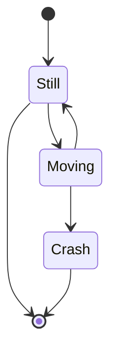
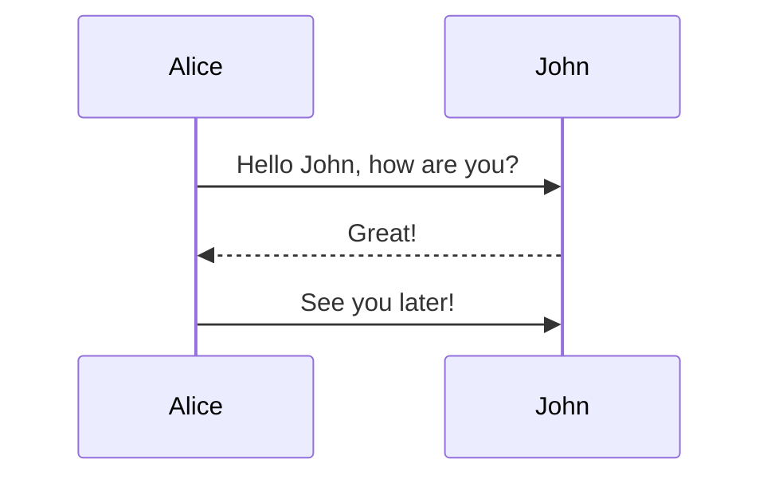
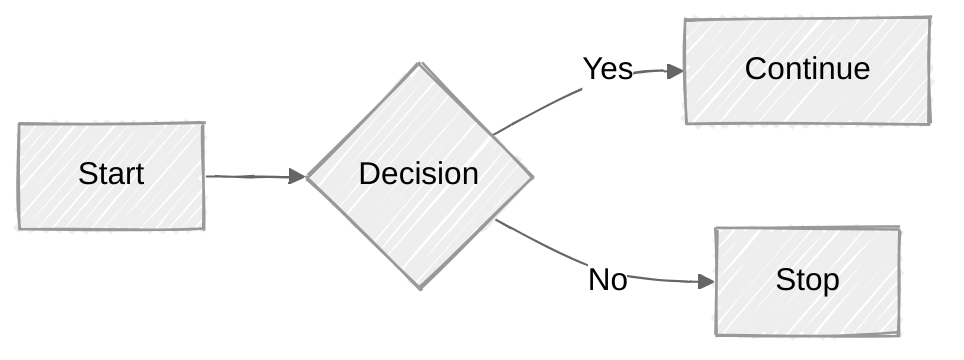
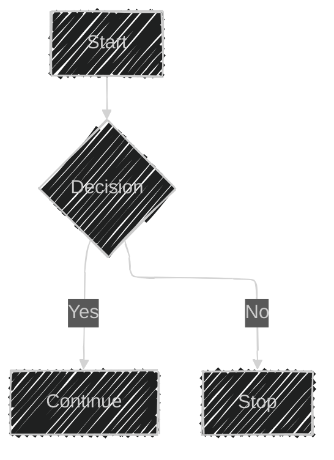

# Simples ejercicios para recordar uso de algoritmos

## Indice

0. [Conceptos y notaciones fundamentales de la Big O Notation](#conceptos-y-notaciones-fundamentales-de-la-big-o-notation)
1. [01-createArray.js](#01-generar-un-arreglo-de-n-elementos-y-guardar-en-un-archivo--01-createarrayjs)
2. [02-bubbleSort.js](#02-ordenar-un-arreglo-por-tipo-burbuja-o-burbble-02-bubblesortjs)
3. [03-selectionSort.js](#03-ordenar-un-arreglo-por-tipo-selección-o-selection-03-selectionsortjs)
4. [04-insertionSort.js](#04-ordenar-un-arreglo-por-tipo-inserción-o-insertion--04-insertionsortjs)
5. [05-mergeSort.js](#05-ordenar-un-arreglo-por-tipo-mezcla-o-merge--05-mergesortjs)
6. [06-mergeSort.js](#06-repetir-el-ejercicio-de-mezcla-o-merge--06-mergesortjs)
7. [07-linkedList.js](#07-listas-enlazadas-conla-class-node--07-linkedlistjs)
8. [08-arraySort.js](#08-ordenar-un-arreglo-usando-las-funciones-propias-de-javascript--08-arraysortjs)
9. [09-fibonacci.js](#09-generar-la-secuencia-de-fibonacci--09-fibonaccijs)
10. [10-pascalTriangle.js](#10-triángulo-de-pascal--10-pascaltrianglejs)
11. [11-occurrenceNumber.js](#11-ocurrencias-de-caracteres-en-un-string--11-occurrencenumberjs)
12. [12-occurrenceNumber.js](#12-ocurrencias-de-caracteres-en-un-string--12-occurrencenumberjs)
13. [13-minInMatrix.js](#13-imprimir-el-valor-mínimo-en-un-arreglo-multi-dimensional--13-mininmatrixjs)

>[!IMPORTANT]
>
>## Conceptos y notaciones fundamentales de la Big O Notation
>
>[🔙](#indice)
>
>No te preocupes si suena demasiado técnico o complejo al inicio. Aquí te explico paso a paso y con ejemplos, pero antes es importante comprender los conceptos básicos.
>
>Big O mide la eficiencia de un algoritmo en términos de tiempo y espacio.
>
> * **Time complexity**: Mide cuánto "tiempo" toma un algoritmo en función del tamaño de la entrada (no en términos de segundos, sino de el número de operaciones que un algoritmo realiza en función al input de entrada, más en los ejemplos...).
> * **Space complexity**: Mide cuánta memoria (espacio) toma un algoritmo en función del tamaño de la entrada.
>
> Y aquí están las notaciones fundamentales de la Big O notation:
>
> * **O(1)**: Tiempo constante. No importa el tamaño de la entrada, el tiempo de ejecución es siempre el mismo.
> * **O(n)**: Tiempo lineal. El tiempo de ejecución aumenta linealmente con el tamaño de la entrada.
> * **O(n^2)**: Tiempo cuadrático. El tiempo de ejecución aumenta cuadráticamente con el tamaño de la entrada.
> * **O(log n)**: Tiempo logarítmico. El tiempo de ejecución disminuye logarítmicamente con el tamaño de la entrada.
> * **O(n log n)**: Tiempo log-lineal. El tiempo de ejecución aumenta logarítmicamente con el tamaño de la entrada.
> * **O(n!)**: Tiempo factorial. El tiempo de ejecución aumenta factorialmente con el tamaño de la entrada.
>
> Ahora veamos una gráfica de Big O notation para visualizar mejor cómo se comparan estas complejidades.
>
> 


## 01. Generar un arreglo de **n** elementos y guardar en un archivo. </br> **`01-createArray.js`**

[🔙](#indice)

1. Importo dos elementos:
```js
const readline = require('readline');
const fs = require('fs');
```
2. Pido por pantalla usando el `readline.createInterface`:
```js
// Crear interfaz para leer entrada del usuario
const rl = readline.createInterface({
    input: process.stdin,
    output: process.stdout
});
```
3. Creo una función que hace uso del `rl` que cree como un _interface_ con el uso de una `question` y recibo una `respuesta`:
```js
// Solicitar la cantidad de elementos
rl.question('Ingresa la cantidad de números aleatorios a generar: ', (respuesta) => {
    const cantidad = parseInt(respuesta);
});
```
4. Valido que la cantidad sea un número válido, sino lo es pongo un mensaje, cierro el `rl` y salgo:
```js
    // Validar que sea un número válido
    if (isNaN(cantidad) || cantidad <= 0) {
        console.log('Error: Debes ingresar un número entero positivo.');
        rl.close();
        return;
    }
```
5. Creo la función `crearArrayAleatorio`, recibiendo de parámetro la `cantidad` que obtuve por pantalla:
```js
// Función para generar números aleatorios
function generarNumeroAleatorio(min = 1, max = 100) {
    return Math.floor(Math.random() * (max - min + 1)) + min;
}

// Función para crear el array con números aleatorios
function crearArrayAleatorio(cantidad) {
    const array = [];
    for (let i = 0; i < cantidad; i++) {
        array.push(generarNumeroAleatorio());
    }
    return array;
}
```
6. Creo la función `guardarArray` que recibe de parámetro el `arreglo`:
```js
// Función para guardar el array en archivo
function guardarArray(arreglo) {
    const arrayTexto = JSON.stringify(arreglo, null, 0);
    
    fs.writeFile('array.txt', arrayTexto, 'utf8', (err) => {
        if (err) {
            console.error('Error al guardar el archivo:', err);
        } else {
            console.log('\n✅ Array guardado exitosamente en "array.txt"');
            console.log('Contenido del archivo:');
            console.log(arrayTexto);
        }
        rl.close();
    });
}
```
7. Ahora si, llamo las dos funciones dentro de `rl.question`, luego de la validación de `cantidad`:
```js
    // Crear el array con números aleatorios
    const arrayAleatorio = crearArrayAleatorio(cantidad);
    
    // Guardar el array en el archivo
    guardarArray(arrayAleatorio);
```

## 02. Ordenar un arreglo por tipo **Burbuja** o **Burbble**.</br> **`02-bubbleSort.js`**

[🔙](#indice)

>[!NOTE]
>
>**Características implementadas:**
>
>* Generación automática de un array de 20 números aleatorios (entre 1 y 100)
>* Implementación completa del algoritmo Bubble Sort con optimización (detección temprana si ya está ordenado)
>* Visualización detallada del proceso de ordenamiento paso a paso
>* Estadísticas de rendimiento (comparaciones e intercambios)
>* Verificación automática de que el array está correctamente ordenado
>
>**Funcionalidades del programa:**
>
>* Muestra el array original desordenado
>* Ejecuta el algoritmo Bubble Sort mostrando cada pasada
>* Indica cada intercambio realizado durante el proceso
>* Muestra el estado del array después de cada pasada
>* Proporciona estadísticas finales del algoritmo
>* Verifica que el resultado final esté correctamente ordenado
>
>**Resultado de la prueba:**
>
>* Array original: 20 números aleatorios desordenados
>* Proceso: 16 pasadas con optimización (se detuvo cuando no hubo más intercambios)
>* Estadísticas: 184 comparaciones y 74 intercambios
>* Resultado: Array correctamente ordenado de menor a mayor
>* Verificación: Confirmado que el ordenamiento es correcto
>
>El algoritmo Bubble Sort está completamente funcional y muestra de manera educativa cómo funciona el proceso de ordenamiento burbuja.
>


1. En dos funciones, creamos el arreglo aleatorio:
```js
// Función para generar números aleatorios
function generarNumeroAleatorio(min = 1, max = 100) {
    return Math.floor(Math.random() * (max - min + 1)) + min;
}

// Función para crear un array con números aleatorios
function crearArrayAleatorio(cantidad) {
    const array = [];
    for (let i = 0; i < cantidad; i++) {
        array.push(generarNumeroAleatorio());
    }
    return array;
}
```
2. Ahora bien una función para el ordenamiento llamada `bubbleSort()` con el parámetro del arreglo, lo primero es clonar el arreglo en `arrayOrdenado` para trabajarlo:
```js
// Implementación del algoritmo Bubble Sort
function bubbleSort(arr) {
    // Crear una copia del array para no modificar el original
    const arrayOrdenado = [...arr];
}
```
3. Luego obtengo el total de elementos y creo dos variables para estadísticas:
```js
    const n = arrayOrdenado.length;
    let intercambios = 0;
    let comparaciones = 0;
```
4. Inicio un ciclo para recorrer todo el arreglo, el límite superior es `n - 1`:
```js
    // Bucle externo: controla el número de pasadas
    for (let i = 0; i < n - 1; i++) {
        let huboIntercambio = false;

    }
```
5. Dentro de este ciclo hacemos otro ciclo, desde el principio hasta este valor `n - i - 1` y aprovecho para incrementar las `comparaciones`:
```js
        // Bucle interno: compara elementos adyacentes
        for (let j = 0; j < n - i - 1; j++) {
            comparaciones++;

        }
```
6. Ahora hacemos el comparativo entre los elementos con el índice `j` vs `j + 1`, si el primero es mayor, procedemos al cambio entre esos dos:
```js
            // Comparar elementos adyacentes
            if (arrayOrdenado[j] > arrayOrdenado[j + 1]) {
                // Intercambiar elementos
                let temp = arrayOrdenado[j];
                arrayOrdenado[j] = arrayOrdenado[j + 1];
                arrayOrdenado[j + 1] = temp;
                
                // incremento intercambios y cambio estado
                intercambios++;
                huboIntercambio = true;
            }
```
7. Antes de cerrar el ciclo mayor, con el índice `i`, si `huboIntercambio` es falso, muestro que no fue necesario ordenar:
```js
        // Si no hubo intercambios, el array ya está ordenado
        if (!huboIntercambio) {
            console.log(`  No hubo intercambios. Array ya ordenado.`);
            break;
        }
```
8. Muestro después del ciclo las estadísticas y retorno el `arrayOrdenado`:
```js
    console.log(`\n--- Estadísticas ---`);
    console.log(`Total de comparaciones: ${comparaciones}`);
    console.log(`Total de intercambios: ${intercambios}`);
```
9. Ahora si creo la función `main()`, para llamar las funciones de `crearArrayAleatorio()` y `bubbleSort()`:
```js
// Programa principal
function main() {
  // Crear array de 20 números aleatorios
  console.log('\nGenerando array de 20 números aleatorios...');
  const arrayOriginal = crearArrayAleatorio(CANTIDAD);

  // Mostrar array original
  console.log(`📊 Array Original: [${arrayOriginal}]`);

  // Aplicar bubble sort
  console.log('\n🔄 Iniciando ordenamiento con Bubble Sort...');
  const arrayOrdenado = bubbleSort(arrayOriginal);

  // Mostrar array ordenado
  console.log(`✅ Array Ordenado: [${arrayOrdenado}]`);
}
```
10. Hago una validadación adicional con la función `every()` y valido que realmente si se hizo el ordenamiento:
```js
  // Verificar que el ordenamiento es correcto
  const estaOrdenado = arrayOrdenado.every(
    (val, i, arr) => i === 0 || arr[i - 1] <= val
  );
  console.log(
    `\n🔍 Verificación: El array ${
      estaOrdenado ? 'SÍ' : 'NO'
    } está correctamente ordenado.`
  );
```
11. Finalizo llamando la función `main()`:
```js
// Ejecutar el programa
main()
```

## 03. Ordenar un arreglo por tipo **Selección** o **Selection**.</br> **`03-selectionSort.js`**

[🔙](#indice)

>[!NOTE]
>
>**Funcionalidad implementada:**
>
>* Algoritmo completo de Selection Sort (ordenamiento por selección)
>* Generación automática de un array de 20 números aleatorios
>* Visualización detallada del proceso de ordenamiento paso a paso
>* Estadísticas de rendimiento (comparaciones e intercambios)
>* Verificación automática de que el array está correctamente ordenado
>
>**Características del algoritmo Selection Sort:**
>
>* En cada pasada, busca el elemento mínimo en la parte no ordenada del array
>* Intercambia el elemento mínimo encontrado con el primer elemento de la parte no ordenada
>* Muestra claramente cuándo encuentra un nuevo mínimo y cuándo realiza intercambios
>* Indica cuando un elemento ya está en su posición correcta
>
>**Resultado de la prueba:**
>
>* Array original: 20 números aleatorios desordenados
>* Proceso: 19 pasadas (n-1 para un array de 20 elementos)
>* Estadísticas: 190 comparaciones y 18 intercambios
>* Resultado: Array correctamente ordenado de menor a mayor
>* Verificación: Confirmado que el ordenamiento es correcto
>
>**Ventajas del Selection Sort mostradas:**
>
>* Número fijo de comparaciones: O(n²)
>* Número mínimo de intercambios: máximo n-1 intercambios
>* Algoritmo in-place (no requiere memoria adicional significativa)
>* Comportamiento predecible independiente del estado inicial del array
>
>La función `selectionSort()` está completamente implementada y funcional, mostrando de manera educativa cómo opera este algoritmo de ordenamiento.
>


1. Empezamos con dos funciones que son las que crean el arreglo aleatorio y una constante del número de elementos:
```js
const CANTIDAD = 20;

// Función para generar números aleatorios
function generarNumeroAleatorio(min = 1, max = 100) {
  return Math.floor(Math.random() * (max - min + 1)) + min;
}

// Función para crear un array con números aleatorios
function crearArrayAleatorio(cantidad) {
  const array = [];
  for (let i = 0; i < cantidad; i++) {
    array.push(generarNumeroAleatorio());
  }
  return array;
}
```
2. La función `selectionSort()` con el parámetro del arreglo, simplemente lo clono en `arrayOrdenado`:
```js
// Implementación del algoritmo Selection Sort
function selectionSort(arr) {
  // Crear una copia del array para no modificar el original
  const arrayOrdenado = [...arr];
}
```
3. Obtengo la cantidad de elementos y dos variables para estadísticas del proceso:
```js
  const n = arrayOrdenado.length;
  let comparaciones = 0;
  let intercambios = 0;
```
4. Empiezo con el ciclo mayor para recorrer todo el arreglo y defino el `indiceMinimo`:
```js
  // Bucle externo: recorre cada posición del array
  for (let i = 0; i < n - 1; i++) {
    // Encontrar el índice del elemento mínimo en la parte no ordenada
    let indiceMinimo = i;
  }
```
5. Hago otro ciclo que recorre desde `i + 1`, hasta el final del arreglo, para hallar un valor menor y asignar el nuevo valor a `indiceMinimo`:
```js
    // Buscar el elemento mínimo en la parte no ordenada
    for (let j = i + 1; j < n; j++) {
      comparaciones++;
      if (arrayOrdenado[j] < arrayOrdenado[indiceMinimo]) {
        indiceMinimo = j;
        console.log(`    Nuevo mínimo encontrado: ${arrayOrdenado[j]} en posición ${j}`);
      }
    }
```
6. Pregunto si `indiceMinimo` es diferente a `i`, hago el intercambio:
```js
    // Si se encontró un elemento menor, intercambiar
    if (indiceMinimo !== i) {
      // Intercambiar elementos
      let temp = arrayOrdenado[i];
      arrayOrdenado[i] = arrayOrdenado[indiceMinimo];
      arrayOrdenado[indiceMinimo] = temp;
      
      intercambios++; // Valor meramente estadísitico
      
    } 
```
7. Despues de cerrar el ciclo mayor , muestro estadísticas y retornamos el `arrayOrdenado`:
```js
  console.log(`\n--- Estadísticas ---`);
  console.log(`Total de comparaciones: ${comparaciones}`);
  console.log(`Total de intercambios: ${intercambios}`);
  
  return arrayOrdenado;
```
8. Hago el método `main()`, llamando las dos funciones `crearArrayAleatorio()` y `selectionSort()`:
```js
// Programa principal
function main() {
  // Crear array de `CANTIDAD` números aleatorios
  const arrayOriginal = crearArrayAleatorio(CANTIDAD);

  // Aplicar selection sort
  const arrayOrdenado = selectionSort(arrayOriginal);

  // Mostrar array ordenado
  console.log(`✅ Array Ordenado: [${arrayOrdenado}]`);
```
9. Dentro de `main()` hago la validación de que el arreglo si esté ordenado:
```js
  // Verificar que el ordenamiento es correcto
  const estaOrdenado = arrayOrdenado.every(
    (val, i, arr) => i === 0 || arr[i - 1] <= val
  );
  console.log(
    `\n🔍 Verificación: El array ${
      estaOrdenado ? 'SÍ' : 'NO'
    } está correctamente ordenado.`
  );
```
10. Llamo la función `main()`.


## 04. Ordenar un arreglo por tipo **Inserción** o **Insertion**. </br> **`04-insertionSort.js`**

[🔙](#indice)

1. Empezamos con dos funciones que son las que crean el arreglo aleatorio y una constante del número de elementos:
```js
const CANTIDAD = 20;

// Función para generar números aleatorios
function generarNumeroAleatorio(min = 1, max = 100) {
  return Math.floor(Math.random() * (max - min + 1)) + min;
}

// Función para crear un array con números aleatorios
function crearArrayAleatorio(cantidad) {
  const array = [];
  for (let i = 0; i < cantidad; i++) {
    array.push(generarNumeroAleatorio());
  }
  return array;
}
```
2. La función `insertionSort()` con el parámetro del arreglo, simplemente lo clono en `arrayOrdenado`:
```js
// Implementación del algoritmo Insertion Sort
function insertionSort(arr) {
  // Crear una copia del array para no modificar el original
  const arrayOrdenado = [...arr];
}
```
3. Obtengo la cantidad de elementos y dos variables para estadísticas del proceso:
```js
  const n = arrayOrdenado.length;
  let comparaciones = 0;
  let intercambios = 0;
```
4. Empiezo con el ciclo mayor para recorrer todo el arreglo empezando en la posición segunda, asigno a `elementoActual` lo que hay en `ì` e inicializo a `j`:
```js  // Comenzar desde el segundo elemento (índice 1)
  for (let i = 1; i < n; i++) {
    const elementoActual = arrayOrdenado[i];
    let j = i - 1; // Índice del elemento anterior
  }
```
5. Ciclo mientras `j >= 0` y `arrayOrdenado[j] > elementoActual`, y el ciclo es llendo hacia atrás o `j--`:
```js
    // Mover elementos mayores hacia la derecha
    while (j >= 0 && arrayOrdenado[j] > elementoActual) {
      comparaciones++;
      console.log(`    Comparando ${arrayOrdenado[j]} > ${elementoActual}: verdadero, desplazando ${arrayOrdenado[j]} hacia la derecha`);
      
      arrayOrdenado[j + 1] = arrayOrdenado[j];
      desplazamientos++; // Valor meramente estadísitico
      j--;
    }
```
6. Por estadísticas si `j >= 0`, es que hubo `comparaciones`:
```js
    // Si j >= 0, significa que hicimos una comparación más
    if (j >= 0) {
      comparaciones++; // Valor meramente estadísitico
    }
```
7. En la posición `j` ponemos el valor de `elementoActual`:
```js
    // Insertar el elemento en su posición correcta
    arrayOrdenado[j + 1] = elementoActual;
```
8. Mostramos las estadísticas y retornamos `arrayOrdenado`, luego de cerrar el ciclo mayor:
```js
  console.log(`\n--- Estadísticas ---`);
  console.log(`Total de comparaciones: ${comparaciones}`);
  console.log(`Total de desplazamientos: ${desplazamientos}`);
  
  return arrayOrdenado;
```
9. Hago el método `main()`, llamando las dos funciones `crearArrayAleatorio()` y `insertionSort()`:
```js
// Programa principal
function main() {
  // Crear array de `CANTIDAD` números aleatorios
  const arrayOriginal = crearArrayAleatorio(CANTIDAD);

  // Aplicar insertion sort
  const arrayOrdenado = insertionSort(arrayOriginal);

  // Mostrar array ordenado
  console.log(`✅ Array Ordenado: [${arrayOrdenado}]`);
```
10. Dentro de `main()` hago la validación de que el arreglo si esté ordenado:
```js
  // Verificar que el ordenamiento es correcto
  const estaOrdenado = arrayOrdenado.every(
    (val, i, arr) => i === 0 || arr[i - 1] <= val
  );
  console.log(
    `\n🔍 Verificación: El array ${
      estaOrdenado ? 'SÍ' : 'NO'
    } está correctamente ordenado.`
  );
```
11. Llamo la función `main()`.


## 05. Ordenar un arreglo por tipo **Mezcla** o **Merge**. </br> **`05-mergeSort.js`**

[🔙](#indice)

>[!NOTE]
>
>**Funcionalidad implementada:**
>
>* Algoritmo completo de Insertion Sort (ordenamiento por inserción)
>* Generación automática de un array de 20 números aleatorios
>* Visualización detallada del proceso de ordenamiento paso a paso
>* Estadísticas de rendimiento (comparaciones y desplazamientos)
>* Verificación automática de que el array está correctamente ordenado
>
>**Características del algoritmo Insertion Sort:**
>
>* Comienza desde el segundo elemento (índice 1) y va insertando cada elemento en su posición correcta dentro de la parte ya ordenada
>* Muestra claramente la parte ordenada vs el elemento a insertar en cada pasada
>* Desplaza elementos mayores hacia la derecha para hacer espacio al elemento actual
>* Indica cuándo un elemento ya está en su posición correcta
>
>**Resultado de la prueba:**
>
>* Array original: 20 números aleatorios desordenados
>* Proceso: 19 pasadas (desde índice 1 hasta n-1)
>* Estadísticas: 124 comparaciones y 109 desplazamientos
>* Resultado: Array correctamente ordenado de menor a mayor
>* Verificación: Confirmado que el ordenamiento es correcto
>
>**Ventajas del Insertion Sort mostradas:**
>
>* Eficiente para arrays pequeños o parcialmente ordenados
>* Algoritmo estable (mantiene el orden relativo de elementos iguales)
>* Algoritmo in-place (requiere solo O(1) memoria adicional)
>* Adaptativo: mejor rendimiento en arrays ya parcialmente ordenados
>
>La función `insertionSort()` está completamente implementada y funcional, mostrando de manera educativa cómo opera este algoritmo de ordenamiento que simula la forma natural de ordenar cartas en la mano.
>


1. Empezamos con dos funciones que son las que crean el arreglo aleatorio y una constante del número de elementos:
```js
const CANTIDAD = 20;

// Función para generar números aleatorios
function generarNumeroAleatorio(min = 1, max = 100) {
  return Math.floor(Math.random() * (max - min + 1)) + min;
}

// Función para crear un array con números aleatorios
function crearArrayAleatorio(cantidad) {
  const array = [];
  for (let i = 0; i < cantidad; i++) {
    array.push(generarNumeroAleatorio());
  }
  return array;
}
```
2. La función `insertionSort()` con el parámetro del arreglo, simplemente lo clono en `arrayOrdenado` y obtengo el largo de `arrayOrdenado`:
```js
// Implementación del algoritmo Insertion Sort
function insertionSort(arr) {
  // Crear una copia del array para no modificar el original
  const arrayOrdenado = [...arr];
  const n = arrayOrdenado.length;
}
```
3. Simplemente miro si el valor de `n` es menor o igual a `1`, devuelvo el `arrayOrdenado`:
```js
  if (n <= 1) {
    return arrayOrdenado;
  }
```
4. Llamo una función por crear de nombre `mergeSortRecursivo()`, con los parámetros de `arrayOrdenado`, `0`, y `n - 1`: </br> `const totalComparaciones = mergeSortRecursivo(arrayOrdenado, 0, n - 1);`
5. Creamos la función `mergeSortRecursivo()`, con los parámetros de un arreglo, el lado `ladoIzquierdo`, `ladoDerecho` y un `nivel` iniciado en `0`:
```js
// Función recursiva principal de Merge Sort
function mergeSortRecursivo(arr, ladoIzquierdo, ladoDerecho, nivel = 0) {
  let totalComparaciones = 0; // Valor meramente estadísitico
}
```
6. Hallamos el punto `medio`, con base la comparación del `ladoIzquierdo` sea menor al `ladoDerecho`:
```js
  if (ladoIzquierdo < ladoDerecho) {
    const medio = Math.floor((ladoIzquierdo + ladoDerecho) / 2);
  }
```
7. Dentro de esa misma condición llamo de forma recursiva esta misma función `mergeSortRecursivo()` dos veces:
```js
    // Ordenar recursivamente las dos mitades
    totalComparaciones += mergeSortRecursivo(arr, ladoIzquierdo, medio, nivel + 1);
    totalComparaciones += mergeSortRecursivo(arr, medio + 1, ladoDerecho, nivel + 1);
```
8. En la misma condición llamo la función por crear de nombre `merge()` enviando de parámetros lo siguiente: `arr`, `ladoIzquierdo`, `medio`, `ladoDerecho`, y `nivel`: </br> `merge(arr, ladoIzquierdo, medio, ladoDerecho, nivel);`
9. Creo la función `merge()`, con los siguiente parámetros, el arreglo, el `ladoIzquierdo`, el valor `medio`,  el `ladoDerecho`, y el `nivel`  iniciado en  `0`:
```js
function merge(arr, ladoIzquierdo, medio, ladoDerecho, nivel = 0) {
}
```
10. Declaramos dos arreglos temporales que son las mitades:
```js
  // Crear arrays temporales para las dos mitades
  const izqArray = arr.slice(ladoIzquierdo, medio + 1);
  const derArray = arr.slice(medio + 1, ladoDerecho + 1);
```
11. Creamos tres variables para hacer recorrido en ambos arreglos `izqArray` y `derArray`:
```js
  let i = 0, j = 0, k = ladoIzquierdo;
```
12. Ahora si empezamos con un ciclo mientras tanto la `i`, como `j`, sean menores de cada arreglo que se asocian:
```js
  // Mezclar los arrays temporales de vuelta al array original
  while (i < izqArray.length && j < derArray.length) {
  }
```
13. Un condicional si el lado `izqArray[i]` es menor o igual a `derArray[j]`  se carga el `arr` (que viene como parámetro y está enlazado al valor de `arrayOrdenado`) con el valor de `izqArray[i]`, en caso contrario se carga el `arr` con el valor de `derArray[j]`:
```js
  // Mezclar los arrays temporales de vuelta al array original
  while (i < izqArray.length && j < derArray.length) {
    comparaciones++; // Valor meramente estadísitico
    if (izqArray[i] <= derArray[j]) {
      arr[k] = izqArray[i];
      i++;
    } else {
      arr[k] = derArray[j];
      j++;
    }
    k++;
  }
```
14. Cargamos al `arr` con los valores restantes de `izqArray[i]`:
```js
  // Copiar elementos restantes del array izquierdo
  while (i < izqArray.length) {
    arr[k] = izqArray[i];
    console.log(`${indent}  Restante izquierdo: ${izqArray[i]}`);
    i++;
    k++;
  }
```
15. Cargamos al `arr` con los valores restantes de `derArray[j]`:
```js
  // Copiar elementos restantes del array derecho
  while (j < derArray.length) {
    arr[k] = derArray[j];
    console.log(`${indent}  Restante derecho: ${derArray[j]}`);
    j++;
    k++;
  }
```
16. Ahora si desde el método `main()`, llamamos las dos funciones `crearArrayAleatorio` y `mergeSort`:
```js
// Programa principal
function main() {
  // Crear array de `CANTIDAD` números aleatorios
  console.log(`\nGenerando array de ${CANTIDAD} números aleatorios...`);
  const arrayOriginal = crearArrayAleatorio(CANTIDAD);

  // Mostrar array original
  console.log(`📊 Array Original: [${arrayOriginal}]`);

  // Aplicar Merge sort
  console.log('\n🔄 Iniciando ordenamiento con Merge Sort...');
  const arrayOrdenado = mergeSort(arrayOriginal);

  // Mostrar array ordenado
  console.log(`✅ Array Ordenado: [${arrayOrdenado}]`);
}
```
17. Hacemos la validación de que se esté ordenado:
```js
  // Verificar que el ordenamiento es correcto
  const estaOrdenado = arrayOrdenado.every(
    (val, i, arr) => i === 0 || arr[i - 1] <= val
  );
  console.log(
    `\n🔍 Verificación: El array ${
      estaOrdenado ? 'SÍ' : 'NO'
    } está correctamente ordenado.`
  );
```
18. Por último llamamos la función `main()`.


>[!TIP]
>
>### Crear una utilidad para tener un arreglo aleatorio
>
>[🔙](#indice)
>
> 1. Creo la carpeta **"utils"**
> 2. Dentro creo el archivo **`randomArray.js`**.
> 3. Con este código:
> ```js
>// Función para generar números aleatorios
>const generarNumeroAleatorio = (min = 1, max = 100) => {
>  return Math.floor(Math.random() * (max - min + 1)) + min;
>};
>
>// Función para crear un array con números aleatorios
>export const crearArrayAleatorio = (cantidad = 20) => {
>  const array = [];
>  for (let i = 0; i < cantidad; i++) {
>    array.push(generarNumeroAleatorio());
>  }
>  return array;
>};
> ```
> 4. En los anteriores archivos hago la importación:
> ```js
>const { crearArrayAleatorio } = require('./utils/randomArray.js');
> ```
> 5. Borro las dos funciones `generarNumeroAleatorio()` y `crearArrayAleatorio()`
> 6. Listo, esto debe trabajar como siempre.

## 06. Repetir el ejercicio de **Mezcla** o **Merge**. </br> **`06-mergeSort.js`**

[🔙](#indice)

1. Obtengo un arreglo aleatorio, llamando la función de `utils` de nombre `crearArrayAleatorio()` , dentro de `arrayBase`: </br> `const arrayBase = crearArrayAleatorio(CANTIDAD);`
2. En la función `quickSort()` con el parámetro de un arreglo: </br> `function quickSort(arr) {`</br>`}`
3. Obtengo el valor del medio `pivot`: </br> `let pivot = arr[Math.floor(arr.length / 2)];`
4. Llevo la mitad del arreglo izquierdo a `left`: </br> `let left = arr.filter((x) => x < pivot);`
5. Llevo la mitad del arreglo derecho a `right`: </br> `let right = arr.filter((x) => x > pivot);`
6. Devuelvo valores haciendo recursividad a la función `quickSort()`: </br> `return [...quickSort(left), pivot, ...quickSort(right)];`
7. Llamo la función `quickSort()` con el parámetro `arrayBase`: </br> `const arrayOrdenado = quickSort(arrayBase);`
8. Muestro el arreglo ordenado (_aunque con errores_): </br> `console.log('✅ Array Ordenado: [' + arrayOrdenado + ']');`


## 07. Listas enlazadas conla _class_ `Node`. </br> **`07-linkedList.js`**

[🔙](#indice)

1. creo una _class_ para estructurar de nombre `Node`, este con un `constructor` que recibe un `value` y dos atributos, el valor `actual` y el `nextTo`:
```js
class Node {
  constructor(value) {
    this.actual = value;
    this.nextTo = null;
  }
}
```
2. Creo otra clase que va a llevar los métodos de `add()`, `remove()`, `print()` e inicia con un `constructor` con la atributo `header`:
```js
class LinkedList {
  constructor() {
    this.header = null;
  }

  add(value) {
  }

  remove(value) {
  }

  print() {
  }
}
```
3. **El método `add(value)`**: </br> Creo la constante `node` e instanciamos la _class_ `Node`:
```js
    const node = new Node(value);
```
4. Preguntamos si el `header` está vacío, entonces asignamos de una vez el `value`:
```js
    if (!this.header) {
      this.header = node;
    }
```
5. El sino de esta condicional cremos la variable `current` y le asignamos el valor del `header`:
```js
    else {
      let current = this.header;
    }
```
6. Hacemos un ciclo mientras `current.nextTo` exista o no sea vacío:
```js
    else {
      let current = this.header;
      while (current.nextTo) {
        current = current.nextTo;
      }
    }
```
7. Al finalizar el ciclo asigno el valor de `node` (que proviene del `value`) a `current.nextTo`:
```js
    else {
      let current = this.header;
      while (current.nextTo) {
        current = current.nextTo;
      }
      current.nextTo = node;
    }
```
8. **El método `remove(value)`**: </br> Si de entrada el valor de `header` es vacío o no existe, se sale:
```js
    if (!this.header) {
      return;
    }
```
9. Si el `header.actual` es igual al `value`, entonces al `header` le asigno el valor de `header.nextTo`:
```js
    if (this.header.actual === value) {
      this.header = this.header.nextTo;
      return;
    }
```
10. Asigno el `header` a la variable `current`:
```js
    let current = this.header;
```
11. Hacemos un ciclo mientras `current.nextTo` exista o no sea vacío:
```js
    while (current.nextTo) {
    }
```
12. Hago similar condicional del paso 9, cambiando `header.actual` por `current.nextTo.actual`: </br> Si el ~~header.actual~~ `current.nextTo.actual` es igual al `value`, entonces al ~~header~~ `current.nextTo` le asigno el valor de ~~header.nextTo~~ `current.nextTo.nextTo`:
```js
      if (current.nextTo.actual === value) {
        current.nextTo = current.nextTo.nextTo;
        return;
      }
```
13. Para que avance el ciclo a `current`, le asigno el valor siguiente que es `current.nextTo`:
```js
      current = current.nextTo;
```
14. **El método `print()`**: </br> Empiezo asignando a la variable `current`, lo que tiene `header`:
```js
    let current = this.header;
```
15. Hacemos un ciclo mientras exista el valor en `current`, que muestre el valor de `current.actual` y para que avence como en el paso 13 a `current`, le asigno el valor siguiente que es `current.nextTo`:
```js
  print() {
    let current = this.header;
    while (current) {
      console.log(current.actual);
      current = current.nextTo;
    }
  }
```
16. Ahora simplemente instanciamos la _class_ `LinkedList()` en la constante `list` y hago algunos procesos e imprimo el resultado:
```js
const list = new LinkedList();
list.add(1);
list.add(5);
list.add(2);
list.add(3);
list.add(6);
list.remove(2);
list.print();
```
17. Este es el resultado esperado:
```dos
1
5
3
6
```

>[!TIP]
>
>### Utilidad para verificar si el arreglo está ordenado
>
>[🔙](#indice)
>
> 1. Creo el archivo **`utils\verifySorted.ts`**.
> 2. Hago una función exportable tipo flecha de nombre `verificarArrayOrdenado()`.
> 3. El arreglo recibido usamos el método `every`, que tiene esta estructura: </br></br>
> `(method) Array<any>.every(predicate: (value: any, index: number, array: any[]) => unknown, thisArg?: any): boolean (+1 overload)`</br></br>
> Determina si todos los miembros de una matriz satisfacen la prueba especificada.</br></br>
>`@param predicate`</br>
> Una función que acepta hasta tres argumentos. El método every llama a la función de predicado para cada elemento del array hasta que este devuelva un valor que pueda convertirse al valor booleano falso o hasta el final del array.</br></br>
>`@param thisArg`</br>
> Un objeto al que la palabra clave "`this`" puede referirse en la función de predicado. Si se omite "`thisArg`", se usa "`undefined`" como valor de "`this`".
>
> 4. Usamos en la función _callback_, los valores de `val`, `i` y `arr`.
> 5. Recorremos el `arr` con estas condiciones: El índice `i` es estricto igual a `0` _OR_ </br> El `arr` en la posición anterior o `arr[i - 1]` es menor o igual al valor actual o `val`.
> 6. Este sería el resultado del método `verificarArrayOrdenado` y el uso de `every`:
> ```js
>// @ts-check
>
>// Función para verificar si un array está ordenado de menor a mayor
>export const verificarArrayOrdenado = (arr: Array<any>) => {
>    const estaOrdenado = arr.every((val: any, i: number, arr: any[]) => i === 0 || arr[i - 1] <= val);
>  console.log(
>  `\n🔍 Verificación: El array ${estaOrdenado ? 'SÍ' : 'NO'} está correctamente ordenado.`
>);
> ```
> 7. Importamos la función donde se usa el `every` y reemplazamos con la función `verificarArrayOrdenado`.
>

## 08. Ordenar un arreglo usando las funciones propias de `JavaScript` </br> **`08-arraySort.js`**

[🔙](#indice)

1. Importamos los métodos `verificarArrayOrdenado` y `generarNumeroAleatorio`, luego definimos la constante `CANTIDAD`:
```js
const { generarNumeroAleatorio } = require('./utils/randomArray.js');
const { verificarArrayOrdenado } = require('./utils/verifySorted.ts');

const CANTIDAD = 20;
```
2. Creamos la constante `arrayAleatorio` usando el tipo especial de objeto `Array`, con el método `from()`, indicando la longitud `length`, cargando en un _callback_ el valor de la función `generarNumeroAleatorio()`:
```js
// Crear un array con `CANTIDAD` números aleatorios
const arrayAleatorio = Array.from({ length: CANTIDAD }, () =>
  generarNumeroAleatorio()
);
```
3. Muestro el arreglo original:
```js
console.log(`📊 Array Original: [${arrayAleatorio.join(', ')}]`);
```
4. Hago el ordenamiento con los métodos `slice()` y luego `sort()`, con dos valores en el _callback_ `a` y `b`, restando `a - b`, los llevo a la constante `arrayOrdenado`:
```js
const arrayOrdenado = arrayAleatorio.slice().sort((a, b) => a - b);
```
5. Muestro el array ordenado
```js
console.log(`✅ Array Ordenado: [${arrayOrdenado.join(', ')}]`);
```
6. Verifico con la función importada `verificarArrayOrdenado` .


## 09. Generar la secuencia de Fibonacci. </br> **`09-fibonacci.js`**

[🔙](#indice)

>[!NOTE]
>
>**Funcionalidad implementada:**
>
>* Captura de entrada por pantalla para solicitar la cantidad de números de Fibonacci
>* Dos métodos de generación: iterativo y recursivo
>* Validación de entrada (números enteros no negativos)
>* Medición de tiempo de ejecución para comparar rendimiento
>* Información matemática detallada sobre la secuencia
>
>**Características del programa:**
>
>* **Método iterativo**: Eficiente O(n), genera la secuencia >completa
>* **Método recursivo**: Para comparación educativa, limitado a n ≤ 35 por su complejidad O(2^n)
>* Muestra propiedades matemáticas como suma total y aproximación a la razón áurea (φ)
>* Información educativa sobre Fibonacci y sus aplicaciones en la naturaleza
>
>**Resultado de las pruebas:**
>
>* Entrada: 10 números de Fibonacci
>* Secuencia generada: [0, 1, 1, 2, 3, 5, 8, 13, 21, 34]
>* Suma total: 88
>* Razón áurea aproximada: 1.619048 (muy cercana a φ ≈ 1.618034)
>* Comparación de rendimiento: método recursivo ~2.17x más lento que el iterativo
>
>**Características educativas:**
>
>* Explica la fórmula matemática F(n) = F(n-1) + F(n-2)
>* Muestra la diferencia de complejidad entre métodos iterativo y recursivo
>* Incluye información sobre aplicaciones en la naturaleza
>* Calcula y muestra la aproximación a la razón áurea para secuencias largas
>
>**Validaciones incluidas:**
>
>* Manejo de entradas inválidas (no números, números negativos)
>* Caso especial para cantidad = 0
>* Limitación inteligente del método recursivo para evitar tiempos excesivos
>
>El programa es completamente funcional y educativo, mostrando tanto la implementación práctica como las propiedades matemáticas fascinantes de la secuencia de Fibonacci.
>

1. Importamos a `readLine`, para leer mas adelante un dato por pantalla, lo que requiere definir una constante, en este caso `rl`, como una `createInterface` y mas abajo se usará en la función `procesarFibonacci()`, usando el método `question()`, con el mensaje y el _callback_:
```js
const readline = require('readline');

// Crear interfaz para leer entrada del usuario
const rl = readline.createInterface({
  input: process.stdin,
  output: process.stdout,
});

// Función principal para procesar la entrada del usuario
function procesarFibonacci() {
  rl.question(
    'Ingresa la cantidad de números de Fibonacci a generar: ',
    (respuesta) => {
      const cantidad = parseInt(respuesta);
  }
}
```
2. Tenemos dos métodos, hacer el proceso con _iteración_ o con _recursividad_, empecemos con _iteración_ en la función `fibonacciIterativo(n)`, validando los tres primeros valores: `0`, `1`, y `2`:
```js
// Función para generar la secuencia de Fibonacci (método iterativo)
function fibonacciIterativo(n) {
  if (n <= 0) return [];
  if (n === 1) return [0];
  if (n === 2) return [0, 1];
}
```
3. Ahora si el proceso para valores mayores a `2`: </br>» Creando una constante `secuencia` de tipo arreglo inicializado con `[0, 1]`, </br> » Luego un ciclo _for_, </br>» Para al final retornar esta `secuencia`:
```js
  const secuencia = [0, 1];

  for (let i = 2; i < n; i++) {
    const siguiente = secuencia[i - 1] + secuencia[i - 2];
    secuencia.push(siguiente);
  }

  return secuencia;
```
4. Luego probemos con la función con _recursividad_ de nombre `fibonacciRecursivo(n)` y empezamos igual al enterior, para valores `0`, `1`, y `2`:
```js
function fibonacciRecursivo(n) {
  if (n <= 0) return 0;
  if (n === 1) return 0;
  if (n === 2) return 1;
}
```
5. Ahora si hacemos la _recursividad_, en una línea con retornando la llamada a la misma función `fibonacciRecursivo()` sumando dos elementos:
```js
  return fibonacciRecursivo(n - 1) + fibonacciRecursivo(n - 2);
```
6. Creamos la función `secuenciaFibonacciRecursiva(cantidad)` que va a llamar a `fibonacciRecursivo()`: </br> » Creamos el arreglo `secuencia` vacío, </br> » Ahora si el ciclo _for_ desde `1`, hasta que sea menor o igual a `cantidad`, </br> » El ciclo es haciendo `push` de lo arrojado de `fibonacciRecursivo(i)` </br>» Retornamos el arreglo `secuencia`:
```js
// Función para generar secuencia usando recursión
function secuenciaFibonacciRecursiva(cantidad) {
  const secuencia = [];
  for (let i = 1; i <= cantidad; i++) {
    secuencia.push(fibonacciRecursivo(i));
  }
  return secuencia;
}
```
7. El proceso principal es `procesarFibonacci()`, que ya vimos tiene `rl.question` y la asignación a `cantidad`:
```js
function procesarFibonacci() {
  rl.question(
    'Ingresa la cantidad de números de Fibonacci a generar: ',
    (respuesta) => {
      const cantidad = parseInt(respuesta);
  }
}
```
8. Validamos que lo leído por pantalla sea número, positivo y mayor a cero:
```js
      // Validar entrada
      if (isNaN(cantidad) || cantidad < 0) {
        console.log('❌ Error: Debes ingresar un número entero no negativo.');
        rl.close();
        return;
      }

      if (cantidad === 0) {
        console.log('📊 Secuencia vacía para cantidad = 0');
        rl.close();
        return;
      }
```
9. Dentro del _callback_ de `rl.question` llamamos cada uno de los dos métodos: </br> » `fibonacciIterativo(cantidad);` </br> » `secuenciaFibonacciRecursiva(cantidad);` </br> Para ambos antes y después, cargamos dos variables para hallar la diferencia y ver el tiempo usado para cada proceso:
```js
      const inicioIterativo = performance.now();
      const secuenciaIterativa = fibonacciIterativo(cantidad);
      const finIterativo = performance.now();
      const tiempoIterativo = finIterativo - inicioIterativo;
```
```js
      // Método recursivo (solo para números pequeños debido a la complejidad exponencial)
      if (cantidad <= 35) {
        const inicioRecursivo = performance.now();
        const secuenciaRecursiva = secuenciaFibonacciRecursiva(cantidad);
        const finRecursivo = performance.now();
        const tiempoRecursivo = finRecursivo - inicioRecursivo;
      }
```
10. A modo de estadísticas vemos la diferencia entre cada proceso a nivel de tiempo:
```js
        // Comparación de rendimiento
        console.log('\n⚡ Comparación de rendimiento:');
        console.log(`Método iterativo: ${tiempoIterativo.toFixed(4)} ms`);
        console.log(`Método recursivo: ${tiempoRecursivo.toFixed(4)} ms`);
        console.log(
          `Diferencia: ${(tiempoRecursivo / tiempoIterativo).toFixed(
            2
          )}x más lento el recursivo`
        );
```
11. Hay mas validaciones a nivel académico y la sugerencia de que el método `secuenciaFibonacciRecursiva()`, solo se puede procesar si la `cantidad` es menor o igual a `35`.
12. Se cierra el `rl`
```js
      rl.close();
```
13. Mostramo el resultado:
```js
      // mostrar la secuencia
      console.log('Secuencia:', secuenciaIterativa);
      console.log(`Tiempo de ejecución: ${tiempoIterativo.toFixed(4)} ms`);

```
14. Llamamos la función principal: </br> `procesarFibonacci();`

## 10. Triángulo de Pascal. </br> **`10-pascalTriangle.js`**

[🔙](#indice)

>[!NOTE]
>
>**Funcionalidad implementada:**
>
>* Captura de entrada por pantalla para solicitar el número de filas del triángulo
>* Generación del triángulo de Pascal usando coeficientes binomiales
>* Dos formatos de visualización: visual (para triángulos pequeños ≤15 filas) y tabular
>* Validación completa del triángulo generado
>* Análisis de propiedades matemáticas
>
>**Características del programa:**
>
>* **Cálculo eficiente**: Usa la fórmula optimizada de coeficientes binomiales C(n,k)
>* **Formato visual**: Muestra el triángulo centrado y alineado para números pequeños
>* **Formato tabular**: Lista cada fila con su índice para mejor legibilidad
>* **Validación automática**: Verifica simetría, número de elementos y sumas de filas
>* **Propiedades matemáticas**: Muestra sumas de filas (potencias de 2) y números triangulares
>
>**Resultado de las pruebas:**
>
>* Entrada: 20 filas del triángulo de Pascal
>* Generación exitosa de todas las filas desde la 0 hasta la 19
>* Validación completa: ✅ Triángulo válido y correcto
>* Tiempo de generación: ~0.14 ms (muy eficiente)
>* Total de elementos: 210 números generados
>
>**Propiedades matemáticas verificadas:**
>
>* Cada fila es perfectamente simétrica
>* Suma de la fila n = 2^n (potencias de 2)
>* Elementos representan coeficientes binomiales C(n,k)
>* Números triangulares en la diagonal izquierda
>* Cada elemento es la suma de los dos elementos superiores
>
>**Características educativas:**
>
>* Información histórica sobre Blaise Pascal
>* Explicación de las propiedades matemáticas
>* Aplicaciones en combinatoria, probabilidad y álgebra
>* Relación con expansiones binomiales (a+b)^n
>* Conexión con secuencias famosas (Fibonacci, números triangulares)
>
>**Validaciones incluidas:**
>
>* Manejo de entradas inválidas (no números, números negativos)
>* Caso especial para 0 filas
>* Advertencia para números grandes (>20 filas)
>* Verificación automática de la correctitud del triángulo
>
>El programa es completamente funcional, educativo y robusto, proporcionando una herramienta completa para generar y estudiar el triángulo de Pascal con sus fascinantes propiedades matemáticas.
>

1. Importamos a `readLine`, para leer mas adelante un dato por pantalla, lo que requiere definir una constante, en este caso `rl`, como una `createInterface` y mas abajo se usará en la función `procesarTrianguloPascal()`, usando el método `question()`, con el mensaje y el _callback_:
```js
const readline = require('readline');

// Crear interfaz para leer entrada del usuario
const rl = readline.createInterface({
  input: process.stdin,
  output: process.stdout,
});

// Función principal para procesar la entrada del usuario
function procesarTrianguloPascal() {
  rl.question(
    'Ingresa el número de filas del triángulo de Pascal a generar: ',
    (respuesta) => {
      const numFilas = parseInt(respuesta);
  }
}
```
2. Empezamos con el método `generarTrianguloPascal(numFilas)`: </br> » Creamo la constante `triangulo` como un arreglo vacío, </br> » El ciclo _for_ para cargar el arreglo `triangulo`, llamando la función, por crear, `generarFila(i)`, </br> » Y luego retornar el `triangulo`:
```js
// Función para generar el triángulo de Pascal completo
function generarTrianguloPascal(numFilas) {
  const triangulo = [];
  for (let i = 0; i < numFilas; i++) {
    triangulo.push(generarFila(i));
  }
  return triangulo;
}
```
3. Vamos a crear la función `generarFila(numeroFila)`, </br> » Creamos la constante `fila` como un arreglo vacío, </br> » Hacemos un ciclo _for_ hasta que sea menor o igual a `numeroFila`, </br> » Cargamos el arreglo `fila` con la función `coeficienteBinomial(numeroFila, k)`, por crear, </br> » Al final retornamos la `fila`:
```js
// Función para generar una fila del triángulo de Pascal
function generarFila(numeroFila) {
  const fila = [];
  for (let k = 0; k <= numeroFila; k++) {
    fila.push(coeficienteBinomial(numeroFila, k));
  }
  return fila;
}
```
4. Ahora si la función mas compleja `coeficienteBinomial(n, k)`, lo primero es si el valor de `k` es exactamente igual a `0` _OR_ `k` es exactamente igual a `n`, retornamos `1`:
```js
  if (k === 0 || k === n) return 1;
```
5. Si `k` es mayor a `n`, retornamos `0`:
```js
  if (k > n) return 0;
```
6. Optimización: usar la propiedad `C(n, k) = C(n, n-k)`:
```js
  if (k > n - k) k = n - k;
```
7. Inicializamos la variable `resultado` en `1`:
```js
  let resultado = 1;
```
8. En este ciclo _for_, la fórmula es: </br> » El `resultado` por `(n - i)` </br> » Y ese valor lo divido entre `(i + 1)`:
```js
  for (let i = 0; i < k; i++) {
    resultado = (resultado * (n - i)) / (i + 1);
  }
```
9. Por último de este método `coeficienteBinomial()`, retornamos el `resultado`, redondeado:
```js
  return Math.round(resultado);
```
10. La función que se hizo en el paso 1, y dentro del _callback_ de `rl.question`, va la validación que el datos recibido por pantalla sea un número, mayor a `0` y ojalá menor a `20`:
```js
function procesarTrianguloPascal() {
  rl.question(
    'Ingresa el número de filas del triángulo de Pascal a generar: ',
    (respuesta) => {
      const numFilas = parseInt(respuesta);

      // Validar entrada
      if (isNaN(numFilas) || numFilas < 0) {
        console.log('❌ Error: Debes ingresar un número entero no negativo.');
        rl.close();
        return;
      }

      if (numFilas === 0) {
        console.log('📊 Triángulo vacío para 0 filas');
        rl.close();
        return;
      }

      if (numFilas > 20) {
        console.log(
          '⚠️  Advertencia: Números grandes pueden ser difíciles de visualizar'
        );
      }
    }
}
```
11. Llamamos la función `generarTrianguloPascal(numFilas)`, cargando la constante `triangulo`, solo por estadísticas , cargamos un `inicio` y `fin`, dar la diferencia:
```js
      // Generar el triángulo
      const inicio = performance.now();
      const triangulo = generarTrianguloPascal(numFilas);
      const fin = performance.now();
      const tiempoEjecucion = fin - inicio;
```
12. En un ciclo simple recorremos el arreglo y lo mostramos por pantalla, cada fila es otro arreglo, adicional podemos mostrar el tiempo utilizado:
```js
      // Ciclo simple para mostrar el triangulo
      for (let i = 0; i < triangulo.length; i++) {
        console.log(`Fila ${i}: [${triangulo[i]}]`);
      }
      console.log(`Tiempo de ejecución: ${tiempoEjecucion.toFixed(4)} ms`);
```
13. Se cierra el `rl`
```js
      rl.close();
```
14. Llamamos la función principal: </br> `procesarTrianguloPascal();`


## 11. Ocurrencias de caracteres en un string </br> **`11-occurrenceNumber.js`**

[🔙](#indice)

0. Dado esta entrada `aabcbabcacbabce`, obtener esta salida `a5b5c4e1`
1. Defino la constante `str`:
```js
const input = 'aabcbabcacbabce';
console.log('Input:text: ', input);
```
2. Ordeno el `input`, dentro de `sort`:
```js
const sort = input.split('').sort().join('');
console.log('Sorted text:', sort);
```
3. Dos arrays, uno para `char` y otro para `count`, luego el índice para estos arreglos `k`:
```js
let char = [sort[0]];
let count = [0];
let k = 0;
```
4. Ciclo para recorrer las ocurrencias:
```ja
for (let i = 0; i < sort.length; i++) {
```
5. Si el caracter actual o `sort[i]` es igual al caracter siguiente o `sort[i + 1]` _OR_ no hay caracteres después `!sort[i + 1]`, asigno a `k` el largo de `char`:
```js
  if (sort[i] === sort[i + 1] || !sort[i + 1]) {
    k = char.length - 1;
  }
```
6. En caso contrario, cargo los arreglos `char` y `count` con un nuevo elemento:
```js
  else {
    char.push(sort[i + 1]);
    count.push(0);
  }
```
7. Incremento el valor en la posición `k`, para el arreglo `count` y cierro el ciclo:
```js
  // 07. Increment the count of the current char
  count[k]++;
}
```
8. Creo el string `output`:
```js
let output = '';
```
9. Ciclo _for_ , con el límite de los arreglos, ya se de `char` o `count`, y lleno `output`, con los valores de estos arreglos:
```js
for (let i = 0; i < char.length; i++) {
  output = output + char[i] + count[i];
}
```
10. Muestro los resultados de `output`
```js
console.log(output);
```


## 12. Ocurrencias de caracteres en un string </br> **`12-occurrenceNumber.js`**

[🔙](#indice)

0. Dado esta entrada `aabcbabcacbabce`, obtener esta salida `a5b5c4e1`
1. Defino la constante `input` y la muestro:
```js
const input = 'aabcbabcacbabce';
console.log(`Input: ${input}`);
```
2. Organizo la `input` en `sorted` y la muestro:
```js
const sorted = input.split('').sort().join('');
console.log(`Sorted: ${sorted}`);
```
3. Creo la función `countOccurrences(str)`, para contar las ocurrencias:
```js
function countOccurrences(str) {}
```
4. En esta función defino el objeto `ocurrences`:
```js
  const occurrences = {};
```
5. Hago un ciclo `for` para recorrer el string, tomando `char of str`, cargo el objeto con la _key_ `char` y el _value_ del objeto es el valor actual _OR_ `0` y luego `+ 1`:
```js
  for (const char of str) {
    occurrences[char] = (occurrences[char] || 0) + 1;
  }
```
6. Muestro el objeto `ocurrences` y retorno este valor:
```js
  console.log('Object:', occurrences);
  // Occurrences object:{ a: 5, b: 5, c: 4, e: 1 }
  return occurrences;
```
7. Hago la función `formatOccurrences`, que va a retornar el objeto convertido en un simple string, con el formato requerido:
```js
function formatOccurrences(occurrences) {
  return Object.entries(occurrences)
    .map(([char, count]) => `${char}${count}`)
    .join('');
}
```
8. Llamo las funciones para contar las ocurrencias y llevar a `ocurrences` y luego cargar el valor con formato a `output`:
```js
const occurrences = countOccurrences(sorted);
const output = formatOccurrences(occurrences);
```
9. Muestro la variable `output` con el resultado esperado:
```js
console.log(`Output: ${output}`);
```
10. Este es el resultado esperado:
```yml
=== Count the Number of Occurrences ===
Input : aabcbabcacbabce
Sorted: aaaaabbbbbcccce
Object: { a: 5, b: 5, c: 4, e: 1 }
Output: a5b5c4e1
```

## 13. Imprimir el valor mínimo en un arreglo multi-dimensional </br> **`13-minInMatrix.js`**

[🔙](#indice)

0. Dado un arreglo que puede ser esta entrada </br> `2 5 8`</br> `2 7 4` </br> `5 6 1`, obtener esta respuesta `1`
1. Defino el arreglo a trabajar:
```js
const array = [
  [2, 5, 8],
  [2, 7, 4],
  [5, 6, 1],
];
```
2. Empiezo la función para imprimir el valor mínimo:
```js
function printMin(str) {
}
```
3. Inicializo la variable a comparar con el valor maximo:
```js
  let min = 999;
```
4. Empiezo un ciclo `for`, para recorrer las filas, es el ciclo MAYOR:
```js
  for (let i = 0; i < str.length; i++) {

  }
```
5. Ciclo para recorrer las columnas en cada fila:
```js
    for (let j = 0; j < str[1].length; j++) {

    }
```
6. Con un condicional hallo el elemento mas pequeño:
```js
      if (str[i][j] < min) min = str[i][j];
```
7. Muestro el valor final en pantalla:
```js
  console.log('Min value is: ', min);
```
8. Llamo la función `printMin(array)`
9. El resultado esperado es : </br> `Min value is:  1`





